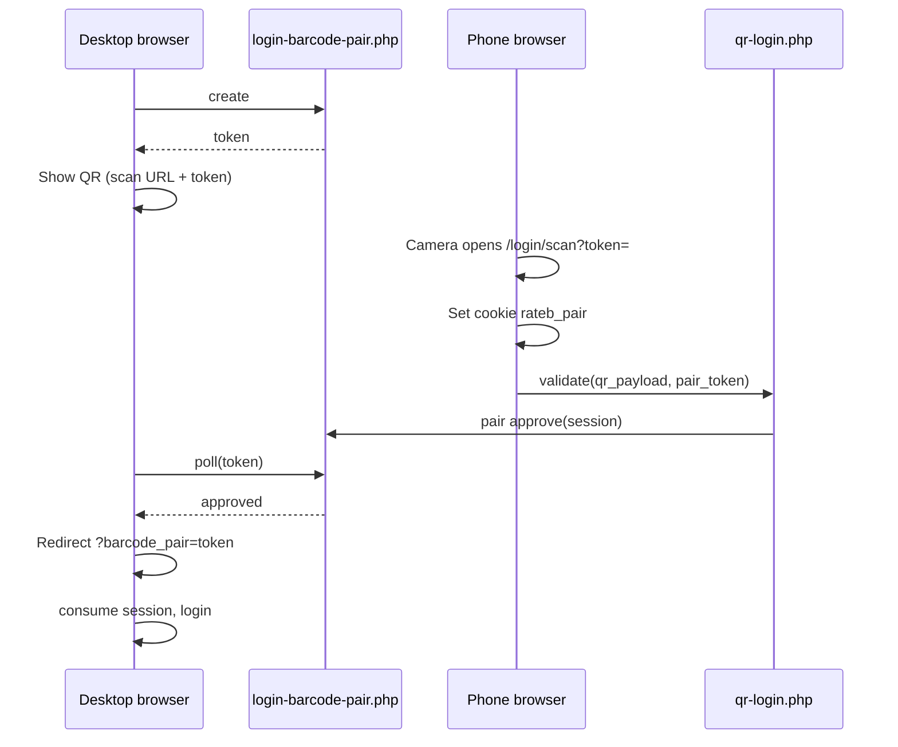

# RATEB QR / Barcode Login

Cross-device login: **computer** shows a pairing QR; **phone** scans an **employee badge**; **RATEB opens on the computer** (phone stays on the scan screen).

Password login is unchanged. Fingerprint login was replaced by barcode/QR on the login page.

---

## User flow (3 steps)

| Step | Device | Action |
|------|--------|--------|
| **1** | **Computer** | Login → method **Barcode** → pairing QR appears (“Scan with your phone”) |
| **2** | **Phone** | Scan the **computer** QR with **iPhone/Android Camera** (or browser) → opens scan page `…/login/scan?token=…` |
| **3** | **Phone** | Scan the **employee badge** from **System Settings → Users → Barcode** (not the computer QR again) |

After step 3, the computer polls the pair API, receives approval, and redirects with `?barcode_pair=…` to complete the session.

### Two different QRs (do not mix them)

| QR | Where | Purpose |
|----|--------|---------|
| **Pairing QR** | Computer login screen | Opens phone scan page (step 2 only) |
| **Employee badge QR** | Users → Barcode modal / print page | Authenticates user (step 3) |

Scanning the **computer** QR with the **in-app camera** on the scan page shows an error: *“That is the computer QR (step 1)…”*

### iPhone Camera on the badge

- **Before step 1:** Camera may show *“No usable data”* if the QR is plain text — use the flow below after deploy.
- **After step 1:** Badge QR is an **HTTPS link** (`/login/badge?d=…`). Camera opens Safari and signs in the PC (requires `rateb_pair` cookie set on step 2).
- **In-app scanner:** On the scan page, tap **Start camera** and point at the badge QR on another screen (laptop admin UI is OK).

---

## Token formats

| Format | Example | Use |
|--------|---------|-----|
| **Secure (preferred)** | `RATEBLOGIN:` + 64 hex chars | Stored hashed in `users.qr_login_token`; issued via API |
| **Badge URL (QR encoding)** | `https://rateb.sa/login/badge?d=RATEBLOGIN%3A…` | What badge QRs encode (iOS Camera friendly) |
| **Legacy reference** | `R000013USR` | Display / 1D barcode only — **not** for scanning (old bug fixed) |
| **Pairing session** | 32-char hex `token` query on scan URL | Links phone to desktop poll |

---

## Routes (`.htaccess`)

| URL | File |
|-----|------|
| `/{country}/login` | `pages/login.php` |
| `/{country}/login/scan?token=` | `pages/login-scan.php` |
| `/login/scan?token=` | `pages/login-scan.php` |
| `/login/badge?d=` | `pages/login-badge.php` |
| `/{country}/login/badge?d=` | `pages/login-badge.php` |
| `/{country}/login-scan?token=` | `pages/login-scan.php` (alias) |
| `/{country}/workforce/scan` | `pages/login-scan.php` (`mode=checkin`) |

---

## API endpoints

### `POST /api/login-barcode-pair.php`

| Action | Body | Result |
|--------|------|--------|
| `create` | `country_id`, `agency_id`, `country_slug`, … | `{ success, token }` |
| `poll` | `token` | `{ success, status: pending \| approved \| expired }` |
| `submit` | `token`, barcode payload | Legacy direct submit (pair flow prefers `qr-login`) |

Pair storage: temp files under `sys_get_temp_dir()/rateb_barcode_pairs` and/or table `login_barcode_pairs`.

### `POST /api/qr-login.php`

| Action | Auth | Purpose |
|--------|------|---------|
| `validate` | Public (rate-limited) | Validate badge; if `pair_token` set, approve pair for desktop |
| `issue` | Logged-in admin | Issue new `RATEBLOGIN` token for a user |
| `revoke` | Logged-in admin | Revoke user QR token |

Validate body example:

```json
{
  "action": "validate",
  "qr_payload": "RATEBLOGIN:…",
  "pair_token": "32-char-hex",
  "country_id": 0,
  "agency_id": 0
}
```

Error codes: `invalid`, `pairing_qr`, `expired`, `revoked`, `replay`, `rate_limit`, `inactive`, `pair_failed`.

---

## Key files

### UI

| File | Role |
|------|------|
| `pages/login.php` | Barcode method; desktop pairing panel; consumes `?barcode_pair=` |
| `js/login.js` | Creates pair, renders pairing QR, polls until approved |
| `pages/login-scan.php` | Phone scanner page; sets `rateb_pair` cookie (10 min) |
| `js/login-scan.js` | html5-qrcode wrapper usage; classifies pairing vs badge |
| `js/rateb-qr-scanner.js` | Camera lifecycle, throttle, rear camera |
| `css/qr-scan.css` | Mobile scan UI |
| `pages/login-badge.php` | Landing when iPhone Camera opens badge URL |
| `pages/system-settings.php` | Login barcode modal markup |
| `js/modern-forms.js` | Users table Barcode column; modal; `ensure_login_barcode` |
| `pages/user-login-barcode.php` | Full-page printable badge |

### Backend

| File | Role |
|------|------|
| `includes/rateb-qr-login.php` | Token issue/validate, audit, rate limits, `rateb_qr_login_badge_url()` |
| `includes/rateb-barcode-login-pair.php` | Pair create / approve / poll / consume |
| `includes/rateb-barcode-login-auth.php` | Session build; legacy barcode auth |
| `includes/rateb-user-login-barcode.php` | Legacy `R000…` reference codes |
| `api/qr-login.php` | QR API front controller |
| `api/login-barcode-pair.php` | Pair API front controller |
| `api/settings/settings-api.php` | `ensure_login_barcode` for Users table |

### Config / deploy

| File | Role |
|------|------|
| `includes/config.php` | API exceptions: `/api/login-barcode-pair`, `/api/qr-login` |
| `public/rateb-build.txt` | Build marker (fast deploy baseline) |
| `sql/migrations/20260522_qr_login_enterprise.sql` | Optional columns + `qr_login_audit` |

**Not deployed by default:** `Designed/`, `.cursor/`, secrets.

---

## Database

Auto-migrated on use (`rateb_qr_login_ensure_schema`):

**`users` columns**

- `qr_login_token` — SHA-256 hash of plain token (pepper uses `DB_PASS`)
- `qr_token_expires_at`
- `qr_token_revoked_at`
- `last_qr_scan_at`
- `login_barcode` — legacy reference (`R000013USR`)

**Tables**

- `qr_login_audit` — scan/issue/revoke events
- `login_barcode_pairs` — pair sessions (if DB storage available)

---

## Admin: employee badge

1. **System Settings → Users**
2. Click **Barcode** on a user row (or “Show barcode”)
3. Modal loads `ensure_login_barcode` → issues secure token + shows QR
4. QR encodes **`https://…/login/badge?d=RATEBLOGIN:…`** (not the `R000…` line)
5. **Open in new tab** → `pages/user-login-barcode.php` for print

Refresh barcode after deploy if QRs still show old plain-text payloads.

---

## Pairing technical flow



---

## Bugs fixed (summary)

| Symptom | Cause | Fix |
|---------|--------|-----|
| 500 / could not store session | Pair cache not writable | File + DB pair storage |
| Poll 400 loop | `pairToken` cleared before poll | Keep token in closure |
| Phone page unstyled | Relative `../css` paths | Absolute `asset()` paths |
| Invalid QR on phone | Scanned **pairing** QR in step 3 | Client + server `pairing_qr` detection |
| Google search for `R000…` | Badge QR encoded reference ID | QR uses `RATEBLOGIN` or badge URL |
| iPhone “No usable data” | Plain-text QR | Badge URL `/login/badge?d=` |
| Modal wrong QR | `renderLoginBarcodeInModal` used legacy code | `qr_payload` for QR; ref for label only |

---

## Deploy checklist

After pushing to `main`, fast deploy uploads changed files under `pages/`, `js/`, `css/`, `api/`, `includes/`, `.htaccess`, `public/rateb-build.txt`.

Verify on production:

- [ ] `https://rateb.sa/login/scan` loads (styled, dark UI)
- [ ] `https://rateb.sa/login/badge` loads
- [ ] Desktop login → Barcode → pairing QR
- [ ] Phone scan page → badge scan → PC redirects
- [ ] Users → Barcode → QR is a link (tap-hold copy URL shows `/login/badge?d=`)

---

## Troubleshooting

| Problem | What to check |
|---------|----------------|
| Scan page 410 | Pair expired — on PC choose Barcode again |
| Badge not recognized | Re-open Users → Barcode (re-issue token); DB columns exist |
| PC never signs in | Network tab: `poll` → `approved`; `qr-login` → `success` |
| Camera black on phone | Tap **Start camera**; allow permission; HTTPS required |
| Wrong QR scanned | Step 3 must be **Users → Barcode**, not login screen QR |
| Badge URL says “scan computer first” | Do step 2 before using iPhone Camera on badge |

---

## Security notes

- Secure tokens are one-time use per validation window (replay guard on `last_qr_scan_at`).
- Tokens stored hashed; plain token only in QR at issue time.
- Rate limiting per IP on validate.
- Pair tokens expire (~minutes); cookie `rateb_pair` HttpOnly, 10 minutes.
- `issue` / `revoke` require authenticated admin session.

---

## Build markers (recent)

- `rateb-workforce-qr-identity-20260523` — persistent credentials, PIN, trusted devices, workforce admin UI
- `rateb-badge-url-iphone-scan-20260522` — badge HTTPS URL + `/login/badge` + scan UX steps

---

## Workforce identity (enterprise extension)

Persistent personal QR credentials — like a workforce badge, not a one-time pairing code.

### Admin: System Settings → Users → Workforce access

| Control | Action |
|---------|--------|
| **Generate QR** | Creates persistent credential (only if none active) |
| **Regenerate** | Invalidates old badge; shows new QR once |
| **Revoke** | Disables badge immediately |
| **PIN** | Optional 4-digit PIN after scan (recommended for admins) |
| **Trusted devices** | View / revoke 30-day device trust |
| **Print / PNG** | Enterprise badge via `/workforce/badge?user_id=` |

### Token format (signed, no PII)

```
RATEBLOGIN:{64_hex_random}.{8_hex_hmac}
```

- Stored in DB: SHA-256 hash in `users.qr_login_token` (same as `qr_login_token_hash` in specs)
- QR encodes HTTPS URL: `/login/badge?d=RATEBLOGIN:…`
- No user ID, email, role, or permissions in QR

### DB columns (`users`)

| Column | Purpose |
|--------|---------|
| `qr_login_token` | Token hash |
| `qr_login_enabled` | Admin toggle |
| `qr_token_expires_at` | `2099-…` = persistent |
| `qr_token_revoked_at` | Revocation timestamp |
| `qr_last_used_at` / `last_qr_scan_at` | Last successful scan |
| `qr_pin_enabled` / `qr_pin_hash` | Optional PIN (bcrypt) |
| `trusted_device_limit` | Max trusted devices (default 5) |

### Tables

- `user_trusted_devices` — 30-day device trust
- `qr_login_challenges` — short-lived PIN challenges
- `qr_login_audit` — scan, PIN, revoke, trust events

### Login modes (all backward compatible)

1. **Password** — unchanged
2. **Desktop pairing** — computer QR → phone scan page → badge scan
3. **Mobile direct** — Login → Barcode → Open camera scanner → badge scan → session
4. **iPhone Camera** — opens `/login/badge?d=…` (pair cookie or direct)
5. **Trusted device** — “Continue as {user}” on mobile login (30 days)

### API actions (`POST /api/qr-login.php`)

| Action | Purpose |
|--------|---------|
| `validate` | Scan badge; may return `needs_pin` + `challenge_token` |
| `validate_pin` | Complete login after PIN |
| `trusted_check` / `trusted_login` | Device trust flow |
| `ensure` / `regenerate` / `revoke` / `status` | Admin credential management |
| `metrics` | 24h operational snapshot (authenticated admin) |

### Settings API actions

`workforce_qr_status`, `workforce_qr_generate`, `workforce_qr_regenerate`, `workforce_qr_revoke`, `workforce_qr_set_pin`, `workforce_qr_set_enabled`, `workforce_revoke_device`

### Key files (workforce)

| File | Role |
|------|------|
| `includes/rateb-qr-workforce-identity.php` | PIN, trust, persistent token, metrics |
| `includes/rateb-qr-login.php` | Core validate/issue (extended) |
| `js/workforce-access.js` | Admin workforce panel |
| `css/workforce-access.css` | Enterprise admin styling |
| `pages/workforce-badge.php` | Printable badge |
| `sql/migrations/20260523_qr_workforce_identity.sql` | Optional migration |

### Deployment

Push to `main` — fast deploy picks up `includes/`, `pages/`, `js/`, `css/`, `api/`, `.htaccess`.

After deploy: **Users → Workforce access → Generate QR** for each user (one-time to capture printable QR).

---

*Last updated: 2026-05-23 — workforce identity extension.*
