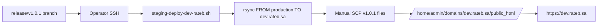
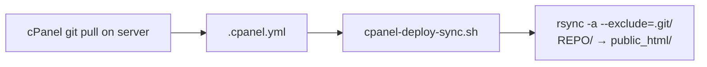

# RATEB ERP — Deployment Flow

**Date:** 2026-06-27  
**Mode:** Read-only audit — no code, deploy, or workflow changes  
**Purpose:** Explain exactly how GitHub Actions deploys RATEB ERP, and **why modified files may not reach the server**

---

## Executive Answer: Why Were Some v1.0.1 Files Not Deployed?

Two independent reasons apply:

| # | Reason | Applies to |
|---|--------|------------|
| **1** | **Deploy only runs on `push` to `main`** — `release/v1.0.1` was never merged | **All 21 changed files** — production still on v1.0.0 |
| **2** | **File-list deploy, not full-tree sync** — paths must pass `is_auto_deploy_path()` | `.gitignore`, `config/test-control-db.php`, all `docs/**` — **skipped even after merge** |

Staging (`dev.rateb.sa`) uses **manual SCP/rsync** — not GitHub Actions.

---

## 1. Workflow Inventory

### Active (`.github/workflows/`)

| File | Trigger | Deploys files? |
|------|---------|----------------|
| `deploy.yml` | `push` → `main`; `workflow_dispatch` | **Yes** — production only |

### Inactive drafts (`.github/workflow-drafts/` — **not loaded by GitHub**)

| File | Purpose | Deploys? |
|------|---------|----------|
| `pr-validation.yml` | PHP lint + enterprise test | No (`if: false`) |
| `backup-verify.yml` | Backup verify reminder | No |
| `tag-validation.yml` | Tag listing | No |
| `rollback-checklist.yml` | Rollback echo checklist | No |

### Does NOT exist in repository

- `deploy-production.yml`
- `deploy-staging.yml`
- `deploy-fast.yml` *(fast mode is `DEPLOY_MODE=fast` inside `deploy.yml`)*
- `deploy-hotfix.yml`

### SCP and artifacts in GitHub Actions

| Mechanism | Used? |
|-----------|-------|
| **rsync** | ✅ Primary (`scripts/github-rsync-deploy.py`) |
| **cPanel Fileman API** | ✅ Optional backend (`scripts/github-cpanel-fileman-deploy-core.py`) |
| **scp** | ❌ **Not used in any workflow** |
| **`actions/upload-artifact`** | ❌ **Not used** |
| **`actions/download-artifact`** | ❌ **Not used** |

SCP appears only in **manual staging scripts** (`scripts/staging-deploy-dev-rateb.sh`), outside GitHub Actions.

---

## 2. Visual Deployment Flow

### Production (GitHub Actions — the only automated path)

```mermaid
flowchart TD
    A[Developer pushes to main] --> B{GitHub Actions<br/>deploy.yml}
    B --> C[actions/checkout@v5<br/>fetch-depth: 2]
    C --> D{DEPLOY_BACKEND secret}
    D -->|rsync default| E[github-rsync-deploy.sh]
    D -->|cpanel + token| F[github-cpanel-fileman-deploy.sh]
    E --> G[github-cpanel-fileman-deploy-core.py<br/>build_file_list mode]
    F --> G
    G --> H{Deploy mode}
    H -->|push default| I[fast: FAST_FILES + CRITICAL<br/>+ commit-changed allow paths]
    H -->|dispatch full_sync| J[critical: CRITICAL list only]
    H -->|dispatch infra_only| K[list: infra-deploy-23-files.list]
    I --> L{Backend}
    J --> L
    K --> L
    L -->|rsync| M["rsync -avz --files-from LIST<br/>./ → user@host:DEPLOY_REMOTE_BASE/"]
    L -->|cpanel| N[Fileman save_file_content<br/>or upload_files multipart]
    M --> O[/home/admin/.../public_html/]
    N --> O
    O --> P[run-rateb-erp-migrations.sh]
    P --> Q[run-restore-super-admins.sh]
    Q --> R[run-rcc-migrations.sh]
    R --> S[run-rcc-realtime-hub.sh SSH]
    S --> T[LiteSpeed cache purge HTTP]
    T --> U[run-rateb-erp-enterprise-cert.sh]
    U --> V[Verify live site curl checks]
    V --> W[https://rateb.sa live]
```

### Staging (manual — NOT in GitHub Actions)



### Server-side git hook (NOT GitHub Actions)



This full-tree rsync runs **on the Hetzner server**, not in GitHub Actions.

---

## 3. The rsync Command (Exact)

From `scripts/github-rsync-deploy.py`:

```bash
rsync -avz \
  --files-from /tmp/rateb-deploy-files-XXXX.txt \
  -e "ssh -i KEY -p PORT -o BatchMode=yes ..." \
  ./ \
  USER@HOST:/home/admin/domains/rateb.sa/public_html/
```

| Property | Value |
|----------|-------|
| **Switches** | `-avz` (override via `DEPLOY_RSYNC_SWITCHES`) |
| **Scope** | **Named files only** — not whole directories |
| **`--delete`** | **Not used** — old server files are never removed |
| **Source** | GitHub Actions checkout `./` |
| **Destination** | `DEPLOY_REMOTE_BASE` (secret; default varies — see §12) |

**Implication:** GitHub Actions never “copies a directory.” It copies **individual files** that pass the allow-list and appear in the built file list.

---

## 4. Include Patterns (What CAN Deploy)

Logic: `scripts/github-cpanel-fileman-deploy-core.py` → `is_auto_deploy_path()`

### Prefix allow list (`DEPLOY_ALLOW_PREFIXES`)

| Prefix | Directory copied? |
|--------|-------------------|
| `includes/` | Files only, when in list |
| `pages/` | Files only |
| `control-panel/` | Files only |
| `rateb-erp/` | Files only |
| `ratib-contact-center/` | Files only |
| `js/` | Files only |
| `css/` | Files only |
| `api/` | Files only |
| `storage/` | Files only (root `storage/`, not all subtrees by default) |
| `modules/infrastructure-marketplace/` | Files only |
| `config/env/` | Files only |
| `public/` | Files only |
| `public/profile-media/` | Files only |
| `assets/images/government/` | Files only |
| `assets/images/diagrams/` | Files only |
| Specific asset files | 4 named SVG/PNG paths |
| `uploads/rateb_cms_media/` | Files only |

### Root file allow list (`DEPLOY_ALLOW_FILES`)

```
.htaccess
index.php
rateb-profile-fix.php
config/env.php
```

### Always-sync baseline (`FAST_FILES` — 41 files, every fast deploy)

Ships on **every** production push even when unchanged. Key paths:

```
.htaccess, index.php
includes/config.php, includes/rateb-clean-url.php, includes/rateb-public-base-url.php
config/env/load.php, config/env/dotenv_bridge.php, config/env/directadmin_db.php
config/env/rateb_sa.php, config/env.php
includes/site-content.php, includes/site-content-home-data.php
pages/home.php, pages/login.php, pages/dashboard.php (+ diagnostics pages)
control-panel/ contact-center + sidebar files
ratib-contact-center/ bootstrap + asset.php
assets/rateb-logo.svg
public/rateb-build.txt          ← marketing build marker (LAST in list)
```

**Not in FAST_FILES:** `rateb-erp/public/ratib-erp-build.txt` — deploys only when **changed in the commit**.

### Commit-changed auto-upload

On `push`, `git diff-tree --name-only $GITHUB_SHA` → filter through `is_auto_deploy_path()` → add to upload list (cap: 200 files unless large-commit mode).

### Full-tree bundle triggers

| Trigger | Effect |
|---------|--------|
| Change under `rateb-erp/migrations/` or CP `rateb-erp*` bridge | Upload **entire** `rateb-erp/` tree |
| Change under `ratib-contact-center/migrations/` or CP contact-center | Upload **entire** `ratib-contact-center/` tree |
| RCC directory exists | May add full RCC bundle on fast deploy |

v1.0.1 changes (app PHP + config only) **do not** trigger full ERP bundle.

---

## 5. Exclude Patterns (What Is SKIPPED)

### Hard deny (`DEPLOY_DENY_PREFIXES`)

```
Designed/
.git/
.github/
.cursor/
archive/
node_modules/
```

### Implicit deny (not in allow list)

| Path | Why skipped |
|------|-------------|
| **Any dotfile** (`.gitignore`, `.env`, `.cpanel.yml`) | `path.startswith(".")` → false |
| `docs/` | Not in `DEPLOY_ALLOW_PREFIXES` |
| `scripts/` | Not in allow list (except items in FAST/CRITICAL/infra list) |
| `config/test-control-db.php` | `config/` allowed only as `config/env/` + `config/env.php` |
| `config/ngenius.secrets.php` | Not in allow list |
| `paypal-checkout/` | Not in allow list |
| `rateb_mobile/` | Not in allow list |
| `coreai/` | Not in allow list |
| `Designed/` | Explicit deny |
| `vendor/` | Gitignored; not in allow prefixes |
| `logs/`, `tmp/`, `cache/` | Gitignored; not in allow prefixes |
| `*.md` | Excluded in `all` mode find; never in fast/critical lists |

### `all` mode find exclusions (not exposed in workflow UI)

```
.git/*  .github/*  .cursor/*  node_modules/*  archive/*
*.md  *.map  *.log  *.zip
-size +3M
```

### rsync on server (`cpanel-deploy-sync.sh` — not GHA)

```
--exclude='.git/'     (only exclusion)
--delete              OFF by default (RATEB_RSYNC_DELETE=0)
```

### Manual staging rsync excludes

```
--exclude='storage/backups/*.sql.gz'
--exclude='storage/backups/*.tar.gz'
```

---

## 6. Every Top-Level Directory — Copied or Skipped?

GitHub Actions uses **file lists**, not directory sync. This table shows whether files **under each directory can ever** reach production via GHA.

| Directory | GHA can deploy files? | Typical fate |
|-----------|----------------------|--------------|
| `includes/` | ✅ Yes | FAST baseline + on-change |
| `pages/` | ✅ Yes | FAST baseline + on-change |
| `control-panel/` | ✅ Yes | Partial FAST + on-change |
| `rateb-erp/` | ✅ Yes | On-change only (unless full bundle) |
| `ratib-contact-center/` | ✅ Yes | Partial FAST + bundle trigger |
| `js/` | ✅ Yes | On-change |
| `css/` | ✅ Yes | On-change |
| `api/` | ✅ Yes | On-change |
| `public/` | ✅ Yes | `rateb-build.txt` always; rest on-change |
| `config/env/` | ✅ Yes | FAST baseline |
| `config/` (other) | ⚠️ **Mostly NO** | Only `config/env.php` |
| `storage/` | ⚠️ Partial | Root `storage/` prefix; ERP storage only if `rateb-erp/` changes |
| `modules/infrastructure-marketplace/` | ✅ Yes | Infra list mode |
| `assets/` | ⚠️ Partial | Only named image paths + `rateb-logo.svg` |
| `uploads/rateb_cms_media/` | ✅ Yes | On-change |
| `docs/` | ❌ **Never** | GitHub-only |
| `scripts/` | ❌ **Never** | Except 1 file in infra list |
| `.github/` | ❌ Denied | Workflows never uploaded |
| `archive/` | ❌ Denied | |
| `Designed/` | ❌ Denied | |
| `node_modules/` | ❌ Denied | |
| `vendor/` | ❌ Not allowed | Server-local Composer |
| `logs/`, `tmp/`, `cache/` | ❌ Not allowed | Runtime |
| `rateb_mobile/` | ❌ Not allowed | |
| `paypal-checkout/` | ❌ Not allowed | |
| `coreai/` | ❌ Not allowed | |

---

## 7. Upload Paths & Build Paths

### Upload destination (production)

| Secret / default | Path |
|------------------|------|
| `DEPLOY_REMOTE_BASE` (deploy step default) | `/home/admin/public_html` |
| `DEPLOY_REMOTE_BASE` (RCC hub step default) | `/home/admin/domains/rateb.sa/public_html` |
| `config/cpanel-deploy-targets.txt` | Both paths above + git checkout |

**Live URL:** `https://rateb.sa/` → files at `public_html/` mirror repo paths  
**ERP URL:** `https://rateb.sa/rateb-erp/public/` → `public_html/rateb-erp/public/`

### cPanel Fileman upload path mapping

```
repo path: rateb-erp/config/app.php
→ remote:  {REMOTE_BASE}/rateb-erp/config/app.php
→ API dir: public_html/rateb-erp/config  (file: app.php)
```

### Build markers (verification paths)

| Marker | Repo path | Verified in deploy.yml? |
|--------|-----------|---------------------------|
| Marketing | `public/rateb-build.txt` | ✅ curl after deploy |
| ERP | `rateb-erp/public/ratib-erp-build.txt` | ❌ **Not verified** |

### Post-deploy HTTP endpoints (no file upload)

| Step | Script | Target |
|------|--------|--------|
| ERP migrations | `run-rateb-erp-migrations.sh` | `{SITE}/rateb-erp/...` migrate HTTP |
| Super-admin restore | `run-restore-super-admins.sh` | HTTP |
| RCC migrations | `run-rcc-migrations.sh` | HTTP |
| WebSocket hub | `run-rcc-realtime-hub.sh` | SSH command on server |
| Cache purge | curl | `/pages/rateb-purge-cache.php?key=...` |
| Enterprise cert | `run-rateb-erp-enterprise-cert.sh` | HTTP |
| Live verify | curl | `/`, `/profile/`, `/site/register`, ERP health |

### Artifact paths

**None.** No workflow produces or consumes GitHub Actions artifacts.

### Side-effect upload (not in Git)

When any `rateb-erp/` file deploys, scripts temporarily write and upload:

```
rateb-erp/storage/deploy-migrate-token   ← from CPANEL_API_TOKEN secret
```

---

## 8. Deploy Modes Compared

| Mode | When | Files uploaded | Directories effectively covered |
|------|------|----------------|--------------------------------|
| **fast** | Every `push` to `main` | ~41 FAST + ~46 CRITICAL + commit-changed (≤200) | Subset of allow prefixes only |
| **critical** | Manual full_sync | CRITICAL list (~46 marketing/shell files) | Marketing shell only — **misses most ERP changes** |
| **list** | Manual infra_only | 23 infra marketplace files | Infra module only |
| **all** | Not in workflow UI | find with exclusions | Broadest — still skips `.md`, `archive/`, large files |

---

## 9. v1.0.1 File-by-File: Why Each Was or Wasn't Deployed

**Branch status:** `release/v1.0.1` not merged → **GHA never ran for this release.**

If merged to `main` tomorrow:

| File | Would GHA upload? | Root cause if skipped |
|------|-------------------|----------------------|
| `.gitignore` | ❌ | Dotfile rule |
| `config/test-control-db.php` | ❌ | `config/` not in allow list (GAP-02) |
| `docs/**` (15 files) | ❌ | `docs/` not deployable — by design |
| `rateb-erp/.../DeploymentReadinessService.php` | ✅ | `rateb-erp/` prefix + commit-changed |
| `rateb-erp/.../CustomerPortalController.php` | ✅ | same |
| `rateb-erp/config/app.php` | ✅ | same |
| `rateb-erp/public/ratib-erp-build.txt` | ✅ | same (not in FAST_FILES but changed) |

---

## 10. Incomplete Deployment Risks (Highlighted)

### 🔴 High impact

| Risk | Mechanism | Example |
|------|-----------|---------|
| **Wrong branch** | Trigger is `main` only | Entire release not deployed (`release/v1.0.1`) |
| **Allow-list gaps** | Path not in prefixes | `config/test-control-db.php` SEC-M01 fix |
| **File-list not directory** | Only listed files upload | New file in `scripts/` never deploys |
| **No `--delete`** | Stale files remain | Old PHP on server after rename |

### 🟠 Medium impact

| Risk | Mechanism | Example |
|------|-----------|---------|
| **200-file cap** | `FAST_DEPLOY_CHANGED_CAP` | Huge commit drops files >200 |
| **ERP marker not in FAST_FILES** | Only on-change | Missed if commit forgets marker file |
| **Dual `DEPLOY_REMOTE_BASE` defaults** | Workflow lines 51 vs 110 | Upload vs RCC hub to different roots if secret unset |
| **critical mode too narrow** | Manual full_sync | Operator thinks “full” but gets ~46 shell files |
| **No staging workflow** | Manual only | `dev.rateb.sa` drifts from Git |

### 🟡 Low impact

| Risk | Mechanism | Example |
|------|-----------|---------|
| **MUST_OK skipped for rsync** | Batch upload | cPanel gate not enforced on rsync path |
| **RCC full bundle on dir exists** | `os.path.isdir(ratib-contact-center)` | Extra RCC files every fast deploy |
| **docs never on server** | Not deployable | Expected — ops docs Git-only |

---

## 11. `deploy.yml` Step Reference

| Step | Uploads files? | Transport |
|------|----------------|-----------|
| Checkout | — | Git |
| Deploy to public_html | ✅ | rsync or Fileman |
| Run RATEB ERP migrations | ❌ | HTTP to live site |
| Restore super-admin auth | ❌ | HTTP |
| Run RCC migrations | ❌ | HTTP |
| Start RCC Realtime Hub | ❌ | SSH command |
| Purge LiteSpeed cache | ❌ | HTTP |
| Run enterprise certification | ❌ | HTTP |
| Verify live site | ❌ | HTTP curl |
| Deploy failed | — | Exit 1 |

**Environment:** `rateb.sa` (GitHub Environment secrets)  
**Concurrency:** `production-deploy` (no cancel-in-progress)

---

## 12. Secrets That Control Deploy Paths

| Secret | Role |
|--------|------|
| `DEPLOY_BACKEND` | `rsync` (default) or `cpanel` |
| `DEPLOY_SSH_HOST`, `DEPLOY_SSH_USER`, `DEPLOY_SSH_PRIVATE_KEY`, `DEPLOY_SSH_PORT` | rsync SSH |
| `DEPLOY_REMOTE_BASE` | Upload root on Hetzner |
| `DEPLOY_SITE_URL` / `CPANEL_SITE_URL` | Post-deploy HTTP targets |
| `CPANEL_HOST`, `CPANEL_USER`, `CPANEL_API_TOKEN` | Fileman API backend |
| `RATEB_ERP_MIGRATE_TOKEN` | Migrations + migrate-token side file |

---

## 13. Recommendations (Documentation Only)

1. **Before merging v1.0.1:** Add `config/test-control-db.php` to deploy allow rules, or accept manual upload.
2. **Set `DEPLOY_REMOTE_BASE` explicitly** in GitHub Environment to `/home/admin/domains/rateb.sa/public_html`.
3. **Add ERP build marker check** to verify step in `deploy.yml`.
4. **Add `deploy-staging.yml`** or document that staging is operator-managed.
5. **Do not use `full_sync` thinking it uploads everything** — it runs `critical` mode (~46 files), not full tree.

---

## 14. Related Documents

- `docs/v1.0.1/DEPLOYMENT-COVERAGE-AUDIT.md` — v1.0.1 three-way Git/production/staging audit
- `scripts/github-cpanel-fileman-deploy-core.py` — source of truth for allow/deny lists
- `.cursor/rules/deploy-on-update.mdc` — project deploy conventions

---

*Deployment Flow — READ ONLY — RATEB ERP*
