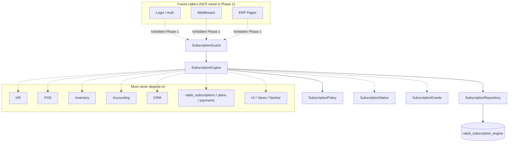

# Subscription Engine — Phase 1 Foundation

**Status:** Architecture foundation (see also [PHASE-2](./PHASE-2-READ-ONLY-INTEGRATION.md), [PHASE-3](./PHASE-3-NOTIFICATION-ENGINE.md), [PHASE-4](./PHASE-4-NOTIFICATION-SCHEDULER.md), [PHASE-5](./PHASE-5-IN-APP-ALERTS.md), [PHASE-6](./PHASE-6-GRACE-PERIOD.md))  
**Scope:** PHP Core, isolated module  
**Non-goals:** business logic, UI, navbar, notifications, cron, billing, payment gateway, auto-renewal, subscription pages, license logic, login/middleware wiring, access blocking

---

## 1. Folder structure

```
rateb-erp/
├── migrations/
│   └── 210_subscription_engine_foundation.sql
└── modules/subscription/
    ├── SubscriptionModule.php      # Optional local autoload; NOT wired to index.php
    ├── SubscriptionEngine.php      # Public query API (contracts only)
    ├── SubscriptionStatus.php      # Status vocabulary
    ├── SubscriptionPolicy.php      # Threshold / access-rule contracts
    ├── SubscriptionRepository.php  # Persistence boundary contracts
    ├── SubscriptionGuard.php       # Guard method surface only (not connected)
    ├── SubscriptionEvents.php      # Future event name catalog
    └── docs/
        └── PHASE-1-FOUNDATION.md   # This document
```

Namespace: `Rateb\App\Subscription\*`

---

## 2. Class responsibilities

| Class | Responsibility | Phase 1 |
|---|---|---|
| `SubscriptionModule` | Module-local autoload for `Rateb\App\Subscription\*` | Present; **not** called from `public/index.php` |
| `SubscriptionStatus` | Canonical status enum values | Constants only |
| `SubscriptionEvents` | Named extension points for future emitters | Constants only |
| `SubscriptionPolicy` | Thresholds and access matrices | Method contracts; throws `LogicException` |
| `SubscriptionRepository` | Read/write `rateb_subscription_engine` only | Method contracts; throws `LogicException` |
| `SubscriptionEngine` | Single source of truth query API for tenant status | Method contracts; throws `LogicException` |
| `SubscriptionGuard` | Ask-engine accessors for future callers | Method contracts; **not** wired to login/middleware/pages |

### Isolation hard rules

The engine and its collaborators **must never** reference:

- HR, POS, Inventory, Accounting, Payroll, CRM, Procurement
- Employees, Attendance
- Any UI / view / navbar / controller class
- Existing billing tables (`rateb_subscriptions`, `rateb_plans`, `rateb_payments`, `rateb_invoices`)

Nothing elsewhere in the ERP should encode subscription rules. Consumers (future) call Engine/Guard only.

---

## 3. Database schema proposal

**Do not modify** existing billing tables.

New table: `rateb_subscription_engine` (one row per tenant company).

| Column | Type | Notes |
|---|---|---|
| `id` | INT UNSIGNED PK | |
| `company_id` | INT UNSIGNED UNIQUE | FK → `rateb_companies.id` (platform tenant only) |
| `subscription_start` | DATE | Period start |
| `subscription_end` | DATE | Period end |
| `grace_period_days` | INT UNSIGNED | Grace length after end |
| `current_status` | ENUM | `ACTIVE` \| `WARNING` \| `CRITICAL` \| `GRACE` \| `SUSPENDED` |
| `suspended_at` | DATETIME NULL | When suspended |
| `renewed_at` | DATETIME NULL | Last renewal marker |
| `next_notification_date` | DATE NULL | Reserved for future notifier (unused now) |
| `last_notification_date` | DATE NULL | Reserved for future notifier (unused now) |
| `created_at` | DATETIME | |
| `updated_at` | DATETIME NULL | |

Indexes: company (unique), status, subscription_end, next_notification_date.

Migration file: `migrations/210_subscription_engine_foundation.sql`.

---

## 4. Public APIs

### `SubscriptionEngine`

| Method | Intent |
|---|---|
| `getStatus(int $companyId): string` | Canonical status |
| `daysRemaining(int $companyId): int` | Days until `subscription_end` |
| `isExpired(int $companyId): bool` | Period ended |
| `isInGrace(int $companyId): bool` | In grace window |
| `isSuspended(int $companyId): bool` | Suspended |
| `canAccessERP(int $companyId): bool` | Advisory access answer |

### `SubscriptionGuard` (not connected)

| Method | Intent |
|---|---|
| `assertCanAccess(int $companyId): bool` | May use ERP |
| `shouldDenyAccess(int $companyId): bool` | Deny signal |
| `shouldWarn(int $companyId): bool` | Non-blocking warn window |
| `currentStatus(int $companyId): string` | Status without side effects |

No redirects. No page blocking. No notifications.

---

## 5. Dependency graph



Internal construction (Phase 1 stubs):

`SubscriptionGuard` → `SubscriptionEngine` → (`SubscriptionRepository`, `SubscriptionPolicy`)

---

## 6. Sequence diagram

Illustrative **future** read path (not active; methods throw in Phase 1):

```mermaid
sequenceDiagram
    participant Caller as Future Caller
    participant Guard as SubscriptionGuard
    participant Engine as SubscriptionEngine
    participant Policy as SubscriptionPolicy
    participant Repo as SubscriptionRepository
    participant DB as rateb_subscription_engine

    Note over Caller,DB: Phase 1 — contracts only; no wiring, no side effects

    Caller->>Guard: assertCanAccess(companyId)
    Guard->>Engine: canAccessERP(companyId)
    Engine->>Repo: findByCompanyId(companyId)
    Repo->>DB: SELECT ...
    DB-->>Repo: row
    Repo-->>Engine: state
    Engine->>Policy: allowsErpAccess(status)
    Policy-->>Engine: bool
    Engine-->>Guard: bool
    Guard-->>Caller: bool
```

---

## 7. Future extension points

| Extension | Owner | Notes |
|---|---|---|
| Status evaluation / transitions | Engine + Policy | Derive ACTIVE→WARNING→CRITICAL→GRACE→SUSPENDED |
| Persistence implementation | Repository | PDO against `rateb_subscription_engine` only |
| Guard wiring | Auth / middleware (later ADR) | Call Guard; never duplicate rules |
| Notifications | Separate notifier | Use `next_notification_date` / `last_notification_date` + `SubscriptionEvents` |
| Scheduler / cron | Separate job | Out of Phase 1 |
| Billing / payments / auto-renew | Separate billing adapter | May **write** engine dates/status via Repository; Engine remains SoT for **status** |
| Subscription admin UI | Admin views (later) | Outside this module’s core |
| License / feature entitlements | Separate module | Explicitly out of scope |
| Event bus listeners | Infrastructure | Subscribe to `SubscriptionEvents::*` |

### Explicit non-wiring checklist (Phase 1)

- [x] No `SubscriptionModule::init()` in `public/index.php`
- [x] No login integration
- [x] No middleware integration
- [x] No page blocking / redirects
- [x] No notification senders
- [x] No cron registration
- [x] No edits to existing billing tables
- [x] No references to other ERP business modules
