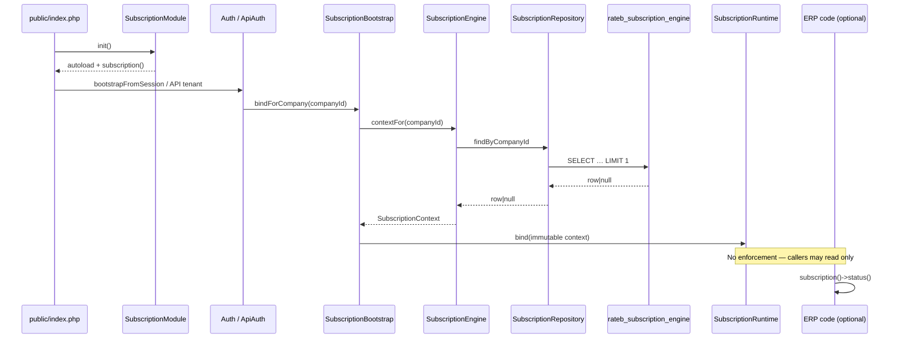

# Subscription Engine — Phase 2 Read-Only Tenant Integration

**Status:** Read-only runtime exposure  
**Depends on:** Phase 1 foundation (`modules/subscription/`, `rateb_subscription_engine`)  
**Non-goals (unchanged):** UI, navbar, notifications, redirects, access blocking, billing, payments, cron, scheduler, auto-renewal, login/middleware behavior changes, API response changes, permission changes

---

## 1. Bootstrap integration

| Hook | Role |
|---|---|
| `public/index.php` | `SubscriptionModule::init()` (autoload + `subscription()` helper) before `Auth::bootstrapFromSession()` |
| `Auth::bootstrapFromSession()` | `SubscriptionBootstrap::bindForCompany($companyId)` after tenant/branch bind |
| `Auth::establishSession()` | Same bind after login establishes company |
| `Auth::logout()` / `clearSessionIdentity()` | `SubscriptionRuntime::reset()` |
| `ApiAuthMiddleware` | Silent bind after bearer tenant company is set — **return path unchanged** |
| `subscription()` | Lazy `ensureFromTenantContext()` if company changed / late bind |

No redirects, flashes, banners, or deny paths were added.

---

## 2. SubscriptionContext

Immutable `readonly` snapshot:

- `companyId()`
- `status()`
- `daysRemaining()`
- `isExpired()` / `isInGrace()` / `isSuspended()`
- `canAccessERP()` — **advisory only**
- `expirationDate()`
- `hasRecord()`

Factories:

- `absent($companyId)` — no engine row / table lag → treats access as allowed (preserves ERP behavior)
- `fromEngineRow(...)` — maps stored columns + calendar day math for remaining/expired

Held in `SubscriptionRuntime` (request-scoped binder for one immutable object). Not a mutable field bag.

---

## 3. Read-only lifecycle



Direction lock:

```
ERP Modules → SubscriptionContext → SubscriptionEngine → Repository → Table
```

No reverse dependency (engine does not import HR/POS/UI/billing).

---

## 4. Dependency verification

| Check | Result |
|---|---|
| Engine references other business modules | None |
| Billing tables (`rateb_subscriptions`, plans, payments) | Not queried |
| Guard connected to login/middleware | No |
| Controllers calculate subscription rules | No |
| UI / navbar / views changed | No |
| Routes / permissions changed | No |
| Middleware auth allow/deny logic changed | No (additive bind only) |

Public accessors:

```php
subscription();
subscription()?->status();
subscription()?->daysRemaining();
subscription()?->isExpired();
subscription()?->isInGrace();
subscription()?->canAccessERP();
```

---

## 5. Performance impact report

| Item | Impact |
|---|---|
| Extra work per authenticated tenant request | **1** indexed `SELECT … WHERE company_id = ? LIMIT 1` |
| Index used | `uq_subscription_engine_company` (UNIQUE) |
| Unauthenticated / no company | No query (`SubscriptionRuntime` cleared) |
| Missing table / DB error | Caught; binds `absent()`; logs; **no 500** |
| Engine instance cache | Dedupes reads if `contextFor` called multiple times on same instance |
| Expected latency | Sub-millisecond on warm DB (primary-key/unique lookup) |
| Behavior regression risk | None — nothing consumes context for deny/redirect yet |

Validation test (no DB):  
`php rateb-erp/modules/subscription/tests/SubscriptionContextPhase2Test.php`

---

## 6. Architecture notes vs Phase 1

| Component | Phase 1 | Phase 2 |
|---|---|---|
| Module init in `index.php` | Forbidden | Enabled (autoload + helpers) |
| Repository | Stub throw | Read `findByCompanyId` / `getCurrentStatus` |
| Engine | Stub throw | Read-only `contextFor` + query APIs |
| Guard | Stub; unwired | Thin delegates; **still unwired** |
| Policy / save / events / notifications | Unused | Still unused |
| SubscriptionContext / Runtime / Bootstrap | — | Added |

### Explicit non-enforcement checklist

- [x] Zero UI / navbar changes
- [x] Zero redirects from this module
- [x] Zero access blocking from this module
- [x] Zero notifications
- [x] Zero permission / routing changes
- [x] Zero API response schema changes
- [x] SubscriptionEngine remains sole SoT for status reads
