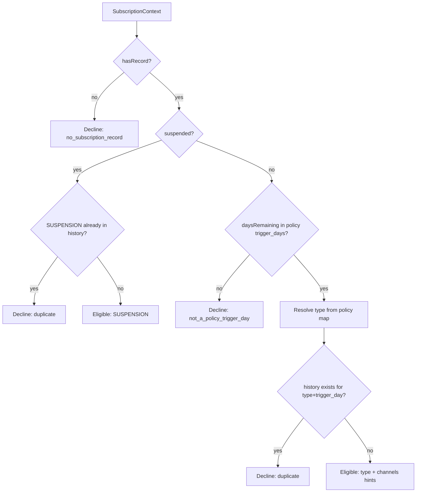
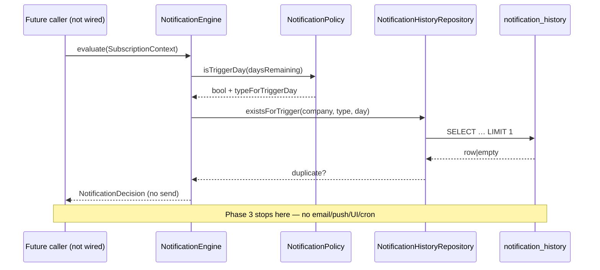

# Subscription Engine — Phase 3 Notification Engine (Eligibility Only)

**Status:** Decision / eligibility architecture  
**Depends on:** Phase 1 schema + Phase 2 `SubscriptionContext`  
**Non-goals:** UI, navbar, banners, toasts, email, SMS, push, WhatsApp, cron, scheduler, redirects, access blocking, billing/payment, routing, permissions

> This phase **must not deliver** notifications. It only decides whether one **should** exist.

---

## 1. Notification architecture

```
SubscriptionContext
        ↓
NotificationEngine
        ↓
NotificationPolicy  (config/notification-policy.php — not hardcoded in Engine)
        ↓
NotificationHistoryRepository
        ↓
rateb_subscription_notification_history
```

| Class | Responsibility |
|---|---|
| `NotificationType` | `REMINDER` / `FINAL_WARNING` / `GRACE` / `SUSPENSION` |
| `NotificationChannel` | Future: email, push, in_app, whatsapp, sms (catalog only) |
| `NotificationPolicy` | Trigger days + type map + channel hints from config |
| `NotificationDecision` | Immutable evaluate() result |
| `NotificationHistoryRepository` | History read + optional `recordGenerated` (not auto-called) |
| `NotificationEngine` | Public eligibility API |

**Not wired** into Auth bootstrap, cron, middleware, or UI. Callers must invoke the Engine explicitly in a later phase.

---

## 2. Database schema

Migration: `migrations/211_subscription_notification_history.sql`

Table: `rateb_subscription_notification_history`  
**Does not alter** `rateb_subscription_engine`.

| Column | Notes |
|---|---|
| `id` | PK |
| `company_id` | FK → `rateb_companies` |
| `subscription_id` | Nullable FK → `rateb_subscription_engine.id` (not billing) |
| `notification_type` | ENUM types above |
| `trigger_day` | Signed offset vs `subscription_end` |
| `scheduled_date` | Decision calendar date |
| `generated_at` | When recorded as generated |
| `delivered_at` | Future delivery (null in Phase 3) |
| `dismissed_at` | Future dismiss (null in Phase 3) |
| `status` | `generated` \| `delivered` \| `dismissed` \| `cancelled` |
| `created_at` | |

**Dedup:** `UNIQUE (company_id, notification_type, trigger_day)` — same reminder never twice.

---

## 3. Public APIs

```php
$engine = new \Rateb\App\Subscription\NotificationEngine();

$decision = $engine->evaluate($context);           // NotificationDecision
$engine->shouldGenerate($context);                 // bool
$engine->nextNotificationDate($context);           // ?Y-m-d (computed, no DB write)
$engine->lastNotification($companyId);             // ?array
$engine->history($companyId);                      // list<array>
$engine->recordGenerated($decision);               // optional persist for future dispatcher
```

`NotificationDecision` accessors: `shouldGenerate()`, `notificationType()`, `triggerDay()`, `scheduledDate()`, `reason()`, `channels()`, …

Default policy trigger days (from config — overrideable):

`14, 11, 8, 5, 3, 2, 1, 0, -1…-7`  
(+1…+7 after end are stored as negative trigger days).

---

## 4. Decision flow



---

## 5. Sequence diagram



---

## 6. Extension points

| Extension | How |
|---|---|
| Custom schedules | Replace/override `config/notification-policy.php` or inject `NotificationPolicy($config)` |
| Email / Push / In-App / WhatsApp / SMS | Use `NotificationChannel::*` + `decision->channels()` in a future Delivery layer |
| Scheduler / cron | Future job calls `evaluate()` then a Delivery service — **not this phase** |
| Persist generation | `recordGenerated($decision)` when a dispatcher commits |
| Mark delivered / dismissed | Update history `delivered_at` / `dismissed_at` / `status` in a later phase |
| In-app banner / toast | Forbidden here — separate UI phase |

---

## 7. Validation checklist

- [x] No UI / navbar / banner / toast
- [x] No email / SMS / push / WhatsApp senders
- [x] No cron / scheduler registration
- [x] No redirects / access blocking
- [x] No billing / payment integration
- [x] No routing / permission changes
- [x] No automatic writes during Auth bootstrap
- [x] `rateb_subscription_engine` schema untouched
- [x] Duplicate prevention via unique key + `existsForTrigger`

Unit test (no DB):  
`php rateb-erp/modules/subscription/tests/NotificationEnginePhase3Test.php`
