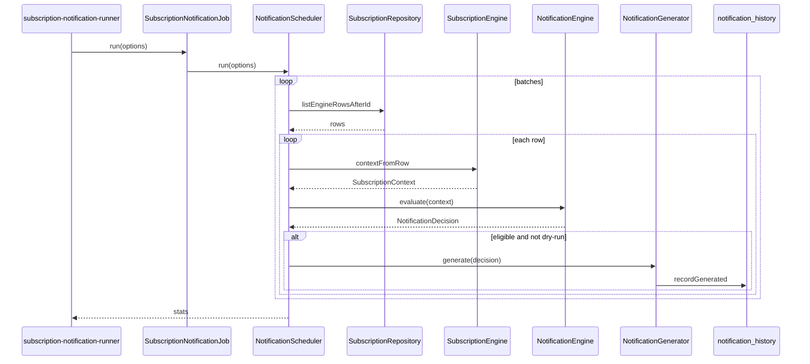

# Subscription Engine — Phase 4 Notification Scheduler / Generator

**Status:** Automated history generation only  
**Depends on:** Phase 3 NotificationEngine + history table  
**Non-goals:** UI, banners, email, SMS, push, WhatsApp, redirects, access blocking, suspension actions, billing, cron installation

> Writes **only** to `rateb_subscription_notification_history`.  
> Never updates `rateb_subscription_engine`.

---

## 1. Scheduler implementation

`NotificationScheduler` — batch entry for “what should be generated today?”

| Step | Action |
|---|---|
| 1 | Cursor-page `rateb_subscription_engine` via `listEngineRowsAfterId` |
| 2 | Build `SubscriptionContext` from each row (`contextFromRow`) |
| 3 | `NotificationEngine::evaluate()` |
| 4 | If eligible → `NotificationGenerator::generate()` |

Options: `today`, `batch_size` (default 100), `dry_run`, `max_batches`.

---

## 2. Generator implementation

`NotificationGenerator` — maps `NotificationDecision` → `recordGenerated()`.

Dedup: unique `(company_id, notification_type, trigger_day)` + repository checks.  
Re-runs insert 0 and count as skipped.

---

## 3. Runner entry point

```bash
php bin/subscription-notification-runner.php
php bin/subscription-notification-runner.php --dry-run
php bin/subscription-notification-runner.php --batch-size=50 --today=2026-07-23

# alias
php modules/subscription/subscription-notification-runner.php
```

Job wrapper: `SubscriptionNotificationJob::run($options)`.

### Cron (documentation only — do **not** install automatically)

```cron
15 6 * * * cd /path/to/rateb-erp && php bin/subscription-notification-runner.php >> storage/logs/subscription-notifications.log 2>&1
```

---

## 4. Batch processing design

```
after_id = 0
loop:
  rows = SELECT … FROM rateb_subscription_engine WHERE id > after_id ORDER BY id LIMIT N
  if empty → stop
  for each row → evaluate → maybe insert history
  after_id = max(id)
```

- Only subscription engine columns (no HR / users / permissions / finance).
- Default batch size 100 (cap 500).
- Per-tenant failures are logged; batch continues.

---

## 5. Failure handling

| Case | Behavior |
|---|---|
| Missing history/engine table | Repository returns []; job exits cleanly with scanned=0 or logs errors |
| Tenant exception | Caught, appended to `errors[]`, continue |
| Duplicate insert | `recordGenerated` → 0; counted as skipped |
| Partial run / restart | Safe: next run resumes; dedupe prevents doubles |
| Multiple runs / day | Safe: evaluate declines duplicates |

Exit codes: `0` ok, `2` completed with warnings, `1` fatal.

---

## 6. Logging

- `error_log` on each successful insert  
- `error_log` JSON summary of stats at end  
- CLI prints scanned / eligible / inserted / skipped / declined / batches / elapsed  
- Tenant errors printed as `WARN:`

---

## 7. Execution flow



---

## Validation checklist

- [x] No UI / banners / user notifications  
- [x] No email / SMS / push / WhatsApp  
- [x] No redirects / access blocking / suspension writes  
- [x] No cron installed by this phase  
- [x] No writes to `rateb_subscription_engine`  
- [x] Idempotent multi-run / retry safe  
- [x] Batch processing of subscription rows only  

Unit test:  
`php rateb-erp/modules/subscription/tests/NotificationSchedulerPhase4Test.php`
