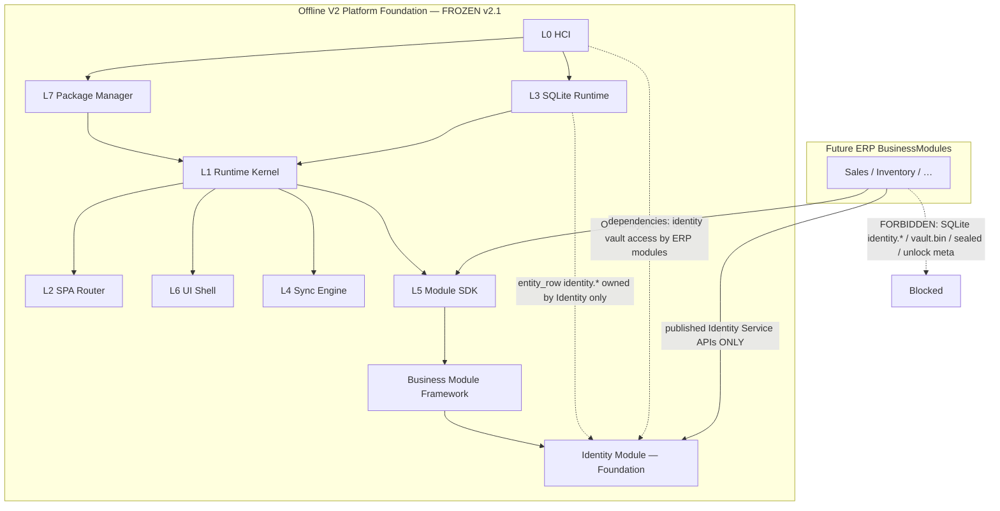
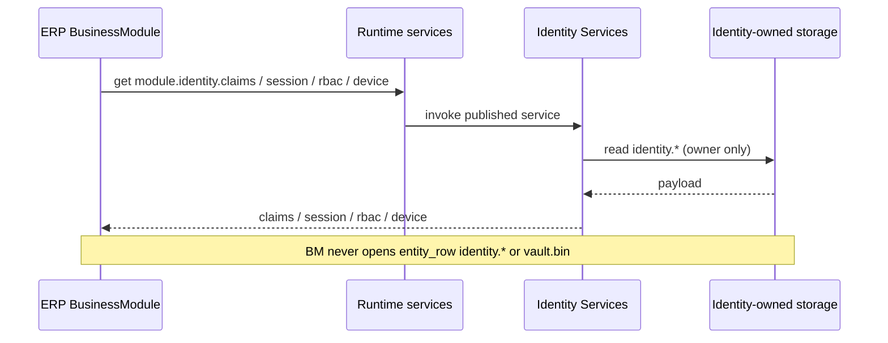
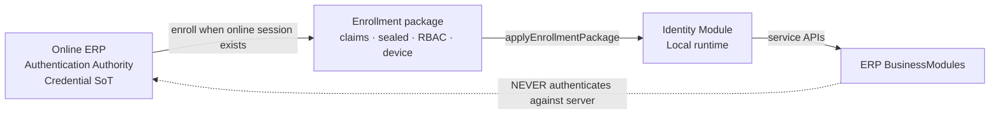

# Architecture Freeze v2.1 — Dependency Diagram

**Binding companion to:** `AF-2.1-ARCHITECTURE-FREEZE.md`

## 1. Platform foundation stack



## 2. Identity consumption path (allowed)



## 3. Authentication authority



## 4. Dependency declaration (required)

Future modules **must** declare:

```json
{
  "dependencies": [
    { "id": "identity", "version": ">=1.0.0" }
  ]
}
```

Validated by Business Module Framework `validateDependencies` before activation.
