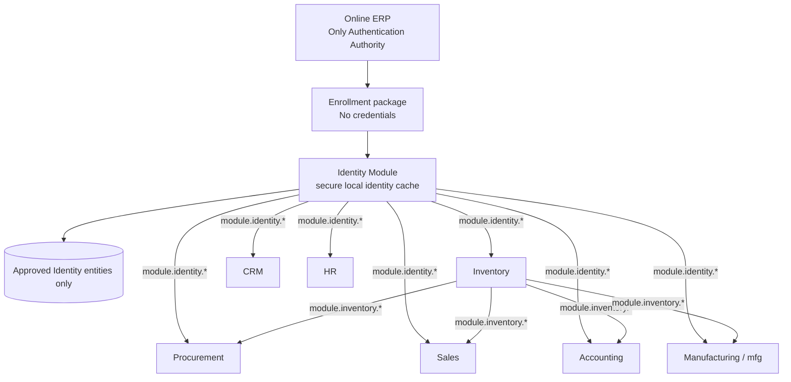

# Phase PX2.1 — AF 2.1 / AF 2.1.1 Architecture Compliance

**Result:** PASS  
**Category B violations after remediation:** 0  
**Authentication Authority:** Online ERP only  
**Architecture Board state:** Awaiting approval; PX3 must not start

## Scope audited

Production Offline V2 BusinessModules:

- Identity
- Inventory
- Procurement
- Sales
- Accounting
- CRM
- HR
- Manufacturing (`mfg`)
- Reference framework fixture

There is no Offline V2 `branches-module.js`. Branch scope is represented by the
approved `branch_id` Identity Claim and consumed through published Identity
claims APIs.

## Storage allowlist

| Entity class | Owner | Allowed purpose | Result |
|---|---|---|---|
| `identity.sealed` | Identity | Sealed Identity | PASS |
| `identity.claims` | Identity | Identity Claims | PASS |
| `identity.rbac` | Identity | RBAC Snapshot | PASS |
| `identity.device` | Identity | Device Trust State | PASS |
| `identity.unlock_meta` | Identity | Unlock verifier and unlock policy metadata | PASS |

Forbidden legacy classes are cleanup-only constants. They can be read only by
Identity's one-time migration and are deleted/checkpointed immediately:

- `identity.config`
- `identity.local_session`
- `identity.security_meta`

No runtime API writes any of those classes.

## BusinessModule Identity access

### Normal runtime paths

Non-Identity BusinessModules resolve Identity through Runtime services:

```text
module.identity.session
module.identity.claims
module.identity.rbac
module.identity.device
```

No non-Identity module SQL statement contains an Identity entity filter after
remediation.

### Negative boundary probes

Accounting, CRM, HR, Manufacturing, Procurement, and Sales contain namespace
guard tests that pass forbidden/non-owned entity names into private stores.
Their store guards reject before `db.exec()`; therefore these tests perform no
Identity read or write. They verify the boundary rather than bypass it.

Inventory now uses a positive `inv.*` allowlist for all repository operations.
Its previous direct Identity-row counting query was removed.

## Direct-access audit

| Check | Result | Evidence |
|---|---|---|
| Non-Identity SQL reads `identity.*` | PASS | zero matches at SQL boundaries |
| Non-Identity SQL writes `identity.*` | PASS | namespace guards reject before SQL |
| Identity stores only approved active classes | PASS | runtime entity-type query |
| Direct Identity SQLite-table access | PASS | zero outside Identity owner/migration |
| `vault.bin` access | PASS | zero BusinessModule matches |
| Identity OPFS path access | PASS | zero BusinessModule matches |
| Password storage | PASS | rejected by `assertNoSecrets` |
| Password-hash storage | PASS | none; local unlock verifier is approved Unlock Metadata, not an Online ERP password hash |
| Session-cookie storage | PASS | none |
| Bearer/JWT/API-token storage | PASS | none |
| TOTP/WebAuthn server secrets | PASS | none |
| Credential synchronization | PASS | hard-refused |
| Online ERP remains Authentication Authority | PASS | enrollment bridge requires existing Online session and never authenticates |

Identity uses HCI only for generic reachability in the Online enrollment bridge.
It does not access HCI/OPFS Identity storage, `vault.bin`, or a private Identity
database.

## Configuration and session-state decision

### Unlock policy

The three enrollment policy values are part of local unlock behavior and now
live inside approved Unlock Metadata:

```text
unlock_ttl_sec
idle_ttl_sec
max_offline_sec
```

They do not grant Online ERP authentication and contain no credential.

### Derived session

Derived unlocked state is held in `IdentityModule._session` only.

- It is never serialized.
- It is never synchronized.
- A reload/process restart returns to locked state.
- Expiry and lock clear it in memory.

### Security diagnostics

Security findings are computed on demand by `securityScan()` and returned to
the caller. No diagnostic entity is persisted.

## Dependency graph



No edge represents direct Identity storage access.

## Frozen-layer verification

Unchanged:

- HCI
- Runtime
- Package Manager
- SQLite Runtime
- Router
- Shell
- Sync Engine
- Module SDK
- Business Module Framework
- Offline V1

Only the two violating BusinessModules and PX2.1 evidence documents changed.

## Test matrix

| Test | Result |
|---|---|
| Identity syntax/lint | PASS |
| Inventory syntax/lint | PASS |
| Legacy-row migration | PASS |
| Migration survives DB close/reload | PASS |
| Identity self-test | PASS |
| Inventory self-test | PASS |
| Procurement self-test | PASS |
| Sales self-test | PASS |
| Accounting self-test | PASS |
| Manufacturing self-test | PASS |
| CRM self-test | `workflow_denied_invalid` assertion failure observed; no Identity boundary failure |
| HR self-test | `workflow_denied_invalid` assertion failure observed; no Identity boundary failure |

The CRM/HR workflow assertions are outside PX2.1 and do not represent Category
B Identity access. They were not modified.

## Final determination

All two reported Category B findings are remediated:

1. Forbidden persistent Identity classes: removed/migrated.
2. Inventory direct Identity SQL: removed.

**Category B count: 0 — PASS.**
