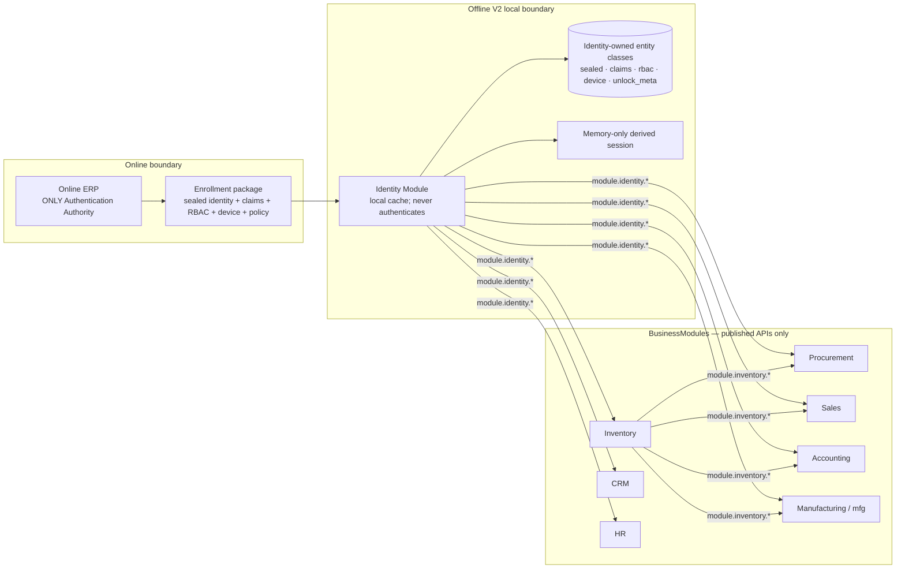

# Phase PX2.1 — Updated Identity Dependency Graph

**Boundary status:** Category B violations = 0

## Mandatory dependency declarations

| Module | Mandatory dependencies | Identity access |
|---|---|---|
| Identity | Platform DB/runtime only | Owns approved local cache |
| Inventory | Identity | `module.identity.*` |
| Procurement | Identity, Inventory | `module.identity.*`, `module.inventory.*` |
| Sales | Identity, Inventory | `module.identity.*`, `module.inventory.*` |
| Accounting | Identity, Inventory | `module.identity.*`, `module.inventory.*` |
| CRM | Identity | `module.identity.*` |
| HR | Identity | `module.identity.*` |
| Manufacturing (`mfg`) | Identity, Inventory | `module.identity.*`, `module.inventory.*` |

Optional cross-module APIs remain unchanged.

## Explicitly absent edges

- No BusinessModule → Identity SQLite edge.
- No BusinessModule → Identity OPFS edge.
- No BusinessModule → `vault.bin` edge.
- No Identity → credential store edge.
- No Identity → credential Sync edge.
- No Identity → authentication-authority edge.

## Branch scope

Offline V2 has no standalone Branches BusinessModule. `branch_id` is an
approved Identity Claim supplied by Online ERP and consumed through
`module.identity.claims`.
