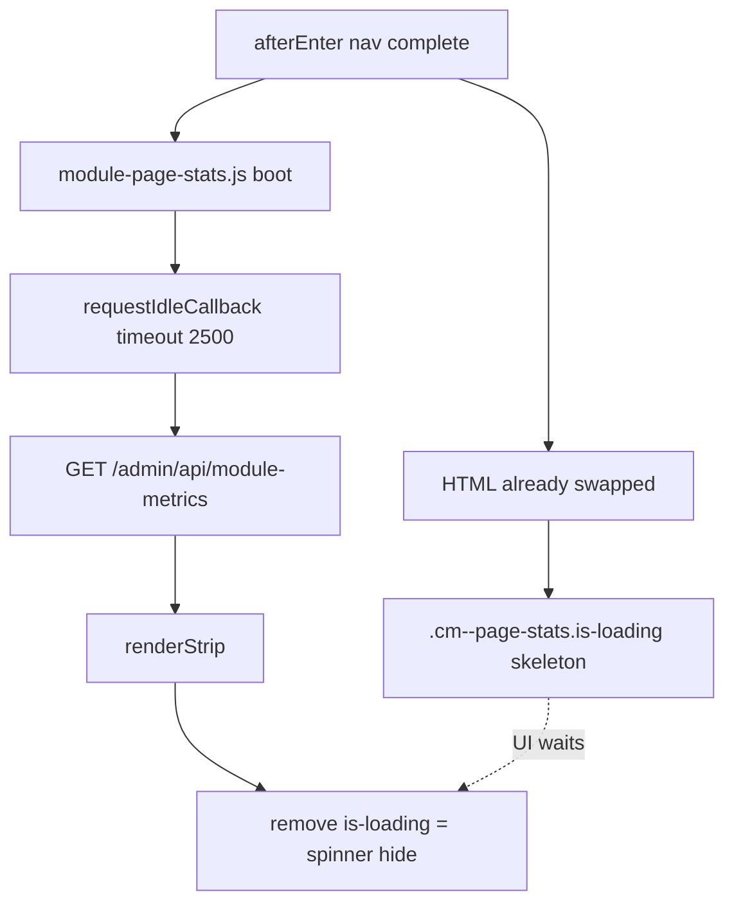

# MODULE LOADING RCA (Evidence Only)

**Date:** 2026-07-18T14:51:19.833Z

**Scope:** Post-navigation module bootstrap only (`rateb:nav:afterEnter` → spinner hide). Navigation pipeline not re-audited.

**Modules:** Inventory, Purchasing, HR, Sales (Customers) — first visit then immediate second.

## Verdict: What keeps the loading indicator visible?

The visible “loading” on module pages is primarily **`.cm--page-stats.is-loading`** — the async KPI/metrics skeleton (`views/components/module-page-stats.php` + shimmer in `dashboard.css`).

It stays until **`module-page-stats.js`** finishes:

1. `boot()` on `afterEnter` (or on script load)
2. **`requestIdleCallback(run, { timeout: 2500 })`** — can delay fetch up to **2.5 s**
3. `fetch(admin/api/module-metrics?route=…)`
4. `renderStrip()` → **`classList.remove('is-loading')`** ← spinner/skeleton disappears

**Operation that finishes immediately before spinner hide:** metrics JSON response processed → `page_stats_is_loading_removed` (same tick as hide).

## First vs second

| Module | 1st afterEnter→hide (ms) | 2nd afterEnter→hide (ms) | 1st metrics AJAX (ms) | Idle wait (ms) | Keeping indicator |
|--------|--------------------------|--------------------------|----------------------|----------------|-------------------|
| Inventory | 12013.7 | 12049.8 | null | 6.8 | .cm--page-stats.is-loading (module metrics skeleton) |
| Purchasing | 12048.2 | 12009.3 | null | 5.4 | .cm--page-stats.is-loading (module metrics skeleton) |
| HR | 12021.9 | 12017.7 | null | 16.3 | .cm--page-stats.is-loading (module metrics skeleton) |
| Sales | undefined | undefined | undefined | undefined | undefined |

## Dependency graph (code + measured)



## Inventory — first

- href: `https://rateb.sa/rateb-erp/public/admin/ops/inventory?company_id=22`
- nav fromCache: false
- **keeping spinner:** .cm--page-stats.is-loading (module metrics skeleton)
- afterEnter → hide: **12013.7 ms**
- spinner visible total: 11987.7 ms
- **immediate event before hide:** `{"t":7456.899999976158,"type":"requestIdleCallback_fired","waited":17.19999998807907,"timeout":3000}`
- **immediate request before hide:** `{"kind":"fetch","url":"https://rateb.sa/rateb-platform-catalog/admin","tStart":12924.799999982119,"initiator":"fetch","stack":["at runPrefetchQueue (https://rateb.sa/rateb-erp/public/assets/js/erp-nav-instant.js?v=20260718-fix-sidebar-init-v58:219:17)","at prefetchUrl (https://rateb.sa/rateb-erp/public/assets/js/erp-nav-instant.js?v=20260718-fix-sidebar-init-v58:271:9)","at https://rateb.sa/rateb-erp/public/assets/js/erp-nav-instant.js?v=20260718-fix-sidebar-init-v58:331:25"],"status":200,"tHeaders":13442.09999999404,"tEnd":13442.699999988079,"duration":517.9000000059605,"bodyBytes":21099,"type":"text","category":"other","uiWaits":false}`

### DOM at afterEnter

```json
{
  "hasPageStats": true,
  "pageStatsLoading": true,
  "metricsUrl": "https://rateb.sa/rateb-erp/public/admin/api/module-metrics?route=admin%2Fops%2Finventory",
  "metricsLoadedFlag": null,
  "modulePageStatsJsPresent": false,
  "skeleton": true,
  "mainTextLen": 560
}
```

### Waterfall (ms from afterEnter)

| Stage | t (ms) |
|-------|--------|
| nav_complete_afterEnter | 0 |
| spinner_first_seen | 26 |
| module_page_stats_js | null |
| idle_callback_fired | -39.2 |
| metrics_response | null |
| page_stats_is_loading_removed | null |
| spinner_final_hide | 12013.7 |

### Metrics AJAX (UI waits: YES)

```json
null
```

### Other AJAX / fetch

```json
[
  {
    "url": "https://rateb.sa/rateb-erp/public/admin/ops/inventory?company_id=22",
    "duration": 152.3,
    "category": "other",
    "uiWaits": false,
    "status": 200,
    "tStart": -160.1,
    "tEnd": -7.8
  },
  {
    "url": "/rateb-erp/public/connectivity-probe.json?_rateb_probe=1784386198583",
    "duration": null,
    "category": "other",
    "uiWaits": false,
    "status": 200,
    "tStart": 246.6,
    "tEnd": null
  },
  {
    "url": "https://rateb.sa/rateb-erp/public/assets/css/critical-shell.css?v=20260718-fix-sidebar-init-v58",
    "duration": null,
    "category": "other",
    "uiWaits": false,
    "status": 200,
    "tStart": 5445,
    "tEnd": null
  },
  {
    "url": "https://rateb.sa/rateb-erp/public/assets/css/dark.css?v=20260718-fix-sidebar-init-v58",
    "duration": null,
    "category": "other",
    "uiWaits": false,
    "status": 200,
    "tStart": 5445.8,
    "tEnd": null
  },
  {
    "url": "https://rateb.sa/rateb-erp/public/assets/vendor/fonts/tajawal/tajawal-critical.css?v=20260718-fix-sidebar-init-v58",
    "duration": null,
    "category": "other",
    "uiWaits": false,
    "status": 200,
    "tStart": 5446.1,
    "tEnd": null
  },
  {
    "url": "https://rateb.sa/rateb-erp/public/assets/vendor/bootstrap/5.3.3/bootstrap.rtl.min.css?v=20260718-fix-sidebar-init-v58",
    "duration": null,
    "category": "other",
    "uiWaits": false,
    "status": 200,
    "tStart": 5446.5,
    "tEnd": null
  },
  {
    "url": "https://rateb.sa/rateb-erp/public/assets/css/variables.css?v=20260718-fix-sidebar-init-v58",
    "duration": null,
    "category": "other",
    "uiWaits": false,
    "status": 200,
    "tStart": 5446.7,
    "tEnd": null
  },
  {
    "url": "https://rateb.sa/rateb-erp/public/assets/css/main.css?v=20260718-fix-sidebar-init-v58",
    "duration": null,
    "category": "other",
    "uiWaits": false,
    "status": 200,
    "tStart": 5447,
    "tEnd": null
  },
  {
    "url": "https://rateb.sa/rateb-erp/public/assets/css/components.css?v=20260718-fix-sidebar-init-v58",
    "duration": null,
    "category": "other",
    "uiWaits": false,
    "status": 200,
    "tStart": 5447.1,
    "tEnd": null
  },
  {
    "url": "https://rateb.sa/rateb-erp/public/assets/css/rtl.css?v=20260718-fix-sidebar-init-v58",
    "duration": null,
    "category": "other",
    "uiWaits": false,
    "status": 200,
    "tStart": 5447.3,
    "tEnd": null
  },
  {
    "url": "https://rateb.sa/rateb-erp/public/assets/vendor/fontawesome/6.5.2/css/shell.min.css?v=20260718-fix-sidebar-init-v58",
    "duration": null,
    "category": "other",
    "uiWaits": false,
    "status": 200,
    "tStart": 5447.4,
    "tEnd": null
  },
  {
    "url": "https://rateb.sa/rateb-erp/public/assets/css/dashboard.css?v=20260718-fix-sidebar-init-v58",
    "duration": null,
    "category": "other",
    "uiWaits": false,
    "status": 200,
    "tStart": 5447.6,
    "tEnd": null
  },
  {
    "url": "https://rateb.sa/rateb-erp/public/assets/css/ar-typography.css?v=20260718-fix-sidebar-init-v58",
    "duration": null,
    "category": "charts",
    "uiWaits": false,
    "status": 200,
    "tStart": 5447.8,
    "tEnd": null
  },
  {
    "url": "https://rateb.sa/rateb-erp/public/assets/vendor/fonts/tajawal/tajawal-rest.css?v=20260718-fix-sidebar-init-v58",
    "duration": null,
    "category": "other",
    "uiWaits": false,
    "status": 200,
    "tStart": 5448,
    "tEnd": null
  },
  {
    "url": "https://rateb.sa/rateb-erp/public/assets/css/critical-shell.css?v=20260718-fix-sidebar-init-v58",
    "duration": null,
    "category": "other",
    "uiWaits": false,
    "status": 200,
    "tStart": 5448.5,
    "tEnd": null
  },
  {
    "url": "https://rateb.sa/rateb-erp/public/assets/css/dark.css?v=20260718-fix-sidebar-init-v58",
    "duration": null,
    "category": "other",
    "uiWaits": false,
    "status": 200,
    "tStart": 5449.3,
    "tEnd": null
  },
  {
    "url": "https://rateb.sa/rateb-erp/public/assets/vendor/fonts/tajawal/tajawal-critical.css?v=20260718-fix-sidebar-init-v58",
    "duration": null,
    "category": "other",
    "uiWaits": false,
    "status": 200,
    "tStart": 5449.5,
    "tEnd": null
  },
  {
    "url": "https://rateb.sa/rateb-erp/public/assets/vendor/bootstrap/5.3.3/bootstrap.rtl.min.css?v=20260718-fix-sidebar-init-v58",
    "duration": null,
    "category": "other",
    "uiWaits": false,
    "status": 200,
    "tStart": 5449.7,
    "tEnd": null
  },
  {
    "url": "https://rateb.sa/rateb-erp/public/assets/css/variables.css?v=20260718-fix-sidebar-init-v58",
    "duration": null,
    "category": "other",
    "uiWaits": false,
    "status": 200,
    "tStart": 5449.9,
    "tEnd": null
  },
  {
    "url": "https://rateb.sa/rateb-erp/public/assets/css/main.css?v=20260718-fix-sidebar-init-v58",
    "duration": null,
    "category": "other",
    "uiWaits": false,
    "status": 200,
    "tStart": 5450.3,
    "tEnd": null
  },
  {
    "url": "https://rateb.sa/rateb-erp/public/assets/css/components.css?v=20260718-fix-sidebar-init-v58",
    "duration": null,
    "category": "other",
    "uiWaits": false,
    "status": 200,
    "tStart": 5450.6,
    "tEnd": null
  },
  {
    "url": "https://rateb.sa/rateb-erp/public/assets/css/rtl.css?v=20260718-fix-sidebar-init-v58",
    "duration": null,
    "category": "other",
    "uiWaits": false,
    "status": 200,
    "tStart": 5451.3,
    "tEnd": null
  },
  {
    "url": "https://rateb.sa/rateb-erp/public/assets/vendor/fontawesome/6.5.2/css/shell.min.css?v=20260718-fix-sidebar-init-v58",
    "duration": null,
    "category": "other",
    "uiWaits": false,
    "status": 200,
    "tStart": 5451.6,
    "tEnd": null
  },
  {
    "url": "https://rateb.sa/rateb-erp/public/assets/css/dashboard.css?v=20260718-fix-sidebar-init-v58",
    "duration": null,
    "category": "other",
    "uiWaits": false,
    "status": 200,
    "tStart": 5452,
    "tEnd": null
  },
  {
    "url": "https://rateb.sa/rateb-erp/public/assets/css/ar-typography.css?v=20260718-fix-sidebar-init-v58",
    "duration": null,
    "category": "charts",
    "uiWaits": false,
    "status": 200,
    "tStart": 5452.2,
    "tEnd": null
  },
  {
    "url": "https://rateb.sa/rateb-erp/public/assets/vendor/fonts/tajawal/tajawal-rest.css?v=20260718-fix-sidebar-init-v58",
    "duration": null,
    "category": "other",
    "uiWaits": false,
    "status": 200,
    "tStart": 5452.4,
    "tEnd": null
  },
  {
    "url": "https://rateb.sa/rateb-erp/public/admin",
    "duration": 586.5,
    "category": "other",
    "uiWaits": false,
    "status": 200,
    "tStart": 8401.7,
    "tEnd": 8988.2
  },
  {
    "url": "https://rateb.sa/rateb-platform-catalog/admin",
    "duration": 517.9,
    "category": "other",
    "uiWaits": false,
    "status": 200,
    "tStart": 10912.5,
    "tEnd": 11430.4
  }
]
```

### Scripts loaded during window

```json
[
  {
    "url": "https://rateb.sa/rateb-erp/public/assets/js/rateb-confirm.js?v=20260718-fix-sidebar-init-v58",
    "duration": 108.2,
    "tStart": -154.2,
    "tEnd": -46
  },
  {
    "url": "https://rateb.sa/rateb-erp/public/assets/vendor/chartjs/4.4.3/chart.umd.min.js?v=20260718-fix-sidebar-init-v58",
    "duration": 141.6,
    "tStart": -39,
    "tEnd": 102.6
  },
  {
    "url": "https://rateb.sa/rateb-erp/public/assets/js/charts.js?v=20260718-fix-sidebar-init-v58",
    "duration": 111.3,
    "tStart": 102.2,
    "tEnd": 213.5
  }
]
```

### Event log

```json
[
  {
    "t": 1834.2999999821186,
    "type": "arm",
    "t_from_afterEnter": -178
  },
  {
    "t": 1966.2999999821186,
    "type": "requestIdleCallback_scheduled",
    "timeout": 6000,
    "t_from_afterEnter": -46
  },
  {
    "t": 1973.0999999940395,
    "type": "requestIdleCallback_fired",
    "waited": 6.800000011920929,
    "timeout": 6000,
    "t_from_afterEnter": -39.2
  },
  {
    "t": 2012.2999999821186,
    "type": "nav_complete_afterEnter",
    "fromCache": false,
    "navMs": 175,
    "t_from_afterEnter": 0
  },
  {
    "t": 2038.2999999821186,
    "type": "spinner_first_seen",
    "count": 2,
    "t_from_afterEnter": 26
  },
  {
    "t": 2114.899999976158,
    "type": "chart_js_loaded",
    "url": "https://rateb.sa/rateb-erp/public/assets/vendor/chartjs/4.4.3/chart.umd.min.js?v=20260718-fix-sidebar-init-v58",
    "ms": 141.59999999403954,
    "t_from_afterEnter": 102.6
  },
  {
    "t": 2225.7999999821186,
    "type": "chart_js_loaded",
    "url": "https://rateb.sa/rateb-erp/public/assets/js/charts.js?v=20260718-fix-sidebar-init-v58",
    "ms": 111.2999999821186,
    "t_from_afterEnter": 213.5
  },
  {
    "t": 2256.2999999821186,
    "type": "requestIdleCallback_scheduled",
    "timeout": 1200,
    "t_from_afterEnter": 244
  },
  {
    "t": 2258.199999988079,
    "type": "requestIdleCallback_fired",
    "waited": 1.9000000059604645,
    "timeout": 1200,
    "t_from_afterEnter": 245.9
  },
  {
    "t": 3406.899999976158,
    "type": "requestIdleCallback_scheduled",
    "timeout": 3000,
    "t_from_afterEnter": 1394.6
  },
  {
    "t": 3423.199999988079,
    "type": "requestIdleCallback_fired",
    "waited": 16.30000001192093,
    "timeout": 3000,
    "t_from_afterEnter": 1410.9
  },
  {
    "t": 6403.799999982119,
    "type": "requestIdleCallback_scheduled",
    "timeout": 15000,
    "t_from_afterEnter": 4391.5
  },
  {
    "t": 6407.5999999940395,
    "type": "requestIdleCallback_fired",
    "waited": 3.800000011920929,
    "timeout": 15000,
    "t_from_afterEnter": 4395.3
  },
  {
    "t": 7439.699999988079,
    "type": "requestIdleCallback_scheduled",
    "timeout": 3000,
    "t_from_afterEnter": 5427.4
  },
  {
    "t": 7456.899999976158,
    "type": "requestIdleCallback_fired",
    "waited": 17.19999998807907,
    "timeout": 3000,
    "t_from_afterEnter": 5444.6
  },
  {
    "t": 14026,
    "type": "spinner_final_hide_forced",
    "stillLoading": true,
    "t_from_afterEnter": 12013.7
  }
]
```

### Measured graph timestamps (from afterEnter)

```json
{
  "afterEnter_t": 0,
  "idle_callback_fired_t": -39.2,
  "metrics_response_t": null,
  "page_stats_loading_removed_t": null,
  "spinner_final_hide_t": 12013.7,
  "first_module_stats_js_t": null
}
```

## Inventory — second

- href: `https://rateb.sa/rateb-erp/public/admin/ops/inventory?company_id=22`
- nav fromCache: true
- **keeping spinner:** .cm--page-stats.is-loading (module metrics skeleton)
- afterEnter → hide: **12049.8 ms**
- spinner visible total: 12032.8 ms
- **immediate event before hide:** `{"t":6436.699999988079,"type":"requestIdleCallback_fired","waited":8.299999982118607,"timeout":3000}`
- **immediate request before hide:** `{"kind":"fetch","url":"https://rateb.sa/rateb-platform-catalog/admin","tStart":11936.09999999404,"initiator":"fetch","stack":["at runPrefetchQueue (https://rateb.sa/rateb-erp/public/assets/js/erp-nav-instant.js?v=20260718-fix-sidebar-init-v58:219:17)","at prefetchUrl (https://rateb.sa/rateb-erp/public/assets/js/erp-nav-instant.js?v=20260718-fix-sidebar-init-v58:271:9)","at https://rateb.sa/rateb-erp/public/assets/js/erp-nav-instant.js?v=20260718-fix-sidebar-init-v58:331:25"],"status":200,"tHeaders":12174.40000000596,"tEnd":12175.199999988079,"duration":239.09999999403954,"bodyBytes":21099,"type":"text","category":"other","uiWaits":false}`

### DOM at afterEnter

```json
{
  "hasPageStats": true,
  "pageStatsLoading": true,
  "metricsUrl": "https://rateb.sa/rateb-erp/public/admin/api/module-metrics?route=admin%2Fops%2Finventory",
  "metricsLoadedFlag": null,
  "modulePageStatsJsPresent": false,
  "skeleton": true,
  "mainTextLen": 560
}
```

### Waterfall (ms from afterEnter)

| Stage | t (ms) |
|-------|--------|
| nav_complete_afterEnter | 0 |
| spinner_first_seen | 17 |
| module_page_stats_js | null |
| idle_callback_fired | 16 |
| metrics_response | null |
| page_stats_is_loading_removed | null |
| spinner_final_hide | 12049.8 |

### Metrics AJAX (UI waits: YES)

```json
null
```

### Other AJAX / fetch

```json
[
  {
    "url": "https://rateb.sa/rateb-erp/public/admin/ops/inventory?company_id=22",
    "duration": 138.2,
    "category": "other",
    "uiWaits": false,
    "status": 200,
    "tStart": -10.8,
    "tEnd": 127.4
  },
  {
    "url": "/rateb-erp/public/connectivity-probe.json?_rateb_probe=1784386211448",
    "duration": null,
    "category": "other",
    "uiWaits": false,
    "status": 200,
    "tStart": 201.1,
    "tEnd": null
  },
  {
    "url": "https://rateb.sa/rateb-erp/public/assets/css/critical-shell.css?v=20260718-fix-sidebar-init-v58",
    "duration": null,
    "category": "other",
    "uiWaits": false,
    "status": 200,
    "tStart": 5584.8,
    "tEnd": null
  },
  {
    "url": "https://rateb.sa/rateb-erp/public/assets/css/dark.css?v=20260718-fix-sidebar-init-v58",
    "duration": null,
    "category": "other",
    "uiWaits": false,
    "status": 200,
    "tStart": 5585.4,
    "tEnd": null
  },
  {
    "url": "https://rateb.sa/rateb-erp/public/assets/vendor/fonts/tajawal/tajawal-critical.css?v=20260718-fix-sidebar-init-v58",
    "duration": null,
    "category": "other",
    "uiWaits": false,
    "status": 200,
    "tStart": 5585.5,
    "tEnd": null
  },
  {
    "url": "https://rateb.sa/rateb-erp/public/assets/vendor/bootstrap/5.3.3/bootstrap.rtl.min.css?v=20260718-fix-sidebar-init-v58",
    "duration": null,
    "category": "other",
    "uiWaits": false,
    "status": 200,
    "tStart": 5585.8,
    "tEnd": null
  },
  {
    "url": "https://rateb.sa/rateb-erp/public/assets/css/variables.css?v=20260718-fix-sidebar-init-v58",
    "duration": null,
    "category": "other",
    "uiWaits": false,
    "status": 200,
    "tStart": 5586,
    "tEnd": null
  },
  {
    "url": "https://rateb.sa/rateb-erp/public/assets/css/main.css?v=20260718-fix-sidebar-init-v58",
    "duration": null,
    "category": "other",
    "uiWaits": false,
    "status": 200,
    "tStart": 5586,
    "tEnd": null
  },
  {
    "url": "https://rateb.sa/rateb-erp/public/assets/css/components.css?v=20260718-fix-sidebar-init-v58",
    "duration": null,
    "category": "other",
    "uiWaits": false,
    "status": 200,
    "tStart": 5586.3,
    "tEnd": null
  },
  {
    "url": "https://rateb.sa/rateb-erp/public/assets/css/rtl.css?v=20260718-fix-sidebar-init-v58",
    "duration": null,
    "category": "other",
    "uiWaits": false,
    "status": 200,
    "tStart": 5586.5,
    "tEnd": null
  },
  {
    "url": "https://rateb.sa/rateb-erp/public/assets/vendor/fontawesome/6.5.2/css/shell.min.css?v=20260718-fix-sidebar-init-v58",
    "duration": null,
    "category": "other",
    "uiWaits": false,
    "status": 200,
    "tStart": 5586.7,
    "tEnd": null
  },
  {
    "url": "https://rateb.sa/rateb-erp/public/assets/css/dashboard.css?v=20260718-fix-sidebar-init-v58",
    "duration": null,
    "category": "other",
    "uiWaits": false,
    "status": 200,
    "tStart": 5587,
    "tEnd": null
  },
  {
    "url": "https://rateb.sa/rateb-erp/public/assets/css/ar-typography.css?v=20260718-fix-sidebar-init-v58",
    "duration": null,
    "category": "charts",
    "uiWaits": false,
    "status": 200,
    "tStart": 5587.2,
    "tEnd": null
  },
  {
    "url": "https://rateb.sa/rateb-erp/public/assets/vendor/fonts/tajawal/tajawal-rest.css?v=20260718-fix-sidebar-init-v58",
    "duration": null,
    "category": "other",
    "uiWaits": false,
    "status": 200,
    "tStart": 5587.3,
    "tEnd": null
  },
  {
    "url": "https://rateb.sa/rateb-erp/public/assets/css/critical-shell.css?v=20260718-fix-sidebar-init-v58",
    "duration": null,
    "category": "other",
    "uiWaits": false,
    "status": 200,
    "tStart": 5587.8,
    "tEnd": null
  },
  {
    "url": "https://rateb.sa/rateb-erp/public/assets/css/dark.css?v=20260718-fix-sidebar-init-v58",
    "duration": null,
    "category": "other",
    "uiWaits": false,
    "status": 200,
    "tStart": 5587.9,
    "tEnd": null
  },
  {
    "url": "https://rateb.sa/rateb-erp/public/assets/vendor/fonts/tajawal/tajawal-critical.css?v=20260718-fix-sidebar-init-v58",
    "duration": null,
    "category": "other",
    "uiWaits": false,
    "status": 200,
    "tStart": 5588.1,
    "tEnd": null
  },
  {
    "url": "https://rateb.sa/rateb-erp/public/assets/vendor/bootstrap/5.3.3/bootstrap.rtl.min.css?v=20260718-fix-sidebar-init-v58",
    "duration": null,
    "category": "other",
    "uiWaits": false,
    "status": 200,
    "tStart": 5588.3,
    "tEnd": null
  },
  {
    "url": "https://rateb.sa/rateb-erp/public/assets/css/variables.css?v=20260718-fix-sidebar-init-v58",
    "duration": null,
    "category": "other",
    "uiWaits": false,
    "status": 200,
    "tStart": 5588.5,
    "tEnd": null
  },
  {
    "url": "https://rateb.sa/rateb-erp/public/assets/css/main.css?v=20260718-fix-sidebar-init-v58",
    "duration": null,
    "category": "other",
    "uiWaits": false,
    "status": 200,
    "tStart": 5588.8,
    "tEnd": null
  },
  {
    "url": "https://rateb.sa/rateb-erp/public/assets/css/components.css?v=20260718-fix-sidebar-init-v58",
    "duration": null,
    "category": "other",
    "uiWaits": false,
    "status": 200,
    "tStart": 5589,
    "tEnd": null
  },
  {
    "url": "https://rateb.sa/rateb-erp/public/assets/css/rtl.css?v=20260718-fix-sidebar-init-v58",
    "duration": null,
    "category": "other",
    "uiWaits": false,
    "status": 200,
    "tStart": 5589.2,
    "tEnd": null
  },
  {
    "url": "https://rateb.sa/rateb-erp/public/assets/vendor/fontawesome/6.5.2/css/shell.min.css?v=20260718-fix-sidebar-init-v58",
    "duration": null,
    "category": "other",
    "uiWaits": false,
    "status": 200,
    "tStart": 5589.5,
    "tEnd": null
  },
  {
    "url": "https://rateb.sa/rateb-erp/public/assets/css/dashboard.css?v=20260718-fix-sidebar-init-v58",
    "duration": null,
    "category": "other",
    "uiWaits": false,
    "status": 200,
    "tStart": 5589.6,
    "tEnd": null
  },
  {
    "url": "https://rateb.sa/rateb-erp/public/assets/css/ar-typography.css?v=20260718-fix-sidebar-init-v58",
    "duration": null,
    "category": "charts",
    "uiWaits": false,
    "status": 200,
    "tStart": 5589.8,
    "tEnd": null
  },
  {
    "url": "https://rateb.sa/rateb-erp/public/assets/vendor/fonts/tajawal/tajawal-rest.css?v=20260718-fix-sidebar-init-v58",
    "duration": null,
    "category": "other",
    "uiWaits": false,
    "status": 200,
    "tStart": 5589.9,
    "tEnd": null
  },
  {
    "url": "https://rateb.sa/rateb-erp/public/admin",
    "duration": 265,
    "category": "other",
    "uiWaits": false,
    "status": 200,
    "tStart": 8578.6,
    "tEnd": 8843.6
  },
  {
    "url": "https://rateb.sa/rateb-platform-catalog/admin",
    "duration": 239.1,
    "category": "other",
    "uiWaits": false,
    "status": 200,
    "tStart": 11082.5,
    "tEnd": 11321.6
  }
]
```

### Scripts loaded during window

```json
[]
```

### Event log

```json
[
  {
    "t": 835.4000000059605,
    "type": "arm",
    "t_from_afterEnter": -18.2
  },
  {
    "t": 853.5999999940395,
    "type": "nav_complete_afterEnter",
    "fromCache": true,
    "navMs": 13,
    "t_from_afterEnter": 0
  },
  {
    "t": 864.6999999880791,
    "type": "requestIdleCallback_scheduled",
    "timeout": 1500,
    "t_from_afterEnter": 11.1
  },
  {
    "t": 869.5999999940395,
    "type": "requestIdleCallback_fired",
    "waited": 4.9000000059604645,
    "timeout": 1500,
    "t_from_afterEnter": 16
  },
  {
    "t": 870.5999999940395,
    "type": "spinner_first_seen",
    "count": 2,
    "t_from_afterEnter": 17
  },
  {
    "t": 1046.5,
    "type": "requestIdleCallback_scheduled",
    "timeout": 1200,
    "t_from_afterEnter": 192.9
  },
  {
    "t": 1054.2999999821186,
    "type": "requestIdleCallback_fired",
    "waited": 7.799999982118607,
    "timeout": 1200,
    "t_from_afterEnter": 200.7
  },
  {
    "t": 2404.5,
    "type": "requestIdleCallback_scheduled",
    "timeout": 3000,
    "t_from_afterEnter": 1550.9
  },
  {
    "t": 2423.699999988079,
    "type": "requestIdleCallback_fired",
    "waited": 19.19999998807907,
    "timeout": 3000,
    "t_from_afterEnter": 1570.1
  },
  {
    "t": 5403.5999999940395,
    "type": "requestIdleCallback_scheduled",
    "timeout": 15000,
    "t_from_afterEnter": 4550
  },
  {
    "t": 5420,
    "type": "requestIdleCallback_fired",
    "waited": 16.400000005960464,
    "timeout": 15000,
    "t_from_afterEnter": 4566.4
  },
  {
    "t": 6428.4000000059605,
    "type": "requestIdleCallback_scheduled",
    "timeout": 3000,
    "t_from_afterEnter": 5574.8
  },
  {
    "t": 6436.699999988079,
    "type": "requestIdleCallback_fired",
    "waited": 8.299999982118607,
    "timeout": 3000,
    "t_from_afterEnter": 5583.1
  },
  {
    "t": 12903.40000000596,
    "type": "spinner_final_hide_forced",
    "stillLoading": true,
    "t_from_afterEnter": 12049.8
  }
]
```

### Measured graph timestamps (from afterEnter)

```json
{
  "afterEnter_t": 0,
  "idle_callback_fired_t": 16,
  "metrics_response_t": null,
  "page_stats_loading_removed_t": null,
  "spinner_final_hide_t": 12049.8,
  "first_module_stats_js_t": null
}
```

## Purchasing — first

- href: `https://rateb.sa/rateb-erp/public/admin/ops/purchase-requests?company_id=22`
- nav fromCache: false
- **keeping spinner:** .cm--page-stats.is-loading (module metrics skeleton)
- afterEnter → hide: **12048.2 ms**
- spinner visible total: 12018.8 ms
- **immediate event before hide:** `{"t":6246.699999988079,"type":"requestIdleCallback_fired","waited":17.5,"timeout":3000}`
- **immediate request before hide:** `{"kind":"fetch","url":"https://rateb.sa/rateb-platform-catalog/admin","tStart":11746,"initiator":"fetch","stack":["at runPrefetchQueue (https://rateb.sa/rateb-erp/public/assets/js/erp-nav-instant.js?v=20260718-fix-sidebar-init-v58:219:17)","at prefetchUrl (https://rateb.sa/rateb-erp/public/assets/js/erp-nav-instant.js?v=20260718-fix-sidebar-init-v58:271:9)","at https://rateb.sa/rateb-erp/public/assets/js/erp-nav-instant.js?v=20260718-fix-sidebar-init-v58:331:25"],"status":200,"tHeaders":11980.59999999404,"tEnd":11981.5,"duration":235.5,"bodyBytes":21099,"type":"text","category":"other","uiWaits":false}`

### DOM at afterEnter

```json
{
  "hasPageStats": true,
  "pageStatsLoading": true,
  "metricsUrl": "https://rateb.sa/rateb-erp/public/admin/api/module-metrics?route=admin%2Fops%2Fpurchase-requests",
  "metricsLoadedFlag": null,
  "modulePageStatsJsPresent": false,
  "skeleton": true,
  "mainTextLen": 656
}
```

### Waterfall (ms from afterEnter)

| Stage | t (ms) |
|-------|--------|
| nav_complete_afterEnter | 0 |
| spinner_first_seen | 29.4 |
| module_page_stats_js | null |
| idle_callback_fired | -165.8 |
| metrics_response | null |
| page_stats_is_loading_removed | null |
| spinner_final_hide | 12048.2 |

### Metrics AJAX (UI waits: YES)

```json
null
```

### Other AJAX / fetch

```json
[
  {
    "url": "/rateb-erp/public/connectivity-probe.json?_rateb_probe=1784386224148",
    "duration": null,
    "category": "other",
    "uiWaits": false,
    "status": 200,
    "tStart": -165.5,
    "tEnd": null
  },
  {
    "url": "https://rateb.sa/rateb-erp/public/admin/ops/purchase-requests?company_id=22",
    "duration": 134.8,
    "category": "other",
    "uiWaits": false,
    "status": 200,
    "tStart": -143,
    "tEnd": -8.2
  },
  {
    "url": "https://rateb.sa/rateb-erp/public/assets/css/critical-shell.css?v=20260718-fix-sidebar-init-v58",
    "duration": null,
    "category": "other",
    "uiWaits": false,
    "status": 200,
    "tStart": 5250.3,
    "tEnd": null
  },
  {
    "url": "https://rateb.sa/rateb-erp/public/assets/css/dark.css?v=20260718-fix-sidebar-init-v58",
    "duration": null,
    "category": "other",
    "uiWaits": false,
    "status": 200,
    "tStart": 5251,
    "tEnd": null
  },
  {
    "url": "https://rateb.sa/rateb-erp/public/assets/vendor/fonts/tajawal/tajawal-critical.css?v=20260718-fix-sidebar-init-v58",
    "duration": null,
    "category": "other",
    "uiWaits": false,
    "status": 200,
    "tStart": 5251.1,
    "tEnd": null
  },
  {
    "url": "https://rateb.sa/rateb-erp/public/assets/vendor/bootstrap/5.3.3/bootstrap.rtl.min.css?v=20260718-fix-sidebar-init-v58",
    "duration": null,
    "category": "other",
    "uiWaits": false,
    "status": 200,
    "tStart": 5251.3,
    "tEnd": null
  },
  {
    "url": "https://rateb.sa/rateb-erp/public/assets/css/variables.css?v=20260718-fix-sidebar-init-v58",
    "duration": null,
    "category": "other",
    "uiWaits": false,
    "status": 200,
    "tStart": 5251.5,
    "tEnd": null
  },
  {
    "url": "https://rateb.sa/rateb-erp/public/assets/css/main.css?v=20260718-fix-sidebar-init-v58",
    "duration": null,
    "category": "other",
    "uiWaits": false,
    "status": 200,
    "tStart": 5251.5,
    "tEnd": null
  },
  {
    "url": "https://rateb.sa/rateb-erp/public/assets/css/components.css?v=20260718-fix-sidebar-init-v58",
    "duration": null,
    "category": "other",
    "uiWaits": false,
    "status": 200,
    "tStart": 5251.6,
    "tEnd": null
  },
  {
    "url": "https://rateb.sa/rateb-erp/public/assets/css/rtl.css?v=20260718-fix-sidebar-init-v58",
    "duration": null,
    "category": "other",
    "uiWaits": false,
    "status": 200,
    "tStart": 5251.8,
    "tEnd": null
  },
  {
    "url": "https://rateb.sa/rateb-erp/public/assets/vendor/fontawesome/6.5.2/css/shell.min.css?v=20260718-fix-sidebar-init-v58",
    "duration": null,
    "category": "other",
    "uiWaits": false,
    "status": 200,
    "tStart": 5251.9,
    "tEnd": null
  },
  {
    "url": "https://rateb.sa/rateb-erp/public/assets/css/dashboard.css?v=20260718-fix-sidebar-init-v58",
    "duration": null,
    "category": "other",
    "uiWaits": false,
    "status": 200,
    "tStart": 5252,
    "tEnd": null
  },
  {
    "url": "https://rateb.sa/rateb-erp/public/assets/css/ar-typography.css?v=20260718-fix-sidebar-init-v58",
    "duration": null,
    "category": "charts",
    "uiWaits": false,
    "status": 200,
    "tStart": 5252.1,
    "tEnd": null
  },
  {
    "url": "https://rateb.sa/rateb-erp/public/assets/vendor/fonts/tajawal/tajawal-rest.css?v=20260718-fix-sidebar-init-v58",
    "duration": null,
    "category": "other",
    "uiWaits": false,
    "status": 200,
    "tStart": 5252.3,
    "tEnd": null
  },
  {
    "url": "https://rateb.sa/rateb-erp/public/assets/css/critical-shell.css?v=20260718-fix-sidebar-init-v58",
    "duration": null,
    "category": "other",
    "uiWaits": false,
    "status": 200,
    "tStart": 5252.8,
    "tEnd": null
  },
  {
    "url": "https://rateb.sa/rateb-erp/public/assets/css/dark.css?v=20260718-fix-sidebar-init-v58",
    "duration": null,
    "category": "other",
    "uiWaits": false,
    "status": 200,
    "tStart": 5253,
    "tEnd": null
  },
  {
    "url": "https://rateb.sa/rateb-erp/public/assets/vendor/fonts/tajawal/tajawal-critical.css?v=20260718-fix-sidebar-init-v58",
    "duration": null,
    "category": "other",
    "uiWaits": false,
    "status": 200,
    "tStart": 5253,
    "tEnd": null
  },
  {
    "url": "https://rateb.sa/rateb-erp/public/assets/vendor/bootstrap/5.3.3/bootstrap.rtl.min.css?v=20260718-fix-sidebar-init-v58",
    "duration": null,
    "category": "other",
    "uiWaits": false,
    "status": 200,
    "tStart": 5253.2,
    "tEnd": null
  },
  {
    "url": "https://rateb.sa/rateb-erp/public/assets/css/variables.css?v=20260718-fix-sidebar-init-v58",
    "duration": null,
    "category": "other",
    "uiWaits": false,
    "status": 200,
    "tStart": 5253.2,
    "tEnd": null
  },
  {
    "url": "https://rateb.sa/rateb-erp/public/assets/css/main.css?v=20260718-fix-sidebar-init-v58",
    "duration": null,
    "category": "other",
    "uiWaits": false,
    "status": 200,
    "tStart": 5253.4,
    "tEnd": null
  },
  {
    "url": "https://rateb.sa/rateb-erp/public/assets/css/components.css?v=20260718-fix-sidebar-init-v58",
    "duration": null,
    "category": "other",
    "uiWaits": false,
    "status": 200,
    "tStart": 5253.6,
    "tEnd": null
  },
  {
    "url": "https://rateb.sa/rateb-erp/public/assets/css/rtl.css?v=20260718-fix-sidebar-init-v58",
    "duration": null,
    "category": "other",
    "uiWaits": false,
    "status": 200,
    "tStart": 5253.7,
    "tEnd": null
  },
  {
    "url": "https://rateb.sa/rateb-erp/public/assets/vendor/fontawesome/6.5.2/css/shell.min.css?v=20260718-fix-sidebar-init-v58",
    "duration": null,
    "category": "other",
    "uiWaits": false,
    "status": 200,
    "tStart": 5253.9,
    "tEnd": null
  },
  {
    "url": "https://rateb.sa/rateb-erp/public/assets/css/dashboard.css?v=20260718-fix-sidebar-init-v58",
    "duration": null,
    "category": "other",
    "uiWaits": false,
    "status": 200,
    "tStart": 5254.2,
    "tEnd": null
  },
  {
    "url": "https://rateb.sa/rateb-erp/public/assets/css/ar-typography.css?v=20260718-fix-sidebar-init-v58",
    "duration": null,
    "category": "charts",
    "uiWaits": false,
    "status": 200,
    "tStart": 5254.5,
    "tEnd": null
  },
  {
    "url": "https://rateb.sa/rateb-erp/public/assets/vendor/fonts/tajawal/tajawal-rest.css?v=20260718-fix-sidebar-init-v58",
    "duration": null,
    "category": "other",
    "uiWaits": false,
    "status": 200,
    "tStart": 5254.7,
    "tEnd": null
  },
  {
    "url": "https://rateb.sa/rateb-erp/public/admin",
    "duration": 274.9,
    "category": "other",
    "uiWaits": false,
    "status": 200,
    "tStart": 8233.6,
    "tEnd": 8508.5
  },
  {
    "url": "https://rateb.sa/rateb-platform-catalog/admin",
    "duration": 235.5,
    "category": "other",
    "uiWaits": false,
    "status": 200,
    "tStart": 10748.9,
    "tEnd": 10984.4
  }
]
```

### Scripts loaded during window

```json
[]
```

### Event log

```json
[
  {
    "t": 635.8999999761581,
    "type": "arm",
    "t_from_afterEnter": -361.2
  },
  {
    "t": 825.8999999761581,
    "type": "requestIdleCallback_scheduled",
    "timeout": 1200,
    "t_from_afterEnter": -171.2
  },
  {
    "t": 831.2999999821186,
    "type": "requestIdleCallback_fired",
    "waited": 5.4000000059604645,
    "timeout": 1200,
    "t_from_afterEnter": -165.8
  },
  {
    "t": 997.0999999940395,
    "type": "nav_complete_afterEnter",
    "fromCache": false,
    "navMs": 359,
    "t_from_afterEnter": 0
  },
  {
    "t": 1026.5,
    "type": "spinner_first_seen",
    "count": 2,
    "t_from_afterEnter": 29.4
  },
  {
    "t": 2211,
    "type": "requestIdleCallback_scheduled",
    "timeout": 3000,
    "t_from_afterEnter": 1213.9
  },
  {
    "t": 2213.0999999940395,
    "type": "requestIdleCallback_fired",
    "waited": 2.0999999940395355,
    "timeout": 3000,
    "t_from_afterEnter": 1216
  },
  {
    "t": 5212.899999976158,
    "type": "requestIdleCallback_scheduled",
    "timeout": 15000,
    "t_from_afterEnter": 4215.8
  },
  {
    "t": 5229.699999988079,
    "type": "requestIdleCallback_fired",
    "waited": 16.80000001192093,
    "timeout": 15000,
    "t_from_afterEnter": 4232.6
  },
  {
    "t": 6229.199999988079,
    "type": "requestIdleCallback_scheduled",
    "timeout": 3000,
    "t_from_afterEnter": 5232.1
  },
  {
    "t": 6246.699999988079,
    "type": "requestIdleCallback_fired",
    "waited": 17.5,
    "timeout": 3000,
    "t_from_afterEnter": 5249.6
  },
  {
    "t": 13045.299999982119,
    "type": "spinner_final_hide_forced",
    "stillLoading": true,
    "t_from_afterEnter": 12048.2
  }
]
```

### Measured graph timestamps (from afterEnter)

```json
{
  "afterEnter_t": 0,
  "idle_callback_fired_t": -165.8,
  "metrics_response_t": null,
  "page_stats_loading_removed_t": null,
  "spinner_final_hide_t": 12048.2,
  "first_module_stats_js_t": null
}
```

## Purchasing — second

- href: `https://rateb.sa/rateb-erp/public/admin/ops/purchase-requests?company_id=22`
- nav fromCache: true
- **keeping spinner:** .cm--page-stats.is-loading (module metrics skeleton)
- afterEnter → hide: **12009.3 ms**
- spinner visible total: 11989.7 ms
- **immediate event before hide:** `{"t":6416.5999999940395,"type":"requestIdleCallback_fired","waited":2.4000000059604645,"timeout":3000}`
- **immediate request before hide:** `{"kind":"fetch","url":"https://rateb.sa/rateb-platform-catalog/admin","tStart":11892.699999988079,"initiator":"fetch","stack":["at runPrefetchQueue (https://rateb.sa/rateb-erp/public/assets/js/erp-nav-instant.js?v=20260718-fix-sidebar-init-v58:219:17)","at prefetchUrl (https://rateb.sa/rateb-erp/public/assets/js/erp-nav-instant.js?v=20260718-fix-sidebar-init-v58:271:9)","at https://rateb.sa/rateb-erp/public/assets/js/erp-nav-instant.js?v=20260718-fix-sidebar-init-v58:331:25"],"status":200,"tHeaders":12326.699999988079,"tEnd":12327.59999999404,"duration":434.90000000596046,"bodyBytes":21099,"type":"text","category":"other","uiWaits":false}`

### DOM at afterEnter

```json
{
  "hasPageStats": true,
  "pageStatsLoading": true,
  "metricsUrl": "https://rateb.sa/rateb-erp/public/admin/api/module-metrics?route=admin%2Fops%2Fpurchase-requests",
  "metricsLoadedFlag": null,
  "modulePageStatsJsPresent": false,
  "skeleton": true,
  "mainTextLen": 656
}
```

### Waterfall (ms from afterEnter)

| Stage | t (ms) |
|-------|--------|
| nav_complete_afterEnter | 0 |
| spinner_first_seen | 19.6 |
| module_page_stats_js | null |
| idle_callback_fired | 19.8 |
| metrics_response | null |
| page_stats_is_loading_removed | null |
| spinner_final_hide | 12009.3 |

### Metrics AJAX (UI waits: YES)

```json
null
```

### Other AJAX / fetch

```json
[
  {
    "url": "https://rateb.sa/rateb-erp/public/admin/ops/purchase-requests?company_id=22",
    "duration": 178.8,
    "category": "other",
    "uiWaits": false,
    "status": 200,
    "tStart": -12.8,
    "tEnd": 166
  },
  {
    "url": "/rateb-erp/public/connectivity-probe.json?_rateb_probe=1784386237399",
    "duration": null,
    "category": "other",
    "uiWaits": false,
    "status": 200,
    "tStart": 178.8,
    "tEnd": null
  },
  {
    "url": "https://rateb.sa/rateb-erp/public/assets/css/critical-shell.css?v=20260718-fix-sidebar-init-v58",
    "duration": null,
    "category": "other",
    "uiWaits": false,
    "status": 200,
    "tStart": 5576.5,
    "tEnd": null
  },
  {
    "url": "https://rateb.sa/rateb-erp/public/assets/css/dark.css?v=20260718-fix-sidebar-init-v58",
    "duration": null,
    "category": "other",
    "uiWaits": false,
    "status": 200,
    "tStart": 5576.8,
    "tEnd": null
  },
  {
    "url": "https://rateb.sa/rateb-erp/public/assets/vendor/fonts/tajawal/tajawal-critical.css?v=20260718-fix-sidebar-init-v58",
    "duration": null,
    "category": "other",
    "uiWaits": false,
    "status": 200,
    "tStart": 5577,
    "tEnd": null
  },
  {
    "url": "https://rateb.sa/rateb-erp/public/assets/vendor/bootstrap/5.3.3/bootstrap.rtl.min.css?v=20260718-fix-sidebar-init-v58",
    "duration": null,
    "category": "other",
    "uiWaits": false,
    "status": 200,
    "tStart": 5577.1,
    "tEnd": null
  },
  {
    "url": "https://rateb.sa/rateb-erp/public/assets/css/variables.css?v=20260718-fix-sidebar-init-v58",
    "duration": null,
    "category": "other",
    "uiWaits": false,
    "status": 200,
    "tStart": 5577.2,
    "tEnd": null
  },
  {
    "url": "https://rateb.sa/rateb-erp/public/assets/css/main.css?v=20260718-fix-sidebar-init-v58",
    "duration": null,
    "category": "other",
    "uiWaits": false,
    "status": 200,
    "tStart": 5577.3,
    "tEnd": null
  },
  {
    "url": "https://rateb.sa/rateb-erp/public/assets/css/components.css?v=20260718-fix-sidebar-init-v58",
    "duration": null,
    "category": "other",
    "uiWaits": false,
    "status": 200,
    "tStart": 5577.5,
    "tEnd": null
  },
  {
    "url": "https://rateb.sa/rateb-erp/public/assets/css/rtl.css?v=20260718-fix-sidebar-init-v58",
    "duration": null,
    "category": "other",
    "uiWaits": false,
    "status": 200,
    "tStart": 5577.6,
    "tEnd": null
  },
  {
    "url": "https://rateb.sa/rateb-erp/public/assets/vendor/fontawesome/6.5.2/css/shell.min.css?v=20260718-fix-sidebar-init-v58",
    "duration": null,
    "category": "other",
    "uiWaits": false,
    "status": 200,
    "tStart": 5577.6,
    "tEnd": null
  },
  {
    "url": "https://rateb.sa/rateb-erp/public/assets/css/dashboard.css?v=20260718-fix-sidebar-init-v58",
    "duration": null,
    "category": "other",
    "uiWaits": false,
    "status": 200,
    "tStart": 5577.8,
    "tEnd": null
  },
  {
    "url": "https://rateb.sa/rateb-erp/public/assets/css/ar-typography.css?v=20260718-fix-sidebar-init-v58",
    "duration": null,
    "category": "charts",
    "uiWaits": false,
    "status": 200,
    "tStart": 5578.2,
    "tEnd": null
  },
  {
    "url": "https://rateb.sa/rateb-erp/public/assets/vendor/fonts/tajawal/tajawal-rest.css?v=20260718-fix-sidebar-init-v58",
    "duration": null,
    "category": "other",
    "uiWaits": false,
    "status": 200,
    "tStart": 5578.6,
    "tEnd": null
  },
  {
    "url": "https://rateb.sa/rateb-erp/public/assets/css/critical-shell.css?v=20260718-fix-sidebar-init-v58",
    "duration": null,
    "category": "other",
    "uiWaits": false,
    "status": 200,
    "tStart": 5579.7,
    "tEnd": null
  },
  {
    "url": "https://rateb.sa/rateb-erp/public/assets/css/dark.css?v=20260718-fix-sidebar-init-v58",
    "duration": null,
    "category": "other",
    "uiWaits": false,
    "status": 200,
    "tStart": 5580,
    "tEnd": null
  },
  {
    "url": "https://rateb.sa/rateb-erp/public/assets/vendor/fonts/tajawal/tajawal-critical.css?v=20260718-fix-sidebar-init-v58",
    "duration": null,
    "category": "other",
    "uiWaits": false,
    "status": 200,
    "tStart": 5580.3,
    "tEnd": null
  },
  {
    "url": "https://rateb.sa/rateb-erp/public/assets/vendor/bootstrap/5.3.3/bootstrap.rtl.min.css?v=20260718-fix-sidebar-init-v58",
    "duration": null,
    "category": "other",
    "uiWaits": false,
    "status": 200,
    "tStart": 5580.5,
    "tEnd": null
  },
  {
    "url": "https://rateb.sa/rateb-erp/public/assets/css/variables.css?v=20260718-fix-sidebar-init-v58",
    "duration": null,
    "category": "other",
    "uiWaits": false,
    "status": 200,
    "tStart": 5580.7,
    "tEnd": null
  },
  {
    "url": "https://rateb.sa/rateb-erp/public/assets/css/main.css?v=20260718-fix-sidebar-init-v58",
    "duration": null,
    "category": "other",
    "uiWaits": false,
    "status": 200,
    "tStart": 5581,
    "tEnd": null
  },
  {
    "url": "https://rateb.sa/rateb-erp/public/assets/css/components.css?v=20260718-fix-sidebar-init-v58",
    "duration": null,
    "category": "other",
    "uiWaits": false,
    "status": 200,
    "tStart": 5581.2,
    "tEnd": null
  },
  {
    "url": "https://rateb.sa/rateb-erp/public/assets/css/rtl.css?v=20260718-fix-sidebar-init-v58",
    "duration": null,
    "category": "other",
    "uiWaits": false,
    "status": 200,
    "tStart": 5581.3,
    "tEnd": null
  },
  {
    "url": "https://rateb.sa/rateb-erp/public/assets/vendor/fontawesome/6.5.2/css/shell.min.css?v=20260718-fix-sidebar-init-v58",
    "duration": null,
    "category": "other",
    "uiWaits": false,
    "status": 200,
    "tStart": 5581.4,
    "tEnd": null
  },
  {
    "url": "https://rateb.sa/rateb-erp/public/assets/css/dashboard.css?v=20260718-fix-sidebar-init-v58",
    "duration": null,
    "category": "other",
    "uiWaits": false,
    "status": 200,
    "tStart": 5581.8,
    "tEnd": null
  },
  {
    "url": "https://rateb.sa/rateb-erp/public/assets/css/ar-typography.css?v=20260718-fix-sidebar-init-v58",
    "duration": null,
    "category": "charts",
    "uiWaits": false,
    "status": 200,
    "tStart": 5582,
    "tEnd": null
  },
  {
    "url": "https://rateb.sa/rateb-erp/public/assets/vendor/fonts/tajawal/tajawal-rest.css?v=20260718-fix-sidebar-init-v58",
    "duration": null,
    "category": "other",
    "uiWaits": false,
    "status": 200,
    "tStart": 5582.1,
    "tEnd": null
  },
  {
    "url": "https://rateb.sa/rateb-erp/public/admin",
    "duration": 513.3,
    "category": "other",
    "uiWaits": false,
    "status": 200,
    "tStart": 8549.2,
    "tEnd": 9062.5
  },
  {
    "url": "https://rateb.sa/rateb-platform-catalog/admin",
    "duration": 434.9,
    "category": "other",
    "uiWaits": false,
    "status": 200,
    "tStart": 11052.1,
    "tEnd": 11487
  }
]
```

### Scripts loaded during window

```json
[]
```

### Event log

```json
[
  {
    "t": 812.2999999821186,
    "type": "arm",
    "t_from_afterEnter": -28.3
  },
  {
    "t": 840.5999999940395,
    "type": "nav_complete_afterEnter",
    "fromCache": true,
    "navMs": 26,
    "t_from_afterEnter": 0
  },
  {
    "t": 855,
    "type": "requestIdleCallback_scheduled",
    "timeout": 1500,
    "t_from_afterEnter": 14.4
  },
  {
    "t": 860.1999999880791,
    "type": "spinner_first_seen",
    "count": 2,
    "t_from_afterEnter": 19.6
  },
  {
    "t": 860.3999999761581,
    "type": "requestIdleCallback_fired",
    "waited": 5.399999976158142,
    "timeout": 1500,
    "t_from_afterEnter": 19.8
  },
  {
    "t": 1005.7999999821186,
    "type": "requestIdleCallback_scheduled",
    "timeout": 1200,
    "t_from_afterEnter": 165.2
  },
  {
    "t": 1019.2999999821186,
    "type": "requestIdleCallback_fired",
    "waited": 13.5,
    "timeout": 1200,
    "t_from_afterEnter": 178.7
  },
  {
    "t": 2383.5999999940395,
    "type": "requestIdleCallback_scheduled",
    "timeout": 3000,
    "t_from_afterEnter": 1543
  },
  {
    "t": 2400.5,
    "type": "requestIdleCallback_fired",
    "waited": 16.900000005960464,
    "timeout": 3000,
    "t_from_afterEnter": 1559.9
  },
  {
    "t": 5375.299999982119,
    "type": "requestIdleCallback_scheduled",
    "timeout": 15000,
    "t_from_afterEnter": 4534.7
  },
  {
    "t": 5385.799999982119,
    "type": "requestIdleCallback_fired",
    "waited": 10.5,
    "timeout": 15000,
    "t_from_afterEnter": 4545.2
  },
  {
    "t": 6414.199999988079,
    "type": "requestIdleCallback_scheduled",
    "timeout": 3000,
    "t_from_afterEnter": 5573.6
  },
  {
    "t": 6416.5999999940395,
    "type": "requestIdleCallback_fired",
    "waited": 2.4000000059604645,
    "timeout": 3000,
    "t_from_afterEnter": 5576
  },
  {
    "t": 12849.899999976158,
    "type": "spinner_final_hide_forced",
    "stillLoading": true,
    "t_from_afterEnter": 12009.3
  }
]
```

### Measured graph timestamps (from afterEnter)

```json
{
  "afterEnter_t": 0,
  "idle_callback_fired_t": 19.8,
  "metrics_response_t": null,
  "page_stats_loading_removed_t": null,
  "spinner_final_hide_t": 12009.3,
  "first_module_stats_js_t": null
}
```

## HR — first

- href: `https://rateb.sa/rateb-erp/public/admin/hr?company_id=22`
- nav fromCache: true
- **keeping spinner:** .cm--page-stats.is-loading (module metrics skeleton)
- afterEnter → hide: **12021.9 ms**
- spinner visible total: 12006.5 ms
- **immediate event before hide:** `{"t":6426.9000000059605,"type":"requestIdleCallback_fired","waited":17.19999998807907,"timeout":3000}`
- **immediate request before hide:** `{"kind":"fetch","url":"https://rateb.sa/rateb-platform-catalog/admin","tStart":11905,"initiator":"fetch","stack":["at runPrefetchQueue (https://rateb.sa/rateb-erp/public/assets/js/erp-nav-instant.js?v=20260718-fix-sidebar-init-v58:219:17)","at prefetchUrl (https://rateb.sa/rateb-erp/public/assets/js/erp-nav-instant.js?v=20260718-fix-sidebar-init-v58:271:9)","at https://rateb.sa/rateb-erp/public/assets/js/erp-nav-instant.js?v=20260718-fix-sidebar-init-v58:331:25"],"status":200,"tHeaders":12373.90000000596,"tEnd":12376.200000017881,"duration":471.2000000178814,"bodyBytes":21099,"type":"text","category":"other","uiWaits":false}`

### DOM at afterEnter

```json
{
  "hasPageStats": true,
  "pageStatsLoading": true,
  "metricsUrl": "https://rateb.sa/rateb-erp/public/admin/api/module-metrics?route=admin%2Fhr",
  "metricsLoadedFlag": null,
  "modulePageStatsJsPresent": false,
  "skeleton": true,
  "mainTextLen": 534
}
```

### Waterfall (ms from afterEnter)

| Stage | t (ms) |
|-------|--------|
| nav_complete_afterEnter | 0 |
| spinner_first_seen | 15.4 |
| module_page_stats_js | null |
| idle_callback_fired | -24.8 |
| metrics_response | null |
| page_stats_is_loading_removed | null |
| spinner_final_hide | 12021.9 |

### Metrics AJAX (UI waits: YES)

```json
null
```

### Other AJAX / fetch

```json
[
  {
    "url": "/rateb-erp/public/connectivity-probe.json?_rateb_probe=1784386250278",
    "duration": null,
    "category": "other",
    "uiWaits": false,
    "status": 200,
    "tStart": -24.6,
    "tEnd": null
  },
  {
    "url": "https://rateb.sa/rateb-erp/public/admin/hr?company_id=22",
    "duration": 227.8,
    "category": "other",
    "uiWaits": false,
    "status": 200,
    "tStart": -6.1,
    "tEnd": 221.7
  },
  {
    "url": "https://rateb.sa/rateb-erp/public/assets/css/critical-shell.css?v=20260718-fix-sidebar-init-v58",
    "duration": null,
    "category": "other",
    "uiWaits": false,
    "status": 200,
    "tStart": 5376.3,
    "tEnd": null
  },
  {
    "url": "https://rateb.sa/rateb-erp/public/assets/css/dark.css?v=20260718-fix-sidebar-init-v58",
    "duration": null,
    "category": "other",
    "uiWaits": false,
    "status": 200,
    "tStart": 5376.7,
    "tEnd": null
  },
  {
    "url": "https://rateb.sa/rateb-erp/public/assets/vendor/fonts/tajawal/tajawal-critical.css?v=20260718-fix-sidebar-init-v58",
    "duration": null,
    "category": "other",
    "uiWaits": false,
    "status": 200,
    "tStart": 5376.9,
    "tEnd": null
  },
  {
    "url": "https://rateb.sa/rateb-erp/public/assets/vendor/bootstrap/5.3.3/bootstrap.rtl.min.css?v=20260718-fix-sidebar-init-v58",
    "duration": null,
    "category": "other",
    "uiWaits": false,
    "status": 200,
    "tStart": 5377,
    "tEnd": null
  },
  {
    "url": "https://rateb.sa/rateb-erp/public/assets/css/variables.css?v=20260718-fix-sidebar-init-v58",
    "duration": null,
    "category": "other",
    "uiWaits": false,
    "status": 200,
    "tStart": 5377.1,
    "tEnd": null
  },
  {
    "url": "https://rateb.sa/rateb-erp/public/assets/css/main.css?v=20260718-fix-sidebar-init-v58",
    "duration": null,
    "category": "other",
    "uiWaits": false,
    "status": 200,
    "tStart": 5377.3,
    "tEnd": null
  },
  {
    "url": "https://rateb.sa/rateb-erp/public/assets/css/components.css?v=20260718-fix-sidebar-init-v58",
    "duration": null,
    "category": "other",
    "uiWaits": false,
    "status": 200,
    "tStart": 5377.4,
    "tEnd": null
  },
  {
    "url": "https://rateb.sa/rateb-erp/public/assets/css/rtl.css?v=20260718-fix-sidebar-init-v58",
    "duration": null,
    "category": "other",
    "uiWaits": false,
    "status": 200,
    "tStart": 5377.5,
    "tEnd": null
  },
  {
    "url": "https://rateb.sa/rateb-erp/public/assets/vendor/fontawesome/6.5.2/css/shell.min.css?v=20260718-fix-sidebar-init-v58",
    "duration": null,
    "category": "other",
    "uiWaits": false,
    "status": 200,
    "tStart": 5377.7,
    "tEnd": null
  },
  {
    "url": "https://rateb.sa/rateb-erp/public/assets/css/dashboard.css?v=20260718-fix-sidebar-init-v58",
    "duration": null,
    "category": "other",
    "uiWaits": false,
    "status": 200,
    "tStart": 5377.9,
    "tEnd": null
  },
  {
    "url": "https://rateb.sa/rateb-erp/public/assets/css/ar-typography.css?v=20260718-fix-sidebar-init-v58",
    "duration": null,
    "category": "charts",
    "uiWaits": false,
    "status": 200,
    "tStart": 5378.2,
    "tEnd": null
  },
  {
    "url": "https://rateb.sa/rateb-erp/public/assets/vendor/fonts/tajawal/tajawal-rest.css?v=20260718-fix-sidebar-init-v58",
    "duration": null,
    "category": "other",
    "uiWaits": false,
    "status": 200,
    "tStart": 5378.4,
    "tEnd": null
  },
  {
    "url": "https://rateb.sa/rateb-erp/public/assets/css/critical-shell.css?v=20260718-fix-sidebar-init-v58",
    "duration": null,
    "category": "other",
    "uiWaits": false,
    "status": 200,
    "tStart": 5378.9,
    "tEnd": null
  },
  {
    "url": "https://rateb.sa/rateb-erp/public/assets/css/dark.css?v=20260718-fix-sidebar-init-v58",
    "duration": null,
    "category": "other",
    "uiWaits": false,
    "status": 200,
    "tStart": 5379.1,
    "tEnd": null
  },
  {
    "url": "https://rateb.sa/rateb-erp/public/assets/vendor/fonts/tajawal/tajawal-critical.css?v=20260718-fix-sidebar-init-v58",
    "duration": null,
    "category": "other",
    "uiWaits": false,
    "status": 200,
    "tStart": 5379.2,
    "tEnd": null
  },
  {
    "url": "https://rateb.sa/rateb-erp/public/assets/vendor/bootstrap/5.3.3/bootstrap.rtl.min.css?v=20260718-fix-sidebar-init-v58",
    "duration": null,
    "category": "other",
    "uiWaits": false,
    "status": 200,
    "tStart": 5379.4,
    "tEnd": null
  },
  {
    "url": "https://rateb.sa/rateb-erp/public/assets/css/variables.css?v=20260718-fix-sidebar-init-v58",
    "duration": null,
    "category": "other",
    "uiWaits": false,
    "status": 200,
    "tStart": 5379.6,
    "tEnd": null
  },
  {
    "url": "https://rateb.sa/rateb-erp/public/assets/css/main.css?v=20260718-fix-sidebar-init-v58",
    "duration": null,
    "category": "other",
    "uiWaits": false,
    "status": 200,
    "tStart": 5379.8,
    "tEnd": null
  },
  {
    "url": "https://rateb.sa/rateb-erp/public/assets/css/components.css?v=20260718-fix-sidebar-init-v58",
    "duration": null,
    "category": "other",
    "uiWaits": false,
    "status": 200,
    "tStart": 5380.2,
    "tEnd": null
  },
  {
    "url": "https://rateb.sa/rateb-erp/public/assets/css/rtl.css?v=20260718-fix-sidebar-init-v58",
    "duration": null,
    "category": "other",
    "uiWaits": false,
    "status": 200,
    "tStart": 5380.4,
    "tEnd": null
  },
  {
    "url": "https://rateb.sa/rateb-erp/public/assets/vendor/fontawesome/6.5.2/css/shell.min.css?v=20260718-fix-sidebar-init-v58",
    "duration": null,
    "category": "other",
    "uiWaits": false,
    "status": 200,
    "tStart": 5381,
    "tEnd": null
  },
  {
    "url": "https://rateb.sa/rateb-erp/public/assets/css/dashboard.css?v=20260718-fix-sidebar-init-v58",
    "duration": null,
    "category": "other",
    "uiWaits": false,
    "status": 200,
    "tStart": 5381.5,
    "tEnd": null
  },
  {
    "url": "https://rateb.sa/rateb-erp/public/assets/css/ar-typography.css?v=20260718-fix-sidebar-init-v58",
    "duration": null,
    "category": "charts",
    "uiWaits": false,
    "status": 200,
    "tStart": 5382,
    "tEnd": null
  },
  {
    "url": "https://rateb.sa/rateb-erp/public/assets/vendor/fonts/tajawal/tajawal-rest.css?v=20260718-fix-sidebar-init-v58",
    "duration": null,
    "category": "other",
    "uiWaits": false,
    "status": 200,
    "tStart": 5382.3,
    "tEnd": null
  },
  {
    "url": "https://rateb.sa/rateb-erp/public/admin",
    "duration": 533.7,
    "category": "other",
    "uiWaits": false,
    "status": 200,
    "tStart": 8352.3,
    "tEnd": 8886
  },
  {
    "url": "https://rateb.sa/rateb-platform-catalog/admin",
    "duration": 471.2,
    "category": "other",
    "uiWaits": false,
    "status": 200,
    "tStart": 10853.9,
    "tEnd": 11325.1
  }
]
```

### Scripts loaded during window

```json
[]
```

### Event log

```json
[
  {
    "t": 817.0999999940395,
    "type": "arm",
    "t_from_afterEnter": -234
  },
  {
    "t": 1010,
    "type": "requestIdleCallback_scheduled",
    "timeout": 1200,
    "t_from_afterEnter": -41.1
  },
  {
    "t": 1026.300000011921,
    "type": "requestIdleCallback_fired",
    "waited": 16.30000001192093,
    "timeout": 1200,
    "t_from_afterEnter": -24.8
  },
  {
    "t": 1051.0999999940395,
    "type": "nav_complete_afterEnter",
    "fromCache": true,
    "navMs": 231,
    "t_from_afterEnter": 0
  },
  {
    "t": 1063.800000011921,
    "type": "requestIdleCallback_scheduled",
    "timeout": 1500,
    "t_from_afterEnter": 12.7
  },
  {
    "t": 1066.5,
    "type": "spinner_first_seen",
    "count": 2,
    "t_from_afterEnter": 15.4
  },
  {
    "t": 1066.7000000178814,
    "type": "requestIdleCallback_fired",
    "waited": 2.9000000059604645,
    "timeout": 1500,
    "t_from_afterEnter": 15.6
  },
  {
    "t": 2391.800000011921,
    "type": "requestIdleCallback_scheduled",
    "timeout": 3000,
    "t_from_afterEnter": 1340.7
  },
  {
    "t": 2393.0999999940395,
    "type": "requestIdleCallback_fired",
    "waited": 1.2999999821186066,
    "timeout": 3000,
    "t_from_afterEnter": 1342
  },
  {
    "t": 5383.9000000059605,
    "type": "requestIdleCallback_scheduled",
    "timeout": 15000,
    "t_from_afterEnter": 4332.8
  },
  {
    "t": 5392.9000000059605,
    "type": "requestIdleCallback_fired",
    "waited": 9,
    "timeout": 15000,
    "t_from_afterEnter": 4341.8
  },
  {
    "t": 6409.700000017881,
    "type": "requestIdleCallback_scheduled",
    "timeout": 3000,
    "t_from_afterEnter": 5358.6
  },
  {
    "t": 6426.9000000059605,
    "type": "requestIdleCallback_fired",
    "waited": 17.19999998807907,
    "timeout": 3000,
    "t_from_afterEnter": 5375.8
  },
  {
    "t": 13073,
    "type": "spinner_final_hide_forced",
    "stillLoading": true,
    "t_from_afterEnter": 12021.9
  }
]
```

### Measured graph timestamps (from afterEnter)

```json
{
  "afterEnter_t": 0,
  "idle_callback_fired_t": -24.8,
  "metrics_response_t": null,
  "page_stats_loading_removed_t": null,
  "spinner_final_hide_t": 12021.9,
  "first_module_stats_js_t": null
}
```

## HR — second

- href: `https://rateb.sa/rateb-erp/public/admin/hr?company_id=22`
- nav fromCache: true
- **keeping spinner:** .cm--page-stats.is-loading (module metrics skeleton)
- afterEnter → hide: **12017.7 ms**
- spinner visible total: 12004.7 ms
- **immediate event before hide:** `{"t":6357.9000000059605,"type":"requestIdleCallback_fired","waited":1.9000000059604645,"timeout":3000}`
- **immediate request before hide:** `{"kind":"fetch","url":"https://rateb.sa/rateb-platform-catalog/admin","tStart":11858,"initiator":"fetch","stack":["at runPrefetchQueue (https://rateb.sa/rateb-erp/public/assets/js/erp-nav-instant.js?v=20260718-fix-sidebar-init-v58:219:17)","at prefetchUrl (https://rateb.sa/rateb-erp/public/assets/js/erp-nav-instant.js?v=20260718-fix-sidebar-init-v58:271:9)","at https://rateb.sa/rateb-erp/public/assets/js/erp-nav-instant.js?v=20260718-fix-sidebar-init-v58:331:25"],"status":200,"tHeaders":12377.800000011921,"tEnd":12388.40000000596,"duration":530.4000000059605,"bodyBytes":21099,"type":"text","category":"other","uiWaits":false}`

### DOM at afterEnter

```json
{
  "hasPageStats": true,
  "pageStatsLoading": true,
  "metricsUrl": "https://rateb.sa/rateb-erp/public/admin/api/module-metrics?route=admin%2Fhr",
  "metricsLoadedFlag": null,
  "modulePageStatsJsPresent": false,
  "skeleton": true,
  "mainTextLen": 534
}
```

### Waterfall (ms from afterEnter)

| Stage | t (ms) |
|-------|--------|
| nav_complete_afterEnter | 0 |
| spinner_first_seen | 13 |
| module_page_stats_js | null |
| idle_callback_fired | 11.3 |
| metrics_response | null |
| page_stats_is_loading_removed | null |
| spinner_final_hide | 12017.7 |

### Metrics AJAX (UI waits: YES)

```json
null
```

### Other AJAX / fetch

```json
[
  {
    "url": "https://rateb.sa/rateb-erp/public/admin/hr?company_id=22",
    "duration": 153.7,
    "category": "other",
    "uiWaits": false,
    "status": 200,
    "tStart": -5.7,
    "tEnd": 148
  },
  {
    "url": "/rateb-erp/public/connectivity-probe.json?_rateb_probe=1784386263295",
    "duration": null,
    "category": "other",
    "uiWaits": false,
    "status": 200,
    "tStart": 202.4,
    "tEnd": null
  },
  {
    "url": "https://rateb.sa/rateb-erp/public/assets/css/critical-shell.css?v=20260718-fix-sidebar-init-v58",
    "duration": null,
    "category": "other",
    "uiWaits": false,
    "status": 200,
    "tStart": 5602.5,
    "tEnd": null
  },
  {
    "url": "https://rateb.sa/rateb-erp/public/assets/css/dark.css?v=20260718-fix-sidebar-init-v58",
    "duration": null,
    "category": "other",
    "uiWaits": false,
    "status": 200,
    "tStart": 5603.1,
    "tEnd": null
  },
  {
    "url": "https://rateb.sa/rateb-erp/public/assets/vendor/fonts/tajawal/tajawal-critical.css?v=20260718-fix-sidebar-init-v58",
    "duration": null,
    "category": "other",
    "uiWaits": false,
    "status": 200,
    "tStart": 5603.4,
    "tEnd": null
  },
  {
    "url": "https://rateb.sa/rateb-erp/public/assets/vendor/bootstrap/5.3.3/bootstrap.rtl.min.css?v=20260718-fix-sidebar-init-v58",
    "duration": null,
    "category": "other",
    "uiWaits": false,
    "status": 200,
    "tStart": 5603.5,
    "tEnd": null
  },
  {
    "url": "https://rateb.sa/rateb-erp/public/assets/css/variables.css?v=20260718-fix-sidebar-init-v58",
    "duration": null,
    "category": "other",
    "uiWaits": false,
    "status": 200,
    "tStart": 5603.7,
    "tEnd": null
  },
  {
    "url": "https://rateb.sa/rateb-erp/public/assets/css/main.css?v=20260718-fix-sidebar-init-v58",
    "duration": null,
    "category": "other",
    "uiWaits": false,
    "status": 200,
    "tStart": 5603.9,
    "tEnd": null
  },
  {
    "url": "https://rateb.sa/rateb-erp/public/assets/css/components.css?v=20260718-fix-sidebar-init-v58",
    "duration": null,
    "category": "other",
    "uiWaits": false,
    "status": 200,
    "tStart": 5604.1,
    "tEnd": null
  },
  {
    "url": "https://rateb.sa/rateb-erp/public/assets/css/rtl.css?v=20260718-fix-sidebar-init-v58",
    "duration": null,
    "category": "other",
    "uiWaits": false,
    "status": 200,
    "tStart": 5604.3,
    "tEnd": null
  },
  {
    "url": "https://rateb.sa/rateb-erp/public/assets/vendor/fontawesome/6.5.2/css/shell.min.css?v=20260718-fix-sidebar-init-v58",
    "duration": null,
    "category": "other",
    "uiWaits": false,
    "status": 200,
    "tStart": 5604.5,
    "tEnd": null
  },
  {
    "url": "https://rateb.sa/rateb-erp/public/assets/css/dashboard.css?v=20260718-fix-sidebar-init-v58",
    "duration": null,
    "category": "other",
    "uiWaits": false,
    "status": 200,
    "tStart": 5604.6,
    "tEnd": null
  },
  {
    "url": "https://rateb.sa/rateb-erp/public/assets/css/ar-typography.css?v=20260718-fix-sidebar-init-v58",
    "duration": null,
    "category": "charts",
    "uiWaits": false,
    "status": 200,
    "tStart": 5604.8,
    "tEnd": null
  },
  {
    "url": "https://rateb.sa/rateb-erp/public/assets/vendor/fonts/tajawal/tajawal-rest.css?v=20260718-fix-sidebar-init-v58",
    "duration": null,
    "category": "other",
    "uiWaits": false,
    "status": 200,
    "tStart": 5605.1,
    "tEnd": null
  },
  {
    "url": "https://rateb.sa/rateb-erp/public/assets/css/critical-shell.css?v=20260718-fix-sidebar-init-v58",
    "duration": null,
    "category": "other",
    "uiWaits": false,
    "status": 200,
    "tStart": 5605.8,
    "tEnd": null
  },
  {
    "url": "https://rateb.sa/rateb-erp/public/assets/css/dark.css?v=20260718-fix-sidebar-init-v58",
    "duration": null,
    "category": "other",
    "uiWaits": false,
    "status": 200,
    "tStart": 5606.2,
    "tEnd": null
  },
  {
    "url": "https://rateb.sa/rateb-erp/public/assets/vendor/fonts/tajawal/tajawal-critical.css?v=20260718-fix-sidebar-init-v58",
    "duration": null,
    "category": "other",
    "uiWaits": false,
    "status": 200,
    "tStart": 5606.3,
    "tEnd": null
  },
  {
    "url": "https://rateb.sa/rateb-erp/public/assets/vendor/bootstrap/5.3.3/bootstrap.rtl.min.css?v=20260718-fix-sidebar-init-v58",
    "duration": null,
    "category": "other",
    "uiWaits": false,
    "status": 200,
    "tStart": 5606.5,
    "tEnd": null
  },
  {
    "url": "https://rateb.sa/rateb-erp/public/assets/css/variables.css?v=20260718-fix-sidebar-init-v58",
    "duration": null,
    "category": "other",
    "uiWaits": false,
    "status": 200,
    "tStart": 5606.5,
    "tEnd": null
  },
  {
    "url": "https://rateb.sa/rateb-erp/public/assets/css/main.css?v=20260718-fix-sidebar-init-v58",
    "duration": null,
    "category": "other",
    "uiWaits": false,
    "status": 200,
    "tStart": 5606.8,
    "tEnd": null
  },
  {
    "url": "https://rateb.sa/rateb-erp/public/assets/css/components.css?v=20260718-fix-sidebar-init-v58",
    "duration": null,
    "category": "other",
    "uiWaits": false,
    "status": 200,
    "tStart": 5606.9,
    "tEnd": null
  },
  {
    "url": "https://rateb.sa/rateb-erp/public/assets/css/rtl.css?v=20260718-fix-sidebar-init-v58",
    "duration": null,
    "category": "other",
    "uiWaits": false,
    "status": 200,
    "tStart": 5607.1,
    "tEnd": null
  },
  {
    "url": "https://rateb.sa/rateb-erp/public/assets/vendor/fontawesome/6.5.2/css/shell.min.css?v=20260718-fix-sidebar-init-v58",
    "duration": null,
    "category": "other",
    "uiWaits": false,
    "status": 200,
    "tStart": 5607.4,
    "tEnd": null
  },
  {
    "url": "https://rateb.sa/rateb-erp/public/assets/css/dashboard.css?v=20260718-fix-sidebar-init-v58",
    "duration": null,
    "category": "other",
    "uiWaits": false,
    "status": 200,
    "tStart": 5607.6,
    "tEnd": null
  },
  {
    "url": "https://rateb.sa/rateb-erp/public/assets/css/ar-typography.css?v=20260718-fix-sidebar-init-v58",
    "duration": null,
    "category": "charts",
    "uiWaits": false,
    "status": 200,
    "tStart": 5607.8,
    "tEnd": null
  },
  {
    "url": "https://rateb.sa/rateb-erp/public/assets/vendor/fonts/tajawal/tajawal-rest.css?v=20260718-fix-sidebar-init-v58",
    "duration": null,
    "category": "other",
    "uiWaits": false,
    "status": 200,
    "tStart": 5607.9,
    "tEnd": null
  },
  {
    "url": "https://rateb.sa/rateb-erp/public/admin",
    "duration": 576.4,
    "category": "other",
    "uiWaits": false,
    "status": 200,
    "tStart": 8595.7,
    "tEnd": 9172.1
  },
  {
    "url": "https://rateb.sa/rateb-platform-catalog/admin",
    "duration": 530.4,
    "category": "other",
    "uiWaits": false,
    "status": 200,
    "tStart": 11101.9,
    "tEnd": 11632.3
  }
]
```

### Scripts loaded during window

```json
[]
```

### Event log

```json
[
  {
    "t": 747.0999999940395,
    "type": "arm",
    "t_from_afterEnter": -9
  },
  {
    "t": 756.0999999940395,
    "type": "nav_complete_afterEnter",
    "fromCache": true,
    "navMs": 7,
    "t_from_afterEnter": 0
  },
  {
    "t": 763.2000000178814,
    "type": "requestIdleCallback_scheduled",
    "timeout": 1500,
    "t_from_afterEnter": 7.1
  },
  {
    "t": 767.4000000059605,
    "type": "requestIdleCallback_fired",
    "waited": 4.199999988079071,
    "timeout": 1500,
    "t_from_afterEnter": 11.3
  },
  {
    "t": 769.0999999940395,
    "type": "spinner_first_seen",
    "count": 2,
    "t_from_afterEnter": 13
  },
  {
    "t": 941.8000000119209,
    "type": "requestIdleCallback_scheduled",
    "timeout": 1200,
    "t_from_afterEnter": 185.7
  },
  {
    "t": 958.2000000178814,
    "type": "requestIdleCallback_fired",
    "waited": 16.400000005960464,
    "timeout": 1200,
    "t_from_afterEnter": 202.1
  },
  {
    "t": 2325.300000011921,
    "type": "requestIdleCallback_scheduled",
    "timeout": 3000,
    "t_from_afterEnter": 1569.2
  },
  {
    "t": 2341.9000000059605,
    "type": "requestIdleCallback_fired",
    "waited": 16.599999994039536,
    "timeout": 3000,
    "t_from_afterEnter": 1585.8
  },
  {
    "t": 5324.5,
    "type": "requestIdleCallback_scheduled",
    "timeout": 15000,
    "t_from_afterEnter": 4568.4
  },
  {
    "t": 5341.5999999940395,
    "type": "requestIdleCallback_fired",
    "waited": 17.099999994039536,
    "timeout": 15000,
    "t_from_afterEnter": 4585.5
  },
  {
    "t": 6356,
    "type": "requestIdleCallback_scheduled",
    "timeout": 3000,
    "t_from_afterEnter": 5599.9
  },
  {
    "t": 6357.9000000059605,
    "type": "requestIdleCallback_fired",
    "waited": 1.9000000059604645,
    "timeout": 3000,
    "t_from_afterEnter": 5601.8
  },
  {
    "t": 12773.800000011921,
    "type": "spinner_final_hide_forced",
    "stillLoading": true,
    "t_from_afterEnter": 12017.7
  }
]
```

### Measured graph timestamps (from afterEnter)

```json
{
  "afterEnter_t": 0,
  "idle_callback_fired_t": 11.3,
  "metrics_response_t": null,
  "page_stats_loading_removed_t": null,
  "spinner_final_hide_t": 12017.7,
  "first_module_stats_js_t": null
}
```

## Sales — first

ERROR: link_not_found

## Sales — second

ERROR: link_not_found

## Why second visit is faster

- `module-page-stats.js` already evaluated (no script download/parse on critical path).
- `requestIdleCallback` often fires sooner when the main thread is quieter.
- Metrics HTTP may be warmer (browser/HTTP cache / PHP opcache / less cold DB).
- Navigation itself may be Cache API HIT (separate from this RCA) so afterEnter arrives earlier — spinner chain still applies.
