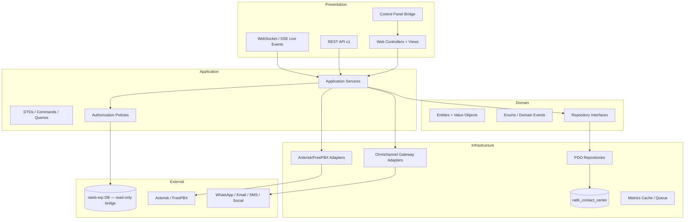
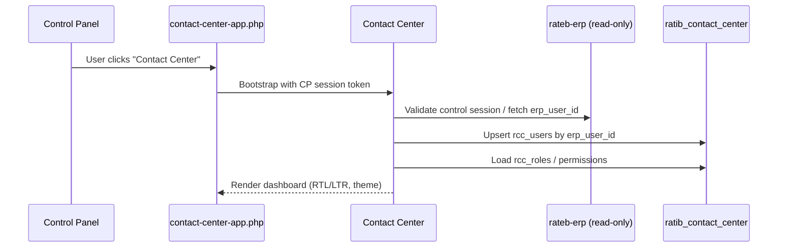

# RATEB Contact Center — Phase 1 Architecture & Database Design

**Project:** RATEB Contact Center  
**Parent:** RATEB ERP  
**Phase:** 1 — Architecture & Database Design Only (no implementation code)  
**Database:** `ratib_contact_center` (dedicated, isolated)

---

## Table of Contents

1. [Architectural Principles](#1-architectural-principles)
2. [Full Folder Structure](#2-full-folder-structure)
3. [Module Structure](#3-module-structure)
4. [Full Database Schema](#4-full-database-schema)
5. [ER Diagram](#5-er-diagram)
6. [Roles & Permissions Matrix](#6-roles--permissions-matrix)
7. [API Endpoints List](#7-api-endpoints-list)
8. [Navigation Integration Plan](#8-navigation-integration-plan)
9. [Phase 2 Implementation Roadmap](#9-phase-2-implementation-roadmap)
10. [Summary](#10-summary)

---

## 1. Architectural Principles

| Principle | Decision |
|-----------|----------|
| Isolation | Database `ratib_contact_center`; table prefix `rcc_`; zero DDL on `rateb_*` / control-panel tables |
| Integration | External references only: `erp_company_id`, `erp_user_id` (INT, indexed, no cross-DB FK) |
| Architecture | Clean Architecture: Domain → Application → Infrastructure → Presentation |
| Patterns | Repository + Service layer; API-first; feature modules |
| UI rules | External CSS/JS only; reusable view components; dark/light + AR/EN + RTL/LTR |
| Voice | Adapter layer for Asterisk / FreePBX / SIP (Phase 2+) |
| Tenancy | `tenant_id` on all business tables; maps 1:1 to ERP company |

### Layer Diagram



---

## 2. Full Folder Structure

Standalone module sibling to `rateb-erp/`:

```
ratib-contact-center/
├── README.md
├── bin/
│   ├── rcc-migrate.php                 # Run migrations
│   ├── rcc-cron.php                    # SLA timers, queue stats, omnichannel sync
│   ├── rcc-voice-worker.php            # AMI/ARI event consumer
│   └── rcc-report-export.php           # Async PDF/Excel jobs
├── config/
│   ├── app.php                         # Base URLs, locale, theme defaults
│   ├── database.php                    # ratib_contact_center connection
│   ├── entity-permissions.php          # Resource → permission slug map
│   ├── module-permissions.php          # Module gate slugs
│   ├── voice.php                       # Asterisk/FreePBX/SIP defaults
│   ├── omnichannel.php                 # Channel provider configs (env-backed)
│   └── lang/
│       ├── en.php
│       └── ar.php
├── docs/
│   ├── architecture/
│   │   ├── ER-DIAGRAM.md
│   │   ├── API-ENDPOINTS.md
│   │   └── RBAC-MATRIX.md
│   └── voice/
│       └── ASTERISK-INTEGRATION.md
├── migrations/
│   ├── run.php
│   ├── 001_core_tenancy.sql
│   ├── 002_security_rbac.sql
│   ├── 003_contacts.sql
│   ├── 004_calls.sql
│   ├── 005_ivr.sql
│   ├── 006_queues.sql
│   ├── 007_agents.sql
│   ├── 008_tickets_sla.sql
│   ├── 009_omnichannel.sql
│   ├── 010_knowledge_base.sql
│   ├── 011_reports.sql
│   ├── 012_voice_infrastructure.sql
│   ├── 013_settings_audit.sql
│   └── 014_seed_roles_permissions.sql
├── public/
│   ├── index.php                       # Front controller
│   ├── .htaccess
│   └── assets/
│       ├── css/
│       │   ├── variables.css           # Theme tokens (light/dark)
│       │   ├── base.css
│       │   ├── layout.css
│       │   ├── rtl.css
│       │   ├── components/             # cards, tables, modals, badges…
│       │   └── modules/                # dashboard, calls, ivr, inbox…
│       └── js/
│           ├── app.js
│           ├── theme.js
│           ├── locale.js
│           ├── api-client.js
│           ├── live-monitor.js         # SSE/WebSocket queue dashboard
│           ├── softphone.js            # WebRTC/SIP.js stub
│           └── modules/                # per-feature JS
├── routes/
│   ├── web.php
│   ├── api.php
│   └── middleware-helpers.php
├── storage/
│   ├── logs/
│   ├── uploads/                        # recordings, attachments
│   ├── exports/                        # PDF/Excel output
│   └── cache/
├── app/
│   ├── Core/
│   │   ├── Bootstrap.php
│   │   ├── Router.php
│   │   ├── Controller.php
│   │   ├── Database.php                # ratib_contact_center PDO
│   │   ├── ErpBridge.php               # Read ERP user/company (no writes)
│   │   ├── Auth.php
│   │   ├── Csrf.php
│   │   ├── View.php
│   │   ├── TenantContext.php
│   │   └── Middleware/
│   │       ├── AuthMiddleware.php
│   │       ├── ApiAuthMiddleware.php
│   │       ├── TenantMiddleware.php
│   │       └── PermissionMiddleware.php
│   ├── Domain/
│   │   ├── Contact/
│   │   ├── Call/
│   │   ├── Ivr/
│   │   ├── Queue/
│   │   ├── Agent/
│   │   ├── Ticket/
│   │   ├── Omnichannel/
│   │   ├── KnowledgeBase/
│   │   ├── Voice/
│   │   ├── Report/
│   │   └── Shared/                     # Enums, ValueObjects
│   ├── Application/
│   │   ├── Contracts/                  # Repository interfaces
│   │   ├── Services/                   # Business orchestration
│   │   ├── DTO/
│   │   ├── Policies/
│   │   └── Events/
│   ├── Infrastructure/
│   │   ├── Persistence/
│   │   │   └── Repositories/           # PDO implementations
│   │   ├── Voice/
│   │   │   ├── AsteriskAmiAdapter.php
│   │   │   ├── FreePbxAdapter.php
│   │   │   └── SipTrunkRegistry.php
│   │   ├── Omnichannel/
│   │   │   ├── WhatsAppAdapter.php
│   │   │   ├── EmailAdapter.php
│   │   │   └── SmsAdapter.php
│   │   └── Export/
│   │       ├── PdfExporter.php
│   │       └── ExcelExporter.php
│   ├── Modules/                        # Feature module entrypoints
│   │   ├── Dashboard/
│   │   ├── Contacts/
│   │   ├── Calls/
│   │   ├── Ivr/
│   │   ├── Queues/
│   │   ├── Agents/
│   │   ├── Tickets/
│   │   ├── Inbox/
│   │   ├── KnowledgeBase/
│   │   ├── Reports/
│   │   ├── Voice/
│   │   ├── Security/
│   │   └── Settings/
│   ├── Controllers/
│   │   ├── Web/                        # Thin — delegate to module controllers
│   │   └── Api/
│   └── helpers/
│       ├── Request.php
│       ├── Str.php
│       └── StorageHelper.php
└── views/
    ├── layouts/
    │   ├── main.php
    │   └── auth.php
    ├── components/                     # Reusable UI only
    │   ├── stat-card.php
    │   ├── data-table.php
    │   ├── filter-bar.php
    │   ├── timeline.php
    │   ├── agent-status-badge.php
    │   ├── queue-monitor.php
    │   └── softphone-panel.php
    ├── partials/
    │   ├── header.php
    │   ├── sidebar.php
    │   ├── theme-toggle.php
    │   └── lang-switcher.php
    └── modules/                        # Mirrors app/Modules/*
        ├── dashboard/
        ├── contacts/
        ├── calls/
        ├── ivr/
        ├── queues/
        ├── agents/
        ├── tickets/
        ├── inbox/
        ├── knowledge-base/
        ├── reports/
        ├── voice/
        ├── security/
        └── settings/
```

### Control Panel Integration Files

```
control-panel/
├── includes/control/
│   ├── contact-center-bridge.php       # NEW — paths, URLs, DB test
│   └── contact-center-nav.php          # NEW — nav helpers
└── pages/control/
    ├── contact-center.php              # NEW — hub landing
    └── contact-center-app.php          # NEW — iframe/proxy shell (like rateb-erp-app.php)
```

---

## 3. Module Structure

Each module follows the same internal shape:

```
Module/
├── Domain/          # Entities, enums, invariants
├── Contracts/       # Repository + gateway interfaces
├── Services/        # Use cases (CallService, QueueService…)
├── Repositories/    # PDO (Infrastructure)
├── Controllers/     # Web + API thin controllers
├── Policies/        # Permission checks
├── DTO/             # Input/output shapes
└── views/           # Module templates + components
```

### Module Map

| # | Module | Primary Entities | Key Services |
|---|--------|------------------|--------------|
| 1 | **Dashboard** | MetricsSnapshot, LiveQueueState | DashboardService, LiveMonitorService |
| 2 | **Contacts** | Contact, Company, Tag, Note, Attachment, TimelineEvent | ContactService, TimelineService |
| 3 | **Calls** | Call, CallLeg, Recording, Transfer, MonitorSession | CallService, ClickToCallService, MonitorService |
| 4 | **IVR** | IvrFlow, IvrNode, RouteRule, WorkingHours, Holiday | IvrService, RoutingService |
| 5 | **Queues** | Queue, QueueMember, QueueStat | QueueService, DistributionService |
| 6 | **Agents** | Agent, AgentStatusLog, PerformanceMetric | AgentService, StatusService |
| 7 | **Tickets** | Ticket, Assignment, EscalationRule, SlaPolicy | TicketService, SlaService, EscalationService |
| 8 | **Inbox** | Channel, Conversation, Message | InboxService, OmnichannelRouter |
| 9 | **KnowledgeBase** | Category, Article, Faq | KnowledgeBaseService, SearchService |
| 10 | **Reports** | ReportDefinition, ExportJob | ReportService, ExportService |
| 11 | **Voice** | PbxServer, SipTrunk, SipExtension, VoiceEvent | VoiceGatewayService, RecordingService |
| 12 | **Security** | Role, Permission, AuditLog, Session | RbacService, AuditService, SessionService |
| 13 | **Settings** | Setting (KV), ThemePref, LanguagePref | SettingsService |

### Cross-Module Event Bus

| Event | Producers | Consumers |
|-------|-----------|-----------|
| `CallStarted` | Calls | Dashboard, Queues, Agents |
| `CallEnded` | Calls | Reports, Agents, Tickets |
| `AgentStatusChanged` | Agents | Dashboard, Queues |
| `TicketCreated` | Tickets, Inbox | SLA, Notifications |
| `SlaBreached` | Tickets | Escalation, Reports |
| `MessageReceived` | Inbox | Tickets, Contacts |

---

## 4. Full Database Schema

**Database:** `ratib_contact_center`  
**Charset:** `utf8mb4_unicode_ci`  
**Engine:** InnoDB  
**Convention:** `rcc_*` tables; `tenant_id` on all tenant data; soft-delete via `deleted_at` where noted  
**No FK to ERP** — only `erp_company_id`, `erp_user_id` as indexed external refs

**Total:** 47 tables

---

### 4.1 Core & Tenancy — Migration 001

```sql
CREATE TABLE rcc_tenants (
    id              INT UNSIGNED AUTO_INCREMENT PRIMARY KEY,
    erp_company_id  INT UNSIGNED NOT NULL,
    name            VARCHAR(200) NOT NULL,
    slug            VARCHAR(120) NOT NULL,
    status          ENUM('active','suspended','pending') NOT NULL DEFAULT 'active',
    timezone        VARCHAR(64) NOT NULL DEFAULT 'Asia/Riyadh',
    default_locale  ENUM('en','ar') NOT NULL DEFAULT 'ar',
    default_theme   ENUM('light','dark','auto') NOT NULL DEFAULT 'auto',
    settings_json   JSON NULL,
    created_at      DATETIME NOT NULL DEFAULT CURRENT_TIMESTAMP,
    updated_at      DATETIME NULL ON UPDATE CURRENT_TIMESTAMP,
    UNIQUE KEY uk_rcc_tenant_erp (erp_company_id),
    UNIQUE KEY uk_rcc_tenant_slug (slug),
    INDEX idx_rcc_tenant_status (status)
);

CREATE TABLE rcc_users (
    id              INT UNSIGNED AUTO_INCREMENT PRIMARY KEY,
    tenant_id       INT UNSIGNED NOT NULL,
    erp_user_id     INT UNSIGNED NOT NULL,
    display_name    VARCHAR(150) NOT NULL,
    email           VARCHAR(190) NOT NULL,
    phone           VARCHAR(40) NULL,
    avatar_path     VARCHAR(255) NULL,
    locale          ENUM('en','ar') NOT NULL DEFAULT 'ar',
    theme           ENUM('light','dark','auto') NOT NULL DEFAULT 'auto',
    status          ENUM('active','inactive','suspended') NOT NULL DEFAULT 'active',
    last_login_at   DATETIME NULL,
    created_at      DATETIME NOT NULL DEFAULT CURRENT_TIMESTAMP,
    updated_at      DATETIME NULL ON UPDATE CURRENT_TIMESTAMP,
    UNIQUE KEY uk_rcc_user_erp (tenant_id, erp_user_id),
    UNIQUE KEY uk_rcc_user_email (tenant_id, email),
    INDEX idx_rcc_user_tenant (tenant_id),
    CONSTRAINT fk_rcc_user_tenant FOREIGN KEY (tenant_id) REFERENCES rcc_tenants(id)
);

CREATE TABLE rcc_migration_log (
    id              INT UNSIGNED AUTO_INCREMENT PRIMARY KEY,
    migration       VARCHAR(120) NOT NULL,
    batch           INT UNSIGNED NOT NULL,
    executed_at     DATETIME NOT NULL DEFAULT CURRENT_TIMESTAMP,
    UNIQUE KEY uk_rcc_migration (migration)
);
```

---

### 4.2 Security & RBAC — Migration 002

```sql
CREATE TABLE rcc_roles (
    id              INT UNSIGNED AUTO_INCREMENT PRIMARY KEY,
    tenant_id       INT UNSIGNED NULL,
    code            VARCHAR(80) NOT NULL,
    name            VARCHAR(120) NOT NULL,
    name_ar         VARCHAR(120) NULL,
    description     TEXT NULL,
    is_system       TINYINT(1) NOT NULL DEFAULT 0,
    created_at      DATETIME NOT NULL DEFAULT CURRENT_TIMESTAMP,
    UNIQUE KEY uk_rcc_role_code (tenant_id, code),
    INDEX idx_rcc_role_tenant (tenant_id)
);

CREATE TABLE rcc_permissions (
    id              INT UNSIGNED AUTO_INCREMENT PRIMARY KEY,
    slug            VARCHAR(120) NOT NULL UNIQUE,
    module          VARCHAR(60) NOT NULL,
    name            VARCHAR(120) NOT NULL,
    name_ar         VARCHAR(120) NULL,
    description     TEXT NULL,
    description_ar  TEXT NULL
);

CREATE TABLE rcc_role_permissions (
    role_id         INT UNSIGNED NOT NULL,
    permission_id   INT UNSIGNED NOT NULL,
    PRIMARY KEY (role_id, permission_id),
    CONSTRAINT fk_rcc_rp_role FOREIGN KEY (role_id) REFERENCES rcc_roles(id) ON DELETE CASCADE,
    CONSTRAINT fk_rcc_rp_perm FOREIGN KEY (permission_id) REFERENCES rcc_permissions(id) ON DELETE CASCADE
);

CREATE TABLE rcc_user_roles (
    user_id         INT UNSIGNED NOT NULL,
    role_id         INT UNSIGNED NOT NULL,
    PRIMARY KEY (user_id, role_id),
    CONSTRAINT fk_rcc_ur_user FOREIGN KEY (user_id) REFERENCES rcc_users(id) ON DELETE CASCADE,
    CONSTRAINT fk_rcc_ur_role FOREIGN KEY (role_id) REFERENCES rcc_roles(id) ON DELETE CASCADE
);

CREATE TABLE rcc_audit_logs (
    id              BIGINT UNSIGNED AUTO_INCREMENT PRIMARY KEY,
    tenant_id       INT UNSIGNED NOT NULL,
    user_id         INT UNSIGNED NULL,
    action          VARCHAR(80) NOT NULL,
    entity_type     VARCHAR(80) NOT NULL,
    entity_id       BIGINT UNSIGNED NULL,
    old_values      JSON NULL,
    new_values      JSON NULL,
    ip_address      VARCHAR(45) NULL,
    user_agent      VARCHAR(500) NULL,
    created_at      DATETIME NOT NULL DEFAULT CURRENT_TIMESTAMP,
    INDEX idx_rcc_audit_tenant (tenant_id, created_at),
    INDEX idx_rcc_audit_entity (entity_type, entity_id)
);

CREATE TABLE rcc_sessions (
    id              BIGINT UNSIGNED AUTO_INCREMENT PRIMARY KEY,
    tenant_id       INT UNSIGNED NOT NULL,
    user_id         INT UNSIGNED NOT NULL,
    session_token   CHAR(64) NOT NULL,
    ip_address      VARCHAR(45) NULL,
    user_agent      VARCHAR(500) NULL,
    last_activity   DATETIME NOT NULL,
    expires_at      DATETIME NOT NULL,
    revoked_at      DATETIME NULL,
    UNIQUE KEY uk_rcc_session_token (session_token),
    INDEX idx_rcc_session_user (user_id, last_activity)
);

CREATE TABLE rcc_api_tokens (
    id              INT UNSIGNED AUTO_INCREMENT PRIMARY KEY,
    tenant_id       INT UNSIGNED NOT NULL,
    user_id         INT UNSIGNED NOT NULL,
    name            VARCHAR(120) NOT NULL,
    token_hash      CHAR(64) NOT NULL,
    scopes          JSON NULL,
    last_used_at    DATETIME NULL,
    expires_at      DATETIME NULL,
    revoked_at      DATETIME NULL,
    created_at      DATETIME NOT NULL DEFAULT CURRENT_TIMESTAMP,
    UNIQUE KEY uk_rcc_api_token (token_hash),
    INDEX idx_rcc_api_user (user_id)
);
```

---

### 4.3 Contacts Management — Migration 003

```sql
CREATE TABLE rcc_contact_companies (
    id              INT UNSIGNED AUTO_INCREMENT PRIMARY KEY,
    tenant_id       INT UNSIGNED NOT NULL,
    name            VARCHAR(200) NOT NULL,
    name_ar         VARCHAR(200) NULL,
    industry        VARCHAR(120) NULL,
    website         VARCHAR(255) NULL,
    phone           VARCHAR(40) NULL,
    email           VARCHAR(190) NULL,
    address         TEXT NULL,
    erp_supplier_id INT UNSIGNED NULL,
    status          ENUM('active','inactive') NOT NULL DEFAULT 'active',
    created_by      INT UNSIGNED NULL,
    created_at      DATETIME NOT NULL DEFAULT CURRENT_TIMESTAMP,
    updated_at      DATETIME NULL ON UPDATE CURRENT_TIMESTAMP,
    deleted_at      DATETIME NULL,
    INDEX idx_rcc_cc_tenant (tenant_id),
    INDEX idx_rcc_cc_name (tenant_id, name)
);

CREATE TABLE rcc_contacts (
    id              INT UNSIGNED AUTO_INCREMENT PRIMARY KEY,
    tenant_id       INT UNSIGNED NOT NULL,
    contact_type    ENUM('customer','lead','prospect','supplier') NOT NULL,
    company_id      INT UNSIGNED NULL,
    first_name      VARCHAR(100) NOT NULL,
    last_name       VARCHAR(100) NULL,
    full_name       VARCHAR(200) NOT NULL,
    email           VARCHAR(190) NULL,
    phone_primary   VARCHAR(40) NULL,
    phone_secondary VARCHAR(40) NULL,
    whatsapp        VARCHAR(40) NULL,
    preferred_lang  ENUM('en','ar') NULL,
    source          VARCHAR(80) NULL,
    owner_user_id   INT UNSIGNED NULL,
    status          ENUM('new','active','inactive','converted','lost') NOT NULL DEFAULT 'new',
    metadata_json   JSON NULL,
    created_by      INT UNSIGNED NULL,
    created_at      DATETIME NOT NULL DEFAULT CURRENT_TIMESTAMP,
    updated_at      DATETIME NULL ON UPDATE CURRENT_TIMESTAMP,
    deleted_at      DATETIME NULL,
    INDEX idx_rcc_contact_tenant (tenant_id),
    INDEX idx_rcc_contact_type (tenant_id, contact_type),
    INDEX idx_rcc_contact_phone (tenant_id, phone_primary),
    INDEX idx_rcc_contact_email (tenant_id, email),
    CONSTRAINT fk_rcc_contact_company FOREIGN KEY (company_id) REFERENCES rcc_contact_companies(id) ON DELETE SET NULL
);

CREATE TABLE rcc_tags (
    id              INT UNSIGNED AUTO_INCREMENT PRIMARY KEY,
    tenant_id       INT UNSIGNED NOT NULL,
    name            VARCHAR(80) NOT NULL,
    color           CHAR(7) NULL,
    scope           ENUM('contact','call','ticket','global') NOT NULL DEFAULT 'global',
    created_at      DATETIME NOT NULL DEFAULT CURRENT_TIMESTAMP,
    UNIQUE KEY uk_rcc_tag (tenant_id, scope, name)
);

CREATE TABLE rcc_contact_tags (
    contact_id      INT UNSIGNED NOT NULL,
    tag_id          INT UNSIGNED NOT NULL,
    PRIMARY KEY (contact_id, tag_id),
    CONSTRAINT fk_rcc_ct_contact FOREIGN KEY (contact_id) REFERENCES rcc_contacts(id) ON DELETE CASCADE,
    CONSTRAINT fk_rcc_ct_tag FOREIGN KEY (tag_id) REFERENCES rcc_tags(id) ON DELETE CASCADE
);

CREATE TABLE rcc_contact_notes (
    id              BIGINT UNSIGNED AUTO_INCREMENT PRIMARY KEY,
    tenant_id       INT UNSIGNED NOT NULL,
    contact_id      INT UNSIGNED NOT NULL,
    author_user_id  INT UNSIGNED NOT NULL,
    body            TEXT NOT NULL,
    is_pinned       TINYINT(1) NOT NULL DEFAULT 0,
    created_at      DATETIME NOT NULL DEFAULT CURRENT_TIMESTAMP,
    updated_at      DATETIME NULL ON UPDATE CURRENT_TIMESTAMP,
    INDEX idx_rcc_cnote_contact (contact_id, created_at),
    CONSTRAINT fk_rcc_cnote_contact FOREIGN KEY (contact_id) REFERENCES rcc_contacts(id) ON DELETE CASCADE
);

CREATE TABLE rcc_contact_attachments (
    id              BIGINT UNSIGNED AUTO_INCREMENT PRIMARY KEY,
    tenant_id       INT UNSIGNED NOT NULL,
    contact_id      INT UNSIGNED NOT NULL,
    uploaded_by     INT UNSIGNED NOT NULL,
    file_name       VARCHAR(255) NOT NULL,
    file_path       VARCHAR(500) NOT NULL,
    mime_type       VARCHAR(120) NULL,
    file_size       INT UNSIGNED NOT NULL DEFAULT 0,
    created_at      DATETIME NOT NULL DEFAULT CURRENT_TIMESTAMP,
    INDEX idx_rcc_cattach_contact (contact_id),
    CONSTRAINT fk_rcc_cattach_contact FOREIGN KEY (contact_id) REFERENCES rcc_contacts(id) ON DELETE CASCADE
);

CREATE TABLE rcc_contact_timeline (
    id              BIGINT UNSIGNED AUTO_INCREMENT PRIMARY KEY,
    tenant_id       INT UNSIGNED NOT NULL,
    contact_id      INT UNSIGNED NOT NULL,
    event_type      ENUM('call','note','ticket','message','status_change','tag','attachment','system') NOT NULL,
    reference_type  VARCHAR(60) NULL,
    reference_id    BIGINT UNSIGNED NULL,
    title           VARCHAR(255) NOT NULL,
    summary         TEXT NULL,
    payload_json    JSON NULL,
    created_by      INT UNSIGNED NULL,
    created_at      DATETIME NOT NULL DEFAULT CURRENT_TIMESTAMP,
    INDEX idx_rcc_timeline_contact (contact_id, created_at),
    CONSTRAINT fk_rcc_timeline_contact FOREIGN KEY (contact_id) REFERENCES rcc_contacts(id) ON DELETE CASCADE
);
```

---

### 4.4 Call Center Core — Migration 004

```sql
CREATE TABLE rcc_calls (
    id              BIGINT UNSIGNED AUTO_INCREMENT PRIMARY KEY,
    tenant_id       INT UNSIGNED NOT NULL,
    uuid            CHAR(36) NOT NULL,
    direction       ENUM('inbound','outbound') NOT NULL,
    status          ENUM('ringing','queued','answered','hold','transferring','conference','completed','missed','abandoned','failed') NOT NULL,
    contact_id      INT UNSIGNED NULL,
    caller_number   VARCHAR(40) NOT NULL,
    callee_number   VARCHAR(40) NOT NULL,
    queue_id        INT UNSIGNED NULL,
    agent_id        INT UNSIGNED NULL,
    ivr_flow_id     INT UNSIGNED NULL,
    pbx_call_id     VARCHAR(120) NULL,
    started_at      DATETIME NOT NULL,
    answered_at     DATETIME NULL,
    ended_at        DATETIME NULL,
    wait_seconds    INT UNSIGNED NOT NULL DEFAULT 0,
    talk_seconds    INT UNSIGNED NOT NULL DEFAULT 0,
    hold_seconds    INT UNSIGNED NOT NULL DEFAULT 0,
    disposition     VARCHAR(80) NULL,
    recording_enabled TINYINT(1) NOT NULL DEFAULT 1,
    metadata_json   JSON NULL,
    created_at      DATETIME NOT NULL DEFAULT CURRENT_TIMESTAMP,
    UNIQUE KEY uk_rcc_call_uuid (uuid),
    INDEX idx_rcc_call_tenant (tenant_id, started_at),
    INDEX idx_rcc_call_status (tenant_id, status),
    INDEX idx_rcc_call_agent (agent_id, started_at),
    INDEX idx_rcc_call_contact (contact_id)
);

CREATE TABLE rcc_call_legs (
    id              BIGINT UNSIGNED AUTO_INCREMENT PRIMARY KEY,
    call_id         BIGINT UNSIGNED NOT NULL,
    leg_type        ENUM('agent','customer','external','conference') NOT NULL,
    participant_id  INT UNSIGNED NULL,
    channel_id      VARCHAR(120) NULL,
    joined_at       DATETIME NOT NULL,
    left_at         DATETIME NULL,
    INDEX idx_rcc_leg_call (call_id),
    CONSTRAINT fk_rcc_leg_call FOREIGN KEY (call_id) REFERENCES rcc_calls(id) ON DELETE CASCADE
);

CREATE TABLE rcc_call_recordings (
    id              BIGINT UNSIGNED AUTO_INCREMENT PRIMARY KEY,
    tenant_id       INT UNSIGNED NOT NULL,
    call_id         BIGINT UNSIGNED NOT NULL,
    file_path       VARCHAR(500) NOT NULL,
    file_name       VARCHAR(255) NOT NULL,
    duration_seconds INT UNSIGNED NOT NULL DEFAULT 0,
    mime_type       VARCHAR(80) NOT NULL DEFAULT 'audio/wav',
    storage_provider ENUM('local','s3') NOT NULL DEFAULT 'local',
    checksum        CHAR(64) NULL,
    created_at      DATETIME NOT NULL DEFAULT CURRENT_TIMESTAMP,
    INDEX idx_rcc_recording_call (call_id),
    CONSTRAINT fk_rcc_recording_call FOREIGN KEY (call_id) REFERENCES rcc_calls(id) ON DELETE CASCADE
);

CREATE TABLE rcc_call_notes (
    id              BIGINT UNSIGNED AUTO_INCREMENT PRIMARY KEY,
    tenant_id       INT UNSIGNED NOT NULL,
    call_id         BIGINT UNSIGNED NOT NULL,
    author_user_id  INT UNSIGNED NOT NULL,
    body            TEXT NOT NULL,
    created_at      DATETIME NOT NULL DEFAULT CURRENT_TIMESTAMP,
    CONSTRAINT fk_rcc_cnote_call FOREIGN KEY (call_id) REFERENCES rcc_calls(id) ON DELETE CASCADE
);

CREATE TABLE rcc_call_tags (
    call_id         BIGINT UNSIGNED NOT NULL,
    tag_id          INT UNSIGNED NOT NULL,
    PRIMARY KEY (call_id, tag_id),
    CONSTRAINT fk_rcc_ctag_call FOREIGN KEY (call_id) REFERENCES rcc_calls(id) ON DELETE CASCADE,
    CONSTRAINT fk_rcc_ctag_tag FOREIGN KEY (tag_id) REFERENCES rcc_tags(id) ON DELETE CASCADE
);

CREATE TABLE rcc_call_transfers (
    id              BIGINT UNSIGNED AUTO_INCREMENT PRIMARY KEY,
    call_id         BIGINT UNSIGNED NOT NULL,
    from_agent_id   INT UNSIGNED NULL,
    to_agent_id     INT UNSIGNED NULL,
    to_queue_id     INT UNSIGNED NULL,
    transfer_type   ENUM('blind','warm','queue') NOT NULL,
    status          ENUM('pending','completed','failed','cancelled') NOT NULL DEFAULT 'pending',
    initiated_at    DATETIME NOT NULL,
    completed_at    DATETIME NULL,
    INDEX idx_rcc_xfer_call (call_id),
    CONSTRAINT fk_rcc_xfer_call FOREIGN KEY (call_id) REFERENCES rcc_calls(id) ON DELETE CASCADE
);

CREATE TABLE rcc_call_monitor_sessions (
    id              BIGINT UNSIGNED AUTO_INCREMENT PRIMARY KEY,
    tenant_id       INT UNSIGNED NOT NULL,
    call_id         BIGINT UNSIGNED NOT NULL,
    supervisor_id   INT UNSIGNED NOT NULL,
    mode            ENUM('listen','whisper','barge') NOT NULL,
    started_at      DATETIME NOT NULL,
    ended_at        DATETIME NULL,
    INDEX idx_rcc_monitor_call (call_id),
    CONSTRAINT fk_rcc_monitor_call FOREIGN KEY (call_id) REFERENCES rcc_calls(id) ON DELETE CASCADE
);
```

---

### 4.5 IVR System — Migration 005

```sql
CREATE TABLE rcc_departments (
    id              INT UNSIGNED AUTO_INCREMENT PRIMARY KEY,
    tenant_id       INT UNSIGNED NOT NULL,
    name            VARCHAR(120) NOT NULL,
    name_ar         VARCHAR(120) NULL,
    code            VARCHAR(40) NOT NULL,
    email           VARCHAR(190) NULL,
    status          ENUM('active','inactive') NOT NULL DEFAULT 'active',
    UNIQUE KEY uk_rcc_dept (tenant_id, code)
);

CREATE TABLE rcc_ivr_flows (
    id              INT UNSIGNED AUTO_INCREMENT PRIMARY KEY,
    tenant_id       INT UNSIGNED NOT NULL,
    name            VARCHAR(120) NOT NULL,
    description     TEXT NULL,
    entry_node_id   INT UNSIGNED NULL,
    default_lang    ENUM('en','ar') NOT NULL DEFAULT 'ar',
    status          ENUM('draft','active','archived') NOT NULL DEFAULT 'draft',
    version         INT UNSIGNED NOT NULL DEFAULT 1,
    created_at      DATETIME NOT NULL DEFAULT CURRENT_TIMESTAMP,
    updated_at      DATETIME NULL ON UPDATE CURRENT_TIMESTAMP,
    INDEX idx_rcc_ivr_tenant (tenant_id)
);

CREATE TABLE rcc_ivr_nodes (
    id              INT UNSIGNED AUTO_INCREMENT PRIMARY KEY,
    flow_id         INT UNSIGNED NOT NULL,
    parent_id       INT UNSIGNED NULL,
    node_type       ENUM('menu','prompt','route_queue','route_dept','route_agent','route_voicemail','route_external','language_select','hangup') NOT NULL,
    title           VARCHAR(120) NOT NULL,
    prompt_audio    VARCHAR(255) NULL,
    prompt_text     TEXT NULL,
    dtmf_map_json   JSON NULL,
    sort_order      INT NOT NULL DEFAULT 0,
    config_json     JSON NULL,
    INDEX idx_rcc_ivr_node_flow (flow_id, sort_order),
    CONSTRAINT fk_rcc_ivr_node_flow FOREIGN KEY (flow_id) REFERENCES rcc_ivr_flows(id) ON DELETE CASCADE
);

CREATE TABLE rcc_working_hours (
    id              INT UNSIGNED AUTO_INCREMENT PRIMARY KEY,
    tenant_id       INT UNSIGNED NOT NULL,
    name            VARCHAR(120) NOT NULL,
    timezone        VARCHAR(64) NOT NULL DEFAULT 'Asia/Riyadh',
    schedule_json   JSON NOT NULL,
    after_hours_flow_id INT UNSIGNED NULL,
    status          ENUM('active','inactive') NOT NULL DEFAULT 'active',
    INDEX idx_rcc_wh_tenant (tenant_id)
);

CREATE TABLE rcc_holidays (
    id              INT UNSIGNED AUTO_INCREMENT PRIMARY KEY,
    tenant_id       INT UNSIGNED NOT NULL,
    name            VARCHAR(120) NOT NULL,
    holiday_date    DATE NOT NULL,
    recurring       TINYINT(1) NOT NULL DEFAULT 0,
    ivr_flow_id     INT UNSIGNED NULL,
    INDEX idx_rcc_holiday_tenant (tenant_id, holiday_date)
);

CREATE TABLE rcc_ivr_routes (
    id              INT UNSIGNED AUTO_INCREMENT PRIMARY KEY,
    tenant_id       INT UNSIGNED NOT NULL,
    route_type      ENUM('working_hours','holiday','department','language','default') NOT NULL,
    priority        INT NOT NULL DEFAULT 100,
    match_json      JSON NULL,
    target_flow_id  INT UNSIGNED NULL,
    target_queue_id INT UNSIGNED NULL,
    target_dept_id  INT UNSIGNED NULL,
    status          ENUM('active','inactive') NOT NULL DEFAULT 'active',
    INDEX idx_rcc_route_tenant (tenant_id, route_type, priority)
);
```

---

### 4.6 Queue Management — Migration 006

```sql
CREATE TABLE rcc_queues (
    id              INT UNSIGNED AUTO_INCREMENT PRIMARY KEY,
    tenant_id       INT UNSIGNED NOT NULL,
    name            VARCHAR(120) NOT NULL,
    name_ar         VARCHAR(120) NULL,
    code            VARCHAR(40) NOT NULL,
    strategy        ENUM('ring_all','round_robin','least_recent','random','linear') NOT NULL DEFAULT 'round_robin',
    priority        TINYINT UNSIGNED NOT NULL DEFAULT 5,
    max_wait_seconds INT UNSIGNED NOT NULL DEFAULT 300,
    max_callers     INT UNSIGNED NOT NULL DEFAULT 50,
    music_on_hold   VARCHAR(255) NULL,
    wrap_up_seconds INT UNSIGNED NOT NULL DEFAULT 30,
    sla_target_seconds INT UNSIGNED NULL,
    ivr_flow_id     INT UNSIGNED NULL,
    department_id   INT UNSIGNED NULL,
    status          ENUM('active','inactive') NOT NULL DEFAULT 'active',
    created_at      DATETIME NOT NULL DEFAULT CURRENT_TIMESTAMP,
    UNIQUE KEY uk_rcc_queue (tenant_id, code),
    INDEX idx_rcc_queue_tenant (tenant_id)
);

CREATE TABLE rcc_queue_members (
    id              INT UNSIGNED AUTO_INCREMENT PRIMARY KEY,
    queue_id        INT UNSIGNED NOT NULL,
    agent_id        INT UNSIGNED NOT NULL,
    penalty         TINYINT UNSIGNED NOT NULL DEFAULT 0,
    is_paused       TINYINT(1) NOT NULL DEFAULT 0,
    joined_at       DATETIME NOT NULL DEFAULT CURRENT_TIMESTAMP,
    UNIQUE KEY uk_rcc_qmember (queue_id, agent_id),
    CONSTRAINT fk_rcc_qmember_queue FOREIGN KEY (queue_id) REFERENCES rcc_queues(id) ON DELETE CASCADE
);

CREATE TABLE rcc_queue_stats_snapshots (
    id              BIGINT UNSIGNED AUTO_INCREMENT PRIMARY KEY,
    tenant_id       INT UNSIGNED NOT NULL,
    queue_id        INT UNSIGNED NOT NULL,
    snapshot_at     DATETIME NOT NULL,
    waiting_count   INT UNSIGNED NOT NULL DEFAULT 0,
    active_count    INT UNSIGNED NOT NULL DEFAULT 0,
    avg_wait_seconds INT UNSIGNED NOT NULL DEFAULT 0,
    longest_wait_seconds INT UNSIGNED NOT NULL DEFAULT 0,
    agents_available INT UNSIGNED NOT NULL DEFAULT 0,
    INDEX idx_rcc_qsnap (queue_id, snapshot_at)
);
```

---

### 4.7 Agents Management — Migration 007

```sql
CREATE TABLE rcc_agents (
    id              INT UNSIGNED AUTO_INCREMENT PRIMARY KEY,
    tenant_id       INT UNSIGNED NOT NULL,
    user_id         INT UNSIGNED NOT NULL,
    extension       VARCHAR(20) NULL,
    sip_username    VARCHAR(80) NULL,
    department_id   INT UNSIGNED NULL,
    supervisor_id   INT UNSIGNED NULL,
    max_concurrent  TINYINT UNSIGNED NOT NULL DEFAULT 1,
    skills_json     JSON NULL,
    current_status  ENUM('offline','online','break','lunch','training','wrap_up') NOT NULL DEFAULT 'offline',
    status_since    DATETIME NOT NULL DEFAULT CURRENT_TIMESTAMP,
    performance_score DECIMAL(5,2) NULL,
    created_at      DATETIME NOT NULL DEFAULT CURRENT_TIMESTAMP,
    updated_at      DATETIME NULL ON UPDATE CURRENT_TIMESTAMP,
    UNIQUE KEY uk_rcc_agent_user (tenant_id, user_id),
    INDEX idx_rcc_agent_status (tenant_id, current_status)
);

CREATE TABLE rcc_agent_status_log (
    id              BIGINT UNSIGNED AUTO_INCREMENT PRIMARY KEY,
    tenant_id       INT UNSIGNED NOT NULL,
    agent_id        INT UNSIGNED NOT NULL,
    from_status     ENUM('offline','online','break','lunch','training','wrap_up') NULL,
    to_status       ENUM('offline','online','break','lunch','training','wrap_up') NOT NULL,
    reason          VARCHAR(255) NULL,
    changed_by      INT UNSIGNED NULL,
    started_at      DATETIME NOT NULL,
    ended_at        DATETIME NULL,
    duration_seconds INT UNSIGNED NULL,
    INDEX idx_rcc_astatus_agent (agent_id, started_at),
    CONSTRAINT fk_rcc_astatus_agent FOREIGN KEY (agent_id) REFERENCES rcc_agents(id) ON DELETE CASCADE
);

CREATE TABLE rcc_agent_performance_daily (
    id              BIGINT UNSIGNED AUTO_INCREMENT PRIMARY KEY,
    tenant_id       INT UNSIGNED NOT NULL,
    agent_id        INT UNSIGNED NOT NULL,
    metric_date     DATE NOT NULL,
    calls_handled   INT UNSIGNED NOT NULL DEFAULT 0,
    calls_missed    INT UNSIGNED NOT NULL DEFAULT 0,
    avg_talk_seconds INT UNSIGNED NOT NULL DEFAULT 0,
    avg_wait_seconds INT UNSIGNED NOT NULL DEFAULT 0,
    avg_wrap_seconds INT UNSIGNED NOT NULL DEFAULT 0,
    occupancy_pct   DECIMAL(5,2) NOT NULL DEFAULT 0,
    sla_met_pct     DECIMAL(5,2) NOT NULL DEFAULT 0,
    tickets_closed  INT UNSIGNED NOT NULL DEFAULT 0,
    UNIQUE KEY uk_rcc_agent_perf (agent_id, metric_date),
    INDEX idx_rcc_agent_perf_tenant (tenant_id, metric_date)
);
```

---

### 4.8 Ticketing & SLA — Migration 008

```sql
CREATE TABLE rcc_sla_policies (
    id              INT UNSIGNED AUTO_INCREMENT PRIMARY KEY,
    tenant_id       INT UNSIGNED NOT NULL,
    name            VARCHAR(120) NOT NULL,
    priority        ENUM('low','normal','high','urgent') NOT NULL DEFAULT 'normal',
    first_response_minutes INT UNSIGNED NOT NULL,
    resolution_minutes INT UNSIGNED NOT NULL,
    business_hours_id INT UNSIGNED NULL,
    status          ENUM('active','inactive') NOT NULL DEFAULT 'active',
    INDEX idx_rcc_sla_tenant (tenant_id)
);

CREATE TABLE rcc_escalation_rules (
    id              INT UNSIGNED AUTO_INCREMENT PRIMARY KEY,
    tenant_id       INT UNSIGNED NOT NULL,
    name            VARCHAR(120) NOT NULL,
    trigger_type    ENUM('sla_breach','priority','idle','manual') NOT NULL,
    conditions_json JSON NOT NULL,
    actions_json    JSON NOT NULL,
    priority        INT NOT NULL DEFAULT 100,
    status          ENUM('active','inactive') NOT NULL DEFAULT 'active',
    INDEX idx_rcc_esc_tenant (tenant_id)
);

CREATE TABLE rcc_tickets (
    id              BIGINT UNSIGNED AUTO_INCREMENT PRIMARY KEY,
    tenant_id       INT UNSIGNED NOT NULL,
    ticket_no       VARCHAR(40) NOT NULL,
    subject         VARCHAR(255) NOT NULL,
    description     TEXT NULL,
    contact_id      INT UNSIGNED NULL,
    call_id         BIGINT UNSIGNED NULL,
    conversation_id BIGINT UNSIGNED NULL,
    channel         ENUM('phone','email','whatsapp','sms','facebook','instagram','x','telegram','web_chat','internal') NOT NULL DEFAULT 'internal',
    priority        ENUM('low','normal','high','urgent') NOT NULL DEFAULT 'normal',
    status          ENUM('open','pending','in_progress','resolved','closed','cancelled') NOT NULL DEFAULT 'open',
    assigned_agent_id INT UNSIGNED NULL,
    assigned_team_id INT UNSIGNED NULL,
    sla_policy_id   INT UNSIGNED NULL,
    first_response_due DATETIME NULL,
    resolution_due  DATETIME NULL,
    first_responded_at DATETIME NULL,
    resolved_at     DATETIME NULL,
    closed_at       DATETIME NULL,
    created_by      INT UNSIGNED NULL,
    created_at      DATETIME NOT NULL DEFAULT CURRENT_TIMESTAMP,
    updated_at      DATETIME NULL ON UPDATE CURRENT_TIMESTAMP,
    UNIQUE KEY uk_rcc_ticket_no (tenant_id, ticket_no),
    INDEX idx_rcc_ticket_status (tenant_id, status),
    INDEX idx_rcc_ticket_agent (assigned_agent_id, status)
);

CREATE TABLE rcc_ticket_assignments (
    id              BIGINT UNSIGNED AUTO_INCREMENT PRIMARY KEY,
    ticket_id       BIGINT UNSIGNED NOT NULL,
    agent_id        INT UNSIGNED NULL,
    assigned_by     INT UNSIGNED NULL,
    assigned_at     DATETIME NOT NULL DEFAULT CURRENT_TIMESTAMP,
    unassigned_at   DATETIME NULL,
    INDEX idx_rcc_tassign_ticket (ticket_id),
    CONSTRAINT fk_rcc_tassign_ticket FOREIGN KEY (ticket_id) REFERENCES rcc_tickets(id) ON DELETE CASCADE
);

CREATE TABLE rcc_ticket_notes (
    id              BIGINT UNSIGNED AUTO_INCREMENT PRIMARY KEY,
    tenant_id       INT UNSIGNED NOT NULL,
    ticket_id       BIGINT UNSIGNED NOT NULL,
    author_user_id  INT UNSIGNED NOT NULL,
    body            TEXT NOT NULL,
    is_internal     TINYINT(1) NOT NULL DEFAULT 0,
    created_at      DATETIME NOT NULL DEFAULT CURRENT_TIMESTAMP,
    CONSTRAINT fk_rcc_tnote_ticket FOREIGN KEY (ticket_id) REFERENCES rcc_tickets(id) ON DELETE CASCADE
);

CREATE TABLE rcc_ticket_history (
    id              BIGINT UNSIGNED AUTO_INCREMENT PRIMARY KEY,
    tenant_id       INT UNSIGNED NOT NULL,
    ticket_id       BIGINT UNSIGNED NOT NULL,
    event_type      VARCHAR(60) NOT NULL,
    old_value       TEXT NULL,
    new_value       TEXT NULL,
    actor_user_id   INT UNSIGNED NULL,
    created_at      DATETIME NOT NULL DEFAULT CURRENT_TIMESTAMP,
    INDEX idx_rcc_thist_ticket (ticket_id, created_at),
    CONSTRAINT fk_rcc_thist_ticket FOREIGN KEY (ticket_id) REFERENCES rcc_tickets(id) ON DELETE CASCADE
);
```

---

### 4.9 Omnichannel Inbox — Migration 009

```sql
CREATE TABLE rcc_channels (
    id              INT UNSIGNED AUTO_INCREMENT PRIMARY KEY,
    tenant_id       INT UNSIGNED NOT NULL,
    channel_type    ENUM('whatsapp','email','sms','facebook','instagram','x','telegram','web_chat') NOT NULL,
    name            VARCHAR(120) NOT NULL,
    status          ENUM('active','inactive','error') NOT NULL DEFAULT 'inactive',
    config_json     JSON NULL,
    webhook_secret  CHAR(64) NULL,
    created_at      DATETIME NOT NULL DEFAULT CURRENT_TIMESTAMP,
    UNIQUE KEY uk_rcc_channel (tenant_id, channel_type, name)
);

CREATE TABLE rcc_conversations (
    id              BIGINT UNSIGNED AUTO_INCREMENT PRIMARY KEY,
    tenant_id       INT UNSIGNED NOT NULL,
    channel_id      INT UNSIGNED NOT NULL,
    contact_id      INT UNSIGNED NULL,
    external_thread_id VARCHAR(190) NULL,
    subject         VARCHAR(255) NULL,
    status          ENUM('open','pending','resolved','closed') NOT NULL DEFAULT 'open',
    assigned_agent_id INT UNSIGNED NULL,
    last_message_at DATETIME NULL,
    unread_count    INT UNSIGNED NOT NULL DEFAULT 0,
    metadata_json   JSON NULL,
    created_at      DATETIME NOT NULL DEFAULT CURRENT_TIMESTAMP,
    updated_at      DATETIME NULL ON UPDATE CURRENT_TIMESTAMP,
    INDEX idx_rcc_conv_tenant (tenant_id, status, last_message_at),
    CONSTRAINT fk_rcc_conv_channel FOREIGN KEY (channel_id) REFERENCES rcc_channels(id)
);

CREATE TABLE rcc_messages (
    id              BIGINT UNSIGNED AUTO_INCREMENT PRIMARY KEY,
    tenant_id       INT UNSIGNED NOT NULL,
    conversation_id BIGINT UNSIGNED NOT NULL,
    direction       ENUM('inbound','outbound') NOT NULL,
    sender_type     ENUM('contact','agent','system') NOT NULL,
    sender_id       BIGINT UNSIGNED NULL,
    body_text       MEDIUMTEXT NULL,
    body_html       MEDIUMTEXT NULL,
    attachments_json JSON NULL,
    external_message_id VARCHAR(190) NULL,
    delivery_status ENUM('queued','sent','delivered','read','failed') NOT NULL DEFAULT 'queued',
    sent_at         DATETIME NULL,
    created_at      DATETIME NOT NULL DEFAULT CURRENT_TIMESTAMP,
    INDEX idx_rcc_msg_conv (conversation_id, created_at),
    CONSTRAINT fk_rcc_msg_conv FOREIGN KEY (conversation_id) REFERENCES rcc_conversations(id) ON DELETE CASCADE
);
```

---

### 4.10 Knowledge Base — Migration 010

```sql
CREATE TABLE rcc_kb_categories (
    id              INT UNSIGNED AUTO_INCREMENT PRIMARY KEY,
    tenant_id       INT UNSIGNED NOT NULL,
    parent_id       INT UNSIGNED NULL,
    name            VARCHAR(150) NOT NULL,
    name_ar         VARCHAR(150) NULL,
    slug            VARCHAR(150) NOT NULL,
    sort_order      INT NOT NULL DEFAULT 0,
    status          ENUM('active','inactive') NOT NULL DEFAULT 'active',
    UNIQUE KEY uk_rcc_kb_cat (tenant_id, slug)
);

CREATE TABLE rcc_kb_articles (
    id              INT UNSIGNED AUTO_INCREMENT PRIMARY KEY,
    tenant_id       INT UNSIGNED NOT NULL,
    category_id     INT UNSIGNED NULL,
    title           VARCHAR(255) NOT NULL,
    title_ar        VARCHAR(255) NULL,
    slug            VARCHAR(190) NOT NULL,
    body            MEDIUMTEXT NOT NULL,
    body_ar         MEDIUMTEXT NULL,
    status          ENUM('draft','published','archived') NOT NULL DEFAULT 'draft',
    view_count      INT UNSIGNED NOT NULL DEFAULT 0,
    author_user_id  INT UNSIGNED NULL,
    published_at    DATETIME NULL,
    created_at      DATETIME NOT NULL DEFAULT CURRENT_TIMESTAMP,
    updated_at      DATETIME NULL ON UPDATE CURRENT_TIMESTAMP,
    UNIQUE KEY uk_rcc_kb_article (tenant_id, slug),
    FULLTEXT idx_rcc_kb_search (title, body)
);

CREATE TABLE rcc_kb_faqs (
    id              INT UNSIGNED AUTO_INCREMENT PRIMARY KEY,
    tenant_id       INT UNSIGNED NOT NULL,
    category_id     INT UNSIGNED NULL,
    question        VARCHAR(500) NOT NULL,
    question_ar     VARCHAR(500) NULL,
    answer          TEXT NOT NULL,
    answer_ar       TEXT NULL,
    sort_order      INT NOT NULL DEFAULT 0,
    status          ENUM('active','inactive') NOT NULL DEFAULT 'active',
    INDEX idx_rcc_faq_tenant (tenant_id, category_id)
);
```

---

### 4.11 Reports & Exports — Migration 011

```sql
CREATE TABLE rcc_report_definitions (
    id              INT UNSIGNED AUTO_INCREMENT PRIMARY KEY,
    tenant_id       INT UNSIGNED NULL,
    code            VARCHAR(80) NOT NULL,
    name            VARCHAR(150) NOT NULL,
    name_ar         VARCHAR(150) NULL,
    module          VARCHAR(60) NOT NULL,
    query_key       VARCHAR(80) NOT NULL,
    default_format  ENUM('pdf','xlsx','csv') NOT NULL DEFAULT 'pdf',
    params_schema_json JSON NULL,
    is_system       TINYINT(1) NOT NULL DEFAULT 1,
    UNIQUE KEY uk_rcc_report (tenant_id, code)
);

CREATE TABLE rcc_report_exports (
    id              BIGINT UNSIGNED AUTO_INCREMENT PRIMARY KEY,
    tenant_id       INT UNSIGNED NOT NULL,
    report_id       INT UNSIGNED NOT NULL,
    requested_by    INT UNSIGNED NOT NULL,
    format          ENUM('pdf','xlsx','csv') NOT NULL,
    params_json     JSON NULL,
    status          ENUM('queued','processing','completed','failed') NOT NULL DEFAULT 'queued',
    file_path       VARCHAR(500) NULL,
    error_message   TEXT NULL,
    started_at      DATETIME NULL,
    completed_at    DATETIME NULL,
    created_at      DATETIME NOT NULL DEFAULT CURRENT_TIMESTAMP,
    INDEX idx_rcc_export_tenant (tenant_id, created_at)
);

CREATE TABLE rcc_dashboard_metrics (
    id              BIGINT UNSIGNED AUTO_INCREMENT PRIMARY KEY,
    tenant_id       INT UNSIGNED NOT NULL,
    metric_key      VARCHAR(80) NOT NULL,
    metric_value    DECIMAL(18,4) NOT NULL,
    dimensions_json JSON NULL,
    captured_at     DATETIME NOT NULL,
    INDEX idx_rcc_metric (tenant_id, metric_key, captured_at)
);
```

---

### 4.12 Voice Infrastructure — Migration 012

```sql
CREATE TABLE rcc_pbx_servers (
    id              INT UNSIGNED AUTO_INCREMENT PRIMARY KEY,
    tenant_id       INT UNSIGNED NULL,
    name            VARCHAR(120) NOT NULL,
    pbx_type        ENUM('asterisk','freepbx') NOT NULL,
    host            VARCHAR(255) NOT NULL,
    ami_port        INT UNSIGNED NOT NULL DEFAULT 5038,
    ari_enabled     TINYINT(1) NOT NULL DEFAULT 0,
    credentials_ref VARCHAR(120) NULL,
    status          ENUM('active','inactive','error') NOT NULL DEFAULT 'inactive',
    last_sync_at    DATETIME NULL,
    config_json     JSON NULL,
    created_at      DATETIME NOT NULL DEFAULT CURRENT_TIMESTAMP
);

CREATE TABLE rcc_sip_trunks (
    id              INT UNSIGNED AUTO_INCREMENT PRIMARY KEY,
    tenant_id       INT UNSIGNED NOT NULL,
    pbx_server_id   INT UNSIGNED NOT NULL,
    name            VARCHAR(120) NOT NULL,
    provider        VARCHAR(120) NULL,
    trunk_id        VARCHAR(80) NOT NULL,
    caller_id       VARCHAR(40) NULL,
    max_channels    INT UNSIGNED NOT NULL DEFAULT 10,
    status          ENUM('active','inactive') NOT NULL DEFAULT 'inactive',
    config_json     JSON NULL,
    INDEX idx_rcc_trunk_tenant (tenant_id),
    CONSTRAINT fk_rcc_trunk_pbx FOREIGN KEY (pbx_server_id) REFERENCES rcc_pbx_servers(id)
);

CREATE TABLE rcc_sip_extensions (
    id              INT UNSIGNED AUTO_INCREMENT PRIMARY KEY,
    tenant_id       INT UNSIGNED NOT NULL,
    agent_id        INT UNSIGNED NULL,
    pbx_server_id   INT UNSIGNED NOT NULL,
    extension       VARCHAR(20) NOT NULL,
    sip_username    VARCHAR(80) NOT NULL,
    sip_secret_ref  VARCHAR(120) NULL,
    webrtc_enabled  TINYINT(1) NOT NULL DEFAULT 0,
    status          ENUM('active','inactive') NOT NULL DEFAULT 'active',
    UNIQUE KEY uk_rcc_ext (tenant_id, extension),
    CONSTRAINT fk_rcc_ext_pbx FOREIGN KEY (pbx_server_id) REFERENCES rcc_pbx_servers(id)
);

CREATE TABLE rcc_voice_events (
    id              BIGINT UNSIGNED AUTO_INCREMENT PRIMARY KEY,
    tenant_id       INT UNSIGNED NULL,
    pbx_server_id   INT UNSIGNED NOT NULL,
    event_type      VARCHAR(80) NOT NULL,
    channel_id      VARCHAR(120) NULL,
    call_uuid       CHAR(36) NULL,
    payload_json    JSON NOT NULL,
    received_at     DATETIME NOT NULL DEFAULT CURRENT_TIMESTAMP,
    processed_at    DATETIME NULL,
    INDEX idx_rcc_vevent (pbx_server_id, received_at),
    INDEX idx_rcc_vevent_call (call_uuid)
);
```

---

### 4.13 Settings — Migration 013

```sql
CREATE TABLE rcc_settings (
    id              INT UNSIGNED AUTO_INCREMENT PRIMARY KEY,
    tenant_id       INT UNSIGNED NOT NULL,
    group_key       VARCHAR(60) NOT NULL,
    setting_key     VARCHAR(80) NOT NULL,
    setting_value   TEXT NULL,
    value_type      ENUM('string','int','bool','json') NOT NULL DEFAULT 'string',
    is_encrypted    TINYINT(1) NOT NULL DEFAULT 0,
    updated_by      INT UNSIGNED NULL,
    updated_at      DATETIME NOT NULL DEFAULT CURRENT_TIMESTAMP ON UPDATE CURRENT_TIMESTAMP,
    UNIQUE KEY uk_rcc_setting (tenant_id, group_key, setting_key)
);
```

**Setting groups:** `languages`, `themes`, `sip`, `queues`, `recording`, `omnichannel`, `security`

---

## 5. ER Diagram

```mermaid
erDiagram
    rcc_tenants ||--o{ rcc_users : has
    rcc_tenants ||--o{ rcc_contacts : owns
    rcc_tenants ||--o{ rcc_queues : owns
    rcc_tenants ||--o{ rcc_agents : owns
    rcc_tenants ||--o{ rcc_tickets : owns
    rcc_tenants ||--o{ rcc_channels : owns

    rcc_users ||--o{ rcc_user_roles : has
    rcc_roles ||--o{ rcc_user_roles : assigned
    rcc_roles ||--o{ rcc_role_permissions : grants
    rcc_permissions ||--o{ rcc_role_permissions : includes

    rcc_contact_companies ||--o{ rcc_contacts : employs
    rcc_contacts ||--o{ rcc_contact_notes : has
    rcc_contacts ||--o{ rcc_contact_attachments : has
    rcc_contacts ||--o{ rcc_contact_timeline : tracks
    rcc_contacts ||--o{ rcc_contact_tags : tagged
    rcc_tags ||--o{ rcc_contact_tags : applied

    rcc_users ||--o| rcc_agents : profile
    rcc_agents ||--o{ rcc_agent_status_log : logs
    rcc_agents ||--o{ rcc_agent_performance_daily : metrics
    rcc_departments ||--o{ rcc_agents : belongs

    rcc_queues ||--o{ rcc_queue_members : members
    rcc_agents ||--o{ rcc_queue_members : joins
    rcc_queues ||--o{ rcc_queue_stats_snapshots : snapshots

    rcc_ivr_flows ||--o{ rcc_ivr_nodes : contains
    rcc_working_hours ||--o{ rcc_ivr_routes : routes
    rcc_holidays ||--o{ rcc_ivr_routes : routes
    rcc_departments ||--o{ rcc_ivr_routes : routes

    rcc_contacts ||--o{ rcc_calls : participates
    rcc_queues ||--o{ rcc_calls : receives
    rcc_agents ||--o{ rcc_calls : handles
    rcc_calls ||--o{ rcc_call_legs : legs
    rcc_calls ||--o{ rcc_call_recordings : recorded
    rcc_calls ||--o{ rcc_call_notes : noted
    rcc_calls ||--o{ rcc_call_transfers : transferred
    rcc_calls ||--o{ rcc_call_monitor_sessions : monitored
    rcc_tags ||--o{ rcc_call_tags : tags

    rcc_sla_policies ||--o{ rcc_tickets : governs
    rcc_contacts ||--o{ rcc_tickets : raises
    rcc_calls ||--o{ rcc_tickets : spawns
    rcc_agents ||--o{ rcc_tickets : assigned
    rcc_tickets ||--o{ rcc_ticket_notes : notes
    rcc_tickets ||--o{ rcc_ticket_history : history
    rcc_tickets ||--o{ rcc_ticket_assignments : assignments

    rcc_channels ||--o{ rcc_conversations : threads
    rcc_contacts ||--o{ rcc_conversations : linked
    rcc_conversations ||--o{ rcc_messages : messages
    rcc_conversations ||--o{ rcc_tickets : escalates

    rcc_kb_categories ||--o{ rcc_kb_articles : contains
    rcc_kb_categories ||--o{ rcc_kb_faqs : contains

    rcc_pbx_servers ||--o{ rcc_sip_trunks : trunks
    rcc_pbx_servers ||--o{ rcc_sip_extensions : extensions
    rcc_agents ||--o| rcc_sip_extensions : uses
    rcc_pbx_servers ||--o{ rcc_voice_events : events

    rcc_tenants ||--o{ rcc_settings : config
    rcc_tenants ||--o{ rcc_audit_logs : audited
    rcc_users ||--o{ rcc_sessions : sessions
```



---

## 6. Roles & Permissions Matrix

### 6.1 System Roles (seeded)

| Role Code | EN | AR | Scope |
|-----------|----|----|-------|
| `platform_admin` | Platform Administrator | مدير المنصة | All tenants (super) |
| `tenant_admin` | Contact Center Admin | مدير مركز الاتصال | Full tenant config |
| `supervisor` | Team Supervisor | مشرف الفريق | Monitor, reports, assign |
| `agent` | Agent | موظف | Handle calls/tickets/inbox |
| `analyst` | Analyst | محلل | Reports read/export |
| `ivr_manager` | IVR Manager | مدير IVR | IVR + routing only |
| `kb_editor` | Knowledge Editor | محرر المعرفة | KB CRUD |
| `readonly` | Read Only | قراءة فقط | View dashboards/reports |

### 6.2 Permission Slugs (by module)

| Module | View | Manage | Special |
|--------|------|--------|---------|
| **dashboard** | `cc.dashboard.view` | — | `cc.dashboard.live` |
| **contacts** | `cc.contacts.view` | `cc.contacts.manage` | `cc.contacts.export` |
| **calls** | `cc.calls.view` | `cc.calls.manage` | `cc.calls.click_to_call`, `cc.calls.recordings`, `cc.calls.monitor`, `cc.calls.whisper`, `cc.calls.barge` |
| **ivr** | `cc.ivr.view` | `cc.ivr.manage` | — |
| **queues** | `cc.queues.view` | `cc.queues.manage` | `cc.queues.monitor` |
| **agents** | `cc.agents.view` | `cc.agents.manage` | `cc.agents.status.self` |
| **tickets** | `cc.tickets.view` | `cc.tickets.manage` | `cc.tickets.assign`, `cc.tickets.escalate` |
| **inbox** | `cc.inbox.view` | `cc.inbox.manage` | `cc.inbox.reply` |
| **knowledge_base** | `cc.kb.view` | `cc.kb.manage` | — |
| **reports** | `cc.reports.view` | — | `cc.reports.export` |
| **voice** | `cc.voice.view` | `cc.voice.manage` | — |
| **security** | `cc.security.view` | `cc.security.manage` | `cc.audit.view` |
| **settings** | `cc.settings.view` | `cc.settings.manage` | — |

### 6.3 Role × Permission Matrix

| Permission | Platform Admin | Tenant Admin | Supervisor | Agent | Analyst | IVR Manager | KB Editor | Readonly |
|------------|:--------------:|:------------:|:----------:|:-----:|:-------:|:-----------:|:---------:|:--------:|
| cc.dashboard.view | ✓ | ✓ | ✓ | ✓ | ✓ | ✓ | ✓ | ✓ |
| cc.dashboard.live | ✓ | ✓ | ✓ | ✓ | — | — | — | — |
| cc.contacts.view | ✓ | ✓ | ✓ | ✓ | ✓ | — | — | ✓ |
| cc.contacts.manage | ✓ | ✓ | ✓ | ✓ | — | — | — | — |
| cc.contacts.export | ✓ | ✓ | ✓ | — | ✓ | — | — | — |
| cc.calls.view | ✓ | ✓ | ✓ | ✓ | ✓ | — | — | ✓ |
| cc.calls.manage | ✓ | ✓ | ✓ | ✓ | — | — | — | — |
| cc.calls.click_to_call | ✓ | ✓ | ✓ | ✓ | — | — | — | — |
| cc.calls.recordings | ✓ | ✓ | ✓ | — | ✓ | — | — | — |
| cc.calls.monitor | ✓ | ✓ | ✓ | — | — | — | — | — |
| cc.calls.whisper | ✓ | ✓ | ✓ | — | — | — | — | — |
| cc.calls.barge | ✓ | ✓ | ✓ | — | — | — | — | — |
| cc.ivr.view | ✓ | ✓ | ✓ | — | — | ✓ | — | ✓ |
| cc.ivr.manage | ✓ | ✓ | — | — | — | ✓ | — | — |
| cc.queues.view | ✓ | ✓ | ✓ | ✓ | ✓ | ✓ | — | ✓ |
| cc.queues.manage | ✓ | ✓ | ✓ | — | — | ✓ | — | — |
| cc.queues.monitor | ✓ | ✓ | ✓ | ✓ | — | — | — | — |
| cc.agents.view | ✓ | ✓ | ✓ | — | ✓ | — | — | ✓ |
| cc.agents.manage | ✓ | ✓ | — | — | — | — | — | — |
| cc.agents.status.self | ✓ | ✓ | ✓ | ✓ | — | — | — | — |
| cc.tickets.view | ✓ | ✓ | ✓ | ✓ | ✓ | — | — | ✓ |
| cc.tickets.manage | ✓ | ✓ | ✓ | ✓ | — | — | — | — |
| cc.tickets.assign | ✓ | ✓ | ✓ | — | — | — | — | — |
| cc.tickets.escalate | ✓ | ✓ | ✓ | — | — | — | — | — |
| cc.inbox.view | ✓ | ✓ | ✓ | ✓ | ✓ | — | — | ✓ |
| cc.inbox.manage | ✓ | ✓ | ✓ | ✓ | — | — | — | — |
| cc.inbox.reply | ✓ | ✓ | ✓ | ✓ | — | — | — | — |
| cc.kb.view | ✓ | ✓ | ✓ | ✓ | ✓ | — | ✓ | ✓ |
| cc.kb.manage | ✓ | ✓ | — | — | — | — | ✓ | — |
| cc.reports.view | ✓ | ✓ | ✓ | — | ✓ | — | — | ✓ |
| cc.reports.export | ✓ | ✓ | ✓ | — | ✓ | — | — | — |
| cc.voice.view | ✓ | ✓ | — | — | — | ✓ | — | — |
| cc.voice.manage | ✓ | ✓ | — | — | — | — | — | — |
| cc.security.view | ✓ | ✓ | — | — | — | — | — | — |
| cc.security.manage | ✓ | ✓ | — | — | — | — | — | — |
| cc.audit.view | ✓ | ✓ | ✓ | — | ✓ | — | — | — |
| cc.settings.view | ✓ | ✓ | ✓ | — | — | ✓ | — | — |
| cc.settings.manage | ✓ | ✓ | — | — | — | — | — | — |

**ERP bridge note:** Contact Center RBAC is self-contained in `ratib_contact_center`. ERP `rateb_permissions` is not modified. Optional Phase 2: mirror `cc.*` slugs into ERP `entity-permissions.php` for unified company portal nav.

---

## 7. API Endpoints List

**Base URL:** `/ratib-contact-center/public/api/v1`  
**Auth:** Bearer token (`POST /auth/token`) or Control Panel SSO session  
**Headers:** `Authorization: Bearer`, `X-Tenant-Id`, `Accept-Language: ar|en`

### 7.1 Auth & Session

| Method | Endpoint | Permission | Description |
|--------|----------|------------|-------------|
| POST | `/auth/token` | — | Issue API token |
| POST | `/auth/logout` | authenticated | Revoke session/token |
| GET | `/auth/me` | authenticated | Current user + roles + permissions |
| GET | `/auth/sessions` | `cc.security.view` | Active sessions |
| DELETE | `/auth/sessions/{id}` | `cc.security.manage` | Revoke session |

### 7.2 Dashboard

| Method | Endpoint | Permission | Description |
|--------|----------|------------|-------------|
| GET | `/dashboard/summary` | `cc.dashboard.view` | KPI cards: active, waiting, missed, avg wait/duration |
| GET | `/dashboard/agent-performance` | `cc.dashboard.view` | Top agents snapshot |
| GET | `/dashboard/queues/live` | `cc.dashboard.live` | Live queue monitor |
| GET | `/dashboard/stream` | `cc.dashboard.live` | SSE live metrics |

### 7.3 Contacts

| Method | Endpoint | Permission |
|--------|----------|------------|
| GET | `/contacts` | `cc.contacts.view` |
| POST | `/contacts` | `cc.contacts.manage` |
| GET | `/contacts/{id}` | `cc.contacts.view` |
| PUT | `/contacts/{id}` | `cc.contacts.manage` |
| DELETE | `/contacts/{id}` | `cc.contacts.manage` |
| GET/POST | `/contact-companies` | view/manage |
| GET/POST/PUT/DELETE | `/tags` | view/manage |
| GET/POST | `/contacts/{id}/notes` | view/manage |
| GET/POST | `/contacts/{id}/attachments` | view/manage |
| GET | `/contacts/{id}/timeline` | `cc.contacts.view` |
| GET | `/contacts/export` | `cc.contacts.export` |

### 7.4 Calls

| Method | Endpoint | Permission |
|--------|----------|------------|
| GET | `/calls` | `cc.calls.view` |
| GET | `/calls/{id}` | `cc.calls.view` |
| POST | `/calls/outbound` | `cc.calls.manage` |
| POST | `/calls/click-to-call` | `cc.calls.click_to_call` |
| POST | `/calls/{id}/hangup` | `cc.calls.manage` |
| POST | `/calls/{id}/hold` | `cc.calls.manage` |
| POST | `/calls/{id}/transfer` | `cc.calls.manage` |
| POST | `/calls/{id}/conference` | `cc.calls.manage` |
| POST | `/calls/{id}/monitor` | `cc.calls.monitor` |
| POST | `/calls/{id}/whisper` | `cc.calls.whisper` |
| POST | `/calls/{id}/barge` | `cc.calls.barge` |
| GET/POST | `/calls/{id}/notes` | view/manage |
| GET/POST/DELETE | `/calls/{id}/tags` | view/manage |
| GET | `/calls/{id}/recordings` | `cc.calls.recordings` |
| GET | `/calls/history` | `cc.calls.view` |

### 7.5 IVR

| Method | Endpoint | Permission |
|--------|----------|------------|
| GET/POST | `/ivr/flows` | view/manage |
| GET/PUT/DELETE | `/ivr/flows/{id}` | view/manage |
| GET/POST | `/ivr/flows/{id}/nodes` | view/manage |
| GET/POST | `/ivr/routes` | view/manage |
| GET/POST | `/working-hours` | view/manage |
| GET/POST | `/holidays` | view/manage |
| GET/POST | `/departments` | view/manage |

### 7.6 Queues

| Method | Endpoint | Permission |
|--------|----------|------------|
| GET/POST | `/queues` | view/manage |
| GET/PUT/DELETE | `/queues/{id}` | view/manage |
| GET/POST/DELETE | `/queues/{id}/members` | view/manage |
| GET | `/queues/{id}/stats` | `cc.queues.view` |
| GET | `/queues/monitor` | `cc.queues.monitor` |
| GET | `/queues/reports` | `cc.reports.view` |

### 7.7 Agents

| Method | Endpoint | Permission |
|--------|----------|------------|
| GET/POST | `/agents` | view/manage |
| GET/PUT | `/agents/{id}` | view/manage |
| GET/PUT | `/agents/{id}/status` | manage or `cc.agents.status.self` (self only) |
| GET | `/agents/{id}/performance` | `cc.agents.view` |
| GET | `/agents/{id}/status-log` | `cc.agents.view` |

### 7.8 Tickets & SLA

| Method | Endpoint | Permission |
|--------|----------|------------|
| GET/POST | `/tickets` | view/manage |
| GET/PUT | `/tickets/{id}` | view/manage |
| POST | `/tickets/{id}/assign` | `cc.tickets.assign` |
| POST | `/tickets/{id}/escalate` | `cc.tickets.escalate` |
| GET/POST | `/tickets/{id}/notes` | view/manage |
| GET | `/tickets/{id}/history` | `cc.tickets.view` |
| GET/POST | `/sla-policies` | view/manage |
| GET/POST | `/escalation-rules` | view/manage |

### 7.9 Omnichannel Inbox

| Method | Endpoint | Permission |
|--------|----------|------------|
| GET/POST | `/channels` | view/manage |
| GET | `/inbox/conversations` | `cc.inbox.view` |
| GET/PUT | `/inbox/conversations/{id}` | view/manage |
| GET/POST | `/inbox/conversations/{id}/messages` | view / `cc.inbox.reply` |
| POST | `/inbox/webhooks/{channelType}` | signature verified (no user auth) |

### 7.10 Knowledge Base

| Method | Endpoint | Permission |
|--------|----------|------------|
| GET/POST | `/kb/categories` | view/manage |
| GET/POST | `/kb/articles` | view/manage |
| GET/PUT/DELETE | `/kb/articles/{id}` | view/manage |
| GET/POST | `/kb/faqs` | view/manage |
| GET | `/kb/search?q=` | `cc.kb.view` |

### 7.11 Reports

| Method | Endpoint | Permission |
|--------|----------|------------|
| GET | `/reports/agents` | `cc.reports.view` |
| GET | `/reports/queues` | `cc.reports.view` |
| GET | `/reports/calls` | `cc.reports.view` |
| GET | `/reports/sla` | `cc.reports.view` |
| GET | `/reports/customers` | `cc.reports.view` |
| POST | `/reports/export` | `cc.reports.export` |
| GET | `/reports/exports/{id}` | `cc.reports.export` |

### 7.12 Voice Infrastructure

| Method | Endpoint | Permission |
|--------|----------|------------|
| GET/POST | `/voice/pbx-servers` | view/manage |
| GET/POST | `/voice/sip-trunks` | view/manage |
| GET/POST | `/voice/extensions` | view/manage |
| POST | `/voice/sync` | `cc.voice.manage` |
| GET | `/voice/events` | `cc.voice.view` |

### 7.13 Security & Settings

| Method | Endpoint | Permission |
|--------|----------|------------|
| GET/POST | `/roles` | `cc.security.manage` |
| GET | `/permissions` | `cc.security.view` |
| GET | `/audit-logs` | `cc.audit.view` |
| GET/PUT | `/settings/{group}` | view/manage |
| GET/PUT | `/settings/theme` | authenticated |
| GET/PUT | `/settings/locale` | authenticated |

---

## 8. Navigation Integration Plan

### 8.1 Control Panel Sidebar

Add under the existing **RATEB ERP** group:

```
RATEB ERP  (fa-hospital)
├── ERP Dashboard
├── …existing ERP links…
├── ─────────────────
├── Contact Center     ← NEW (fa-headset)
│   └── Opens full CC dashboard
└── CC DB Setup        ← NEW (fa-database) — migrations only
```

**Files to add/modify (Phase 2 implementation):**

| File | Action |
|------|--------|
| `control-panel/includes/control/contact-center-bridge.php` | Create — root path, URLs, DB health |
| `control-panel/includes/control/contact-center-nav.php` | Create — active key, nav links |
| `control-panel/pages/control/contact-center.php` | Create — hub card (like `rateb-erp.php`) |
| `control-panel/pages/control/contact-center-app.php` | Create — embedded shell (like `rateb-erp-app.php`) |
| `control-panel/pages/control/contact-center-migrate.php` | Create — run migrations |
| `control-panel/includes/control/sidebar.php` | Add 2 nav items after ERP links |
| `control-panel/includes/i18n.php` (or lang files) | Add `nav.contact_center`, `nav.cc_db_setup` |

### 8.2 URL Strategy

| Context | URL Pattern |
|---------|-------------|
| Control Panel hub | `/control-panel/pages/control/contact-center.php?control=1` |
| Embedded app | `/control-panel/pages/control/contact-center-app.php?control=1&route=dashboard` |
| Direct public | `/ratib-contact-center/public/dashboard` |
| API | `/ratib-contact-center/public/api/v1/...` |
| Alt proxy (optional) | `/api/v1/contact-center/...` |

### 8.3 Authentication Flow



- No writes to ERP DB.
- `ErpBridge` reads `rateb_users` / `rateb_companies` via separate PDO (read-only credentials).
- First login auto-provisions `rcc_tenants` + `rcc_users`.

### 8.4 Contact Center Internal Sidebar

```
Dashboard
Contacts          → Companies, Customers, Leads, Prospects, Suppliers
Calls             → Live, History, Recordings
IVR               → Flows, Routes, Hours, Holidays
Queues            → Manage, Monitor
Agents            → Profiles, Status, Performance
Tickets           → Open, SLA, Escalations
Inbox             → All channels unified
Knowledge Base    → Articles, FAQ
Reports           → Agent, Queue, Call, SLA, Customer
Voice             → PBX, Trunks, Extensions
Security          → Roles, Audit, Sessions
Settings          → Language, Theme, SIP, Queues, Recording
```

Each item gated by `cc.*` permission slugs; hidden if unauthorized.

### 8.5 Environment Variables

```env
RATIB_CC_DB_NAME=ratib_contact_center
RATIB_CC_DB_USER=...
RATIB_CC_DB_PASS=...
RATEB_ERP_DB_NAME=admin_rateb-erp    # read-only bridge only
```

### 8.6 Deploy Alignment

Phase 2 files under:

- `ratib-contact-center/` (new module root)
- `control-panel/includes/control/contact-center-*.php`
- `control-panel/pages/control/contact-center*.php`

Fast deploy picks up changes under `control-panel/` automatically.

---

## 9. Phase 2 Implementation Roadmap

| Sprint | Deliverable |
|--------|-------------|
| 1 | Core bootstrap, migrations 001–002, auth bridge, dashboard shell |
| 2 | Contacts + Calls CRUD, click-to-call stub |
| 3 | Queues, Agents, live monitor SSE |
| 4 | IVR builder, routing engine |
| 5 | Tickets + SLA cron |
| 6 | Omnichannel inbox + webhooks |
| 7 | Knowledge base + search |
| 8 | Reports + PDF/Excel export |
| 9 | Asterisk AMI adapter + recordings |
| 10 | Hardening, audit, load testing |

---

## 10. Summary

| Deliverable | Section |
|-------------|---------|
| Full folder structure | §2 |
| Full database schema (47 tables) | §4 |
| ER diagram | §5 |
| Roles & permissions matrix | §6 |
| API endpoints list (~90 routes) | §7 |
| Module structure | §3 |
| Navigation integration plan | §8 |

The module is designed as a **standalone, API-first, clean-architecture** system with its own database, RBAC, and voice/omnichannel adapter layers — integrated into the RATEB Control Panel without touching existing ERP tables.

---

*Document version: Phase 1 — Architecture only. No implementation code.*
