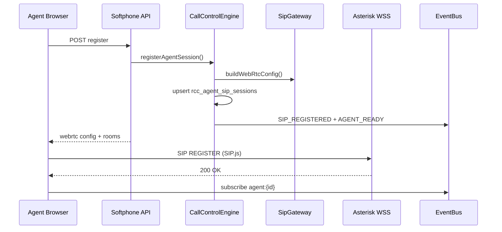

# RATEB Contact Center — Phase 4: WebRTC Softphone

**Status:** Implemented  
**Media:** Browser ↔ PBX direct (WebRTC/RTP) — **no server-side audio**

---

## Architecture

```
Asterisk PJSIP / WebRTC Gateway (WSS)
        │
        ▼
SIP.js (Browser) ←→ RTP/WebRTC media
        │
        ├── rcc-softphone.js (SDK)
        ├── rcc-softphone-ui.js (UI)
        └── RccRealtimeClient (EventBus WebSocket)
        │
        ▼
CallControlEngine.php (signaling + state only)
        │
        ├── SipGateway.php
        ├── MediaSessionManager.php
        ├── TransferEngine.php
        └── EventBus → Dashboard
```

---

## Core modules

| File | Role |
|------|------|
| `app/Domain/Softphone/CallControlEngine.php` | Register, accept, hold, transfer, hangup |
| `app/Infrastructure/WebRTC/SipGateway.php` | Tenant SIP/WebRTC credentials |
| `app/Domain/Softphone/MediaSessionManager.php` | Signaling state + auto-answer setting |
| `app/Domain/Softphone/TransferEngine.php` | Blind + attended transfer |
| `app/Application/Services/SoftphoneErpService.php` | ERP customer on CONNECT |
| `app/Controllers/Api/SoftphoneApiController.php` | Thin API (no SIP logic) |
| `public/assets/js/rcc-softphone.js` | Browser SDK |
| `public/assets/js/rcc-softphone-ui.js` | UI bindings |
| `views/components/softphone-panel.php` | Reusable component |

---

## SIP registration flow



---

## Call state machine

```
ringing → connected → held → connected
    │         │          │
    └─────────┴──────────┴→ transferred → ended
    └──────────────────────→ ended
```

### State model (strict)

```json
{
  "call_id": 9912,
  "agent_id": 12,
  "tenant_id": 1,
  "status": "ringing | connected | held | transferred | ended",
  "direction": "inbound | outbound",
  "queue_id": 3,
  "duration": 120,
  "started_at": "2026-06-21T14:30:01.123Z"
}
```

Stored in `rcc_softphone_calls`.

---

## EventBus integration

### Listen (browser via WebSocket)

| Event | Action |
|-------|--------|
| `CALL_INCOMING` | Show ring popup |
| `QUEUE_ASSIGNED` | Auto-answer if tenant setting enabled |
| `CALL_CONNECTED` | Start timer + ERP profile |
| `CALL_ENDED` | Cleanup UI |
| `AGENT_BUSY` | Lock UI |
| `AGENT_READY` / `AGENT_WRAPUP` | Unlock UI |

### Emit (via CallControlEngine API)

| Event | When |
|-------|------|
| `SIP_REGISTERED` | Agent session registered |
| `CALL_ACCEPTED` | Agent answers |
| `CALL_CONNECTED` | Media connected + ERP lookup |
| `CALL_HOLD` | Hold |
| `CALL_RESUME` | Resume |
| `CALL_TRANSFERRED` | Blind / attended |
| `CALL_ENDED` | Hangup |
| `SOFTPHONE_STATE` | State snapshot push |

**Rule:** No polling. No direct DB reads from frontend for live state.

---

## Queue auto-answer

Tenant setting: `rcc_settings` → `softphone.auto_answer_queue_calls`

When `true` and `QUEUE_ASSIGNED` received:
1. Browser auto-accepts SIP INVITE
2. API `accept` → `CALL_ACCEPTED` → `CALL_CONNECTED`
3. AgentState → busy

---

## Transfer engine

| Type | Flow |
|------|------|
| **Blind** | `TransferEngine::blindTransfer()` → AMI Redirect + `CALL_TRANSFERRED` |
| **Attended** | `attendedTransferInit()` → consult → `attendedTransferComplete()` |

Integrates: `QueueRealtimeService`, `AgentStateService`, `EventBus`.

---

## API endpoints

Base: `/ratib-contact-center/public/api/v1/softphone.php?action=`

| Action | Method | Body |
|--------|--------|------|
| `register` | POST | tenant_id, agent_id, user_id |
| `ping` | POST | tenant_id, agent_id |
| `unregister` | POST | tenant_id, agent_id |
| `outbound` | POST | destination |
| `accept` | POST | call_id, remote_number, queue_id |
| `connected` | POST | softphone_call_id |
| `hold` | POST | softphone_call_id |
| `resume` | POST | softphone_call_id |
| `hangup` | POST | softphone_call_id |
| `transfer_blind` | POST | softphone_call_id, target_extension |
| `transfer_attended` | POST | softphone_call_id, target_extension, complete |
| `settings` | POST | — |

---

## Database

**Migration:** `migrations/006_softphone.sql`

- `rcc_agent_sip_sessions` — online/offline, last_ping
- `rcc_softphone_calls` — call state machine
- `rcc_sip_extensions` — per-tenant SIP credentials
- `rcc_settings` — auto_answer_queue_calls

---

## Frontend usage

```php
<?php
$tenantId = 1;
$agentId = 12;
$userId = 100;
include __DIR__ . '/views/components/softphone-panel.php';
```

Or programmatic SDK:

```javascript
var phone = new RccSoftphone({
  tenantId: 1,
  agentId: 12,
  apiBase: '/ratib-contact-center/public/api/v1/softphone.php',
  wsUrl: 'ws://127.0.0.1:9702'
});
phone.init();
phone.answer();
phone.hold();
phone.transferBlind('1002');
phone.hangup();
```

---

## ERP integration on CALL_CONNECTED

`SoftphoneErpService::customerProfileByPhone()` returns:

- Contact name + company
- Recent tickets (last 5)
- SLA status (`ok` | `breached` | `unknown`)

Emitted in `CALL_CONNECTED.payload.erp_customer` → softphone UI panel.

---

## Environment

```env
RCC_SIP_WSS_URI=wss://pbx.ratib.sa:8089/ws
RCC_SIP_DOMAIN=pbx.ratib.sa
RCC_SIP_PASS_TENANT_1=secret
RCC_WEBSOCKET_PORT=9702
```

Run realtime hub: `php bin/rcc-realtime-hub.php`

---

## Critical rules (enforced)

- No media processing on backend
- No polling — EventBus WebSocket only
- No SIP logic in controllers
- Multi-tenant SIP isolation via `SipGateway::assertTenantAccess()`
- IVR logic stays in IvrEngine — not in softphone

---

## Success criteria

| Scenario | Result |
|----------|--------|
| Agent answers from browser | SIP.js accept + CALL_CONNECTED |
| Queue call pops instantly | QUEUE_ASSIGNED → WebSocket → popup |
| Hold / resume / transfer | API → EventBus → dashboard sync |
| ERP data on connect | CALL_CONNECTED.payload.erp_customer |
| Zero refresh | WebSocket + SIP events only |

---

*Phase 4 — WebRTC Softphone for RATEB RCC.*
