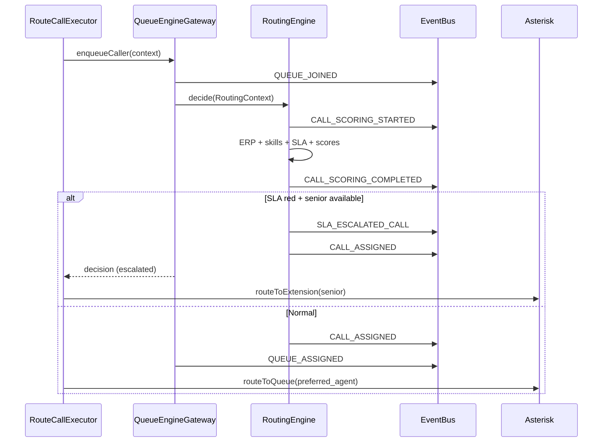

# RATEB Contact Center — Phase 5: AI Routing Engine

**Status:** Implemented  
**Model:** Rule-based scoring MVP (no ML) — configurable via `config/routing.php`

---

## Architecture

```
IVR route_call / Queue join
        │
        ▼
QueueEngineGateway::enqueueCaller()
        │
        ▼
RoutingEngine::decide()
        │
        ├── SkillMatcher
        ├── ErpContextAnalyzer
        ├── QueueScoringEngine
        ├── SlaPredictor
        └── AgentScoringEngine
        │
        ▼
RoutingDecision + rcc_routing_logs
        │
        ├── EventBus: CALL_SCORING_* / CALL_ASSIGNED / SLA_ESCALATED_CALL
        ├── QueueRealtimeService::onAgentAssigned() → QUEUE_ASSIGNED
        └── Asterisk PBX (RCC_PREFERRED_AGENT_ID or direct extension on RED)
```

---

## Core modules

| File | Role |
|------|------|
| `app/Domain/Routing/AI/RoutingEngine.php` | Main decision engine |
| `app/Domain/Routing/AI/SkillMatcher.php` | IVR/queue → skill mapping |
| `app/Domain/Routing/AI/ErpContextAnalyzer.php` | VIP, SLA breach, repeat caller boosts |
| `app/Domain/Routing/AI/SlaPredictor.php` | green / yellow / red risk |
| `app/Domain/Routing/AI/AgentScoringEngine.php` | Weighted agent ranking |
| `app/Domain/Routing/AI/QueueScoringEngine.php` | Optimal queue selection |
| `config/routing.php` | Weights & rules (not in controllers) |
| `migrations/007_ai_routing_engine.sql` | Skills, logs, queue members |

---

## Routing decision flow



---

## Input / output model

### Input (`RoutingContext`)

```json
{
  "call_id": 9912,
  "tenant_id": 1,
  "queue": "support",
  "customer_phone": "0500000000",
  "ivr_input": "2",
  "erp_customer_id": 5521,
  "channel_id": "PJSIP/..."
}
```

### Output (`RoutingDecision`)

```json
{
  "selected_agent_id": 12,
  "selected_queue_id": 3,
  "selected_queue_code": "support",
  "reason": "highest_skill_match + low_load + VIP_customer",
  "sla_risk": "yellow",
  "alternatives": [14, 9, 22],
  "escalated": false,
  "score_breakdown": { "...": "..." },
  "erp_context": { "...": "..." }
}
```

See `docs/examples/routing-decision.json`.

---

## Agent scoring weights

| Factor | Weight |
|--------|--------|
| Skill match | 30% |
| Current load | 25% |
| Availability | 20% |
| ERP familiarity | 15% |
| SLA risk penalty | −10% |

Configured in `config/routing.php` → `agent_weights`.

---

## ERP priority boosts

| Condition | Boost |
|-----------|-------|
| VIP customer | +40% |
| Open SLA breach | +30% |
| High-value company | +25% |
| Repeat caller (24h) | +10% |

Applied to `priority_multiplier` on `rcc_calls.priority_score`.

---

## SLA escalation (RED)

When `SlaPredictor` returns **red**:

1. Bypass FIFO queue wait logic
2. Select **senior agent** (`rcc_agents.is_senior = 1`, status `ready`)
3. Emit `SLA_ESCALATED_CALL`
4. `RouteCallExecutor` uses `routeToExtension()` instead of `Queue()`

---

## EventBus events

| Event | When |
|-------|------|
| `CALL_SCORING_STARTED` | Before scoring |
| `CALL_SCORING_COMPLETED` | Decision ready |
| `CALL_ASSIGNED` | Agent selected |
| `SLA_ESCALATED_CALL` | RED SLA → senior bypass |
| `QUEUE_ASSIGNED` | Queue layer confirms (existing) |

All decisions persisted in `rcc_routing_logs` (`decision_json`, `score_json`).

---

## Integration points

| Component | Hook |
|-----------|------|
| `QueueEngineGateway::assignCall()` | Runs `RoutingEngine::decide()` |
| `RouteCallExecutor` | Calls `enqueueCaller()` before PBX |
| `AgentStateService` | Reacts to `CALL_ASSIGNED` |
| `QueueRealtimeService` | Snapshot refresh on scoring/assign |
| Softphone / dashboard | WebSocket rooms `agent:{id}`, `queue:{id}` |

**Rule:** No direct queue assignment without `RoutingEngine`.

---

## Database

### `rcc_agent_skills`

| Column | Type |
|--------|------|
| agent_id | INT |
| tenant_id | INT |
| skill | sales / support / billing |
| level | 1–5 |

### `rcc_routing_logs`

| Column | Type |
|--------|------|
| call_id | BIGINT |
| decision_json | JSON |
| score_json | JSON |
| selected_agent_id | INT |
| selected_queue_id | INT |
| sla_risk | green/yellow/red |

---

## Multi-tenant isolation

- All queries scoped by `tenant_id`
- Skills, queue members, and logs are tenant-bound
- Per-tenant weight overrides via `rcc_settings` (`group_key=routing`, `setting_key=weights`)

---

## Run migration

```bash
mysql ratib_contact_center < ratib-contact-center/migrations/007_ai_routing_engine.sql
```

Ensure demo agents exist (migration `005` / `006`) before seed skills in `007`.

---

## Success criteria

| Criteria | Status |
|----------|--------|
| Smarter than FIFO | Weighted agent + queue scoring |
| VIP preference | ERP boosts in `ErpContextAnalyzer` |
| Avoid overloaded agents | Load + availability factors |
| SLA prediction before assign | `SlaPredictor` before agent pick |
| ERP history influence | Familiarity + ticket SLA flags |
| EventBus-only output | No polling |
| All decisions logged | `rcc_routing_logs` |
