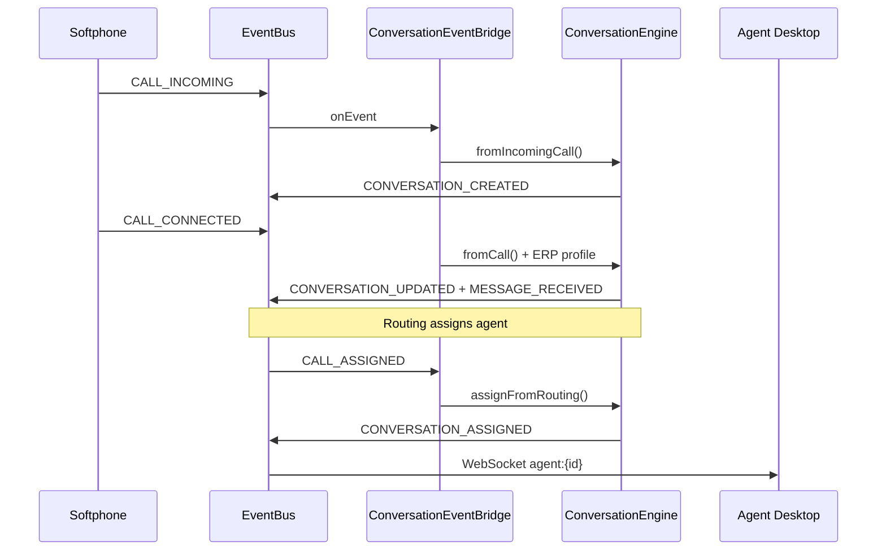

# RATEB Contact Center — Phase 6: Unified Omnichannel Inbox

**Status:** Implemented  
**Principle:** Every interaction becomes one **Conversation Thread** — no standalone channels.

---

## Architecture

```
Voice (Softphone) ──┐
WhatsApp Webhook ───┤
Email Ingestor ─────┼──► Channel Adapters
Web Chat Widget ────┘
        │
        ▼
ChannelNormalizer + IdentityResolver
        │
        ▼
ConversationEngine (CORE)
        │
        ├── ConversationPriorityEngine (ERP + routing SLA + channel urgency)
        ├── rcc_conversations / rcc_conversation_messages
        └── rcc_customer_identity_map
        │
        ▼
EventBus → Agent Desktop UI (zero refresh)
```

---

## Core modules

| File | Role |
|------|------|
| `app/Domain/Conversation/ConversationEngine.php` | Create/update threads, assign agents, append messages |
| `app/Domain/Conversation/IdentityResolver.php` | Match phone / email / ERP ID |
| `app/Domain/Conversation/ChannelNormalizer.php` | voice / whatsapp / email / chat → `ConversationMessage` |
| `app/Domain/Conversation/ConversationPriorityEngine.php` | Unified priority + SLA score |
| `app/Application/Services/ConversationEventBridge.php` | Voice/IVR/routing → conversations |
| `app/Infrastructure/Channels/*ChannelAdapter.php` | Per-channel ingest |
| `app/Controllers/Api/InboxApiController.php` | Thin inbox API |
| `public/assets/js/rcc-agent-inbox.js` | Real-time agent inbox SDK |
| `views/components/agent-desktop.php` | Unified desktop shell |

---

## Conversation model

```json
{
  "conversation_id": 8821,
  "tenant_id": 1,
  "customer_identity": "0500000000",
  "channels": ["voice", "whatsapp", "email"],
  "status": "open",
  "assigned_agent_id": 12,
  "priority": "high",
  "last_message": "...",
  "sla_status": "yellow"
}
```

See `docs/examples/conversation-thread.json`.

---

## Unified inbox event flow



### WhatsApp / email / chat

```
Webhook → InboxApiController (webhook_whatsapp|email|chat)
       → ChannelAdapter → ConversationEngine::ingestInbound()
       → EventBus MESSAGE_RECEIVED + CONVERSATION_UPDATED
       → Agent inbox updates live
```

---

## Database (`migrations/008_omnichannel_conversations.sql`)

| Table | Purpose |
|-------|---------|
| `rcc_conversations` | Unified thread per customer identity |
| `rcc_conversation_messages` | All channel messages in one timeline |
| `rcc_customer_identity_map` | phone / email / ERP ID linkage |
| `rcc_contacts` | Minimal CRM contacts (ERP enrichment) |

`rcc_calls.conversation_id` links voice calls to threads.

---

## EventBus events

| Event | When |
|-------|------|
| `CONVERSATION_CREATED` | New thread |
| `CONVERSATION_UPDATED` | Status / last message change |
| `MESSAGE_RECEIVED` | Inbound message on any channel |
| `MESSAGE_SENT` | Agent reply |
| `CONVERSATION_ASSIGNED` | Agent assigned (via routing or manual) |
| `CONVERSATION_PRIORITY_CHANGED` | VIP / SLA boost |

WebSocket rooms: `agent:{id}`, `conversation:{id}`, `tenant:{id}`.

---

## Integration points

| System | Hook |
|--------|------|
| Softphone | `CALL_INCOMING` / `CALL_CONNECTED` → `ConversationEventBridge` |
| IVR | `IVR_STARTED` → attach session to thread |
| Routing Engine | `CALL_ASSIGNED` → `assignFromRouting()` |
| ERP | `IdentityResolver` + `SoftphoneErpService` on connect |
| EventBus | Mandatory for all UI updates |

**Rule:** No direct agent assignment outside `ConversationEngine`.

---

## Priority engine

Combines:

| Source | Effect |
|--------|--------|
| ERP VIP / SLA breach | Boost score |
| RoutingEngine decision | `priority_multiplier` |
| Channel urgency | voice > whatsapp > chat > email |
| SLA risk | green / yellow / red |

Config: `config/conversation.php`.

---

## API (`public/api/v1/inbox.php`)

| Action | Purpose |
|--------|---------|
| `inbox` | List agent conversations |
| `thread` | Messages + metadata |
| `send` | Outbound reply |
| `close` | Close thread |
| `webhook_whatsapp` | WhatsApp ingest |
| `webhook_email` | Email ingest |
| `webhook_chat` | Web chat ingest |

---

## Agent desktop

Include in control panel or agent page:

```php
$tenantId = 1;
$agentId = 12;
include 'ratib-contact-center/views/components/agent-desktop.php';
```

Layout:

- **Left:** conversation list (priority, SLA, channels)
- **Center:** unified message thread + composer
- **Right:** ERP customer panel
- **Top:** softphone controls (embedded)

---

## Run migration

```bash
mysql ratib_contact_center < ratib-contact-center/migrations/008_omnichannel_conversations.sql
```

Requires prior migrations including `007_ai_routing_engine.sql` for `rcc_calls.routing_reason` column (or adjust ALTER if skipped).

---

## Success criteria

| Criteria | Status |
|----------|--------|
| Voice + WhatsApp + email in one thread | Identity merge by phone/email |
| Full customer history in one view | `thread` API + unified messages |
| SLA + ERP context preserved | Priority engine + metadata |
| Real-time UI | EventBus + `RccAgentInbox` |
| Multi-tenant isolation | All queries scoped by `tenant_id` |
| No standalone channels | All ingest via `ConversationEngine` |
