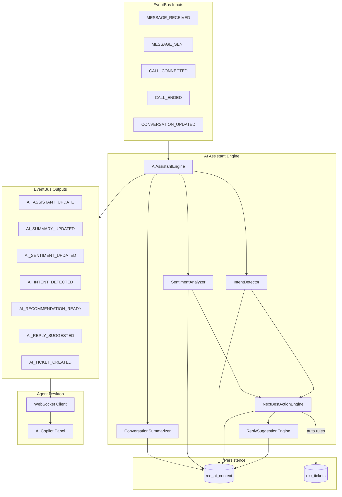

# PHASE 7 — AI Copilot (Agent Assistant Layer)

Intelligent advisory layer on top of Omnichannel Inbox, AI Routing, ERP, and EventBus realtime.

## Architecture

## Data flow (real-time)

1. **MESSAGE_RECEIVED** (or call lifecycle event) hits EventBus.
2. **AiAssistantEngine** (subscriber) resolves `conversation_id`, loads thread messages.
3. **Summarizer** → live summary; on **CALL_ENDED** → wrap-up summary.
4. **SentimentAnalyzer** → `{ score, label, confidence }`.
5. **IntentDetector** → complaint / refund / sales / technical / cancellation.
6. **NextBestActionEngine** → risk score + recommended action (advisory only).
7. **ReplySuggestionEngine** → channel-specific reply draft.
8. Context upserted to **rcc_ai_context**.
9. **AI_ASSISTANT_UPDATE** (+ granular AI_* events) broadcast via WebSocket.
10. Agent Desktop **AI Copilot panel** updates mood, intent, risk, reply, actions.

## Critical rules

| Rule | Implementation |
|------|----------------|
| AI must NOT override routing | No hooks into `RoutingEngine::decide()` |
| No blocking agent actions | All UI actions are suggestions or agent-confirmed |
| Advisory only | Badge + `RCC_AI_ASSISTANT_ENABLED` config |
| EventBus mandatory | `AiAssistantEngine implements EventSubscriberInterface` |
| Multi-tenant | All queries scoped by `tenant_id` |

## Modules

| File | Role |
|------|------|
| `app/Domain/AI/Assistant/AiAssistantEngine.php` | Orchestrator + EventBus subscriber |
| `app/Domain/AI/Summary/ConversationSummarizer.php` | Live + final summaries |
| `app/Domain/AI/Sentiment/SentimentAnalyzer.php` | Mood detection |
| `app/Domain/AI/Intent/IntentDetector.php` | Intent classification |
| `app/Domain/AI/Actions/NextBestActionEngine.php` | Risk + next-best-action |
| `app/Domain/AI/Reply/ReplySuggestionEngine.php` | Reply templates by channel |
| `config/assistant.php` | Keywords, rules, templates |
| `migrations/009_ai_assistant.sql` | `rcc_ai_context`, `rcc_tickets` |

## EventBus events (new)

- `AI_SUMMARY_UPDATED`
- `AI_SENTIMENT_UPDATED`
- `AI_INTENT_DETECTED`
- `AI_RECOMMENDATION_READY`
- `AI_REPLY_SUGGESTED`
- `AI_TICKET_CREATED`
- `AI_ASSISTANT_UPDATE` (full context bundle for UI)

## Auto ticket rules

When **all** match (config `auto_ticket`):

- sentiment = `angry`
- intent = `complaint`
- SLA = `yellow` or `red`

→ `TicketGateway::createFromAssistant()` with `source=ai_assistant`, `auto_created=1`.

## Agent Desktop AI panel

Right column (`#rcc-ai-copilot`):

- **Live insights** — mood emoji, intent, risk %, summary
- **Suggested reply** — Send as-is / Edit before send
- **Actions** — Escalate, create ticket, transfer (advisory buttons)
- **Customer** — ERP snippet (moved from old ERP column)

## API

`POST /ratib-contact-center/public/api/v1/assistant.php`

| action | params |
|--------|--------|
| `context` | `tenant_id`, `conversation_id` |
| `create_ticket` | `tenant_id`, `conversation_id`, `agent_id`, optional `subject` |
| `health` | — |

## Setup

1. Run migration **009** via Control Panel → Contact Center DB Setup.
2. Optional `.env`: `RCC_AI_ASSISTANT_ENABLED=1`
3. Open Agent Desktop; select a conversation; AI panel loads from API + WebSocket.

## LLM upgrade path

Replace heuristic analyzers with LLM providers by injecting adapters into `AiAssistantEngine` constructors — config hook: `RCC_AI_PROVIDER`.

## Success criteria

- Real-time summaries on message/call events
- Angry sentiment detected via lexicon (instant)
- Reply suggestions per channel
- Escalation recommendations when risk ≥ 75%
- Works on voice, WhatsApp, email, chat (any `MESSAGE_RECEIVED` thread)
