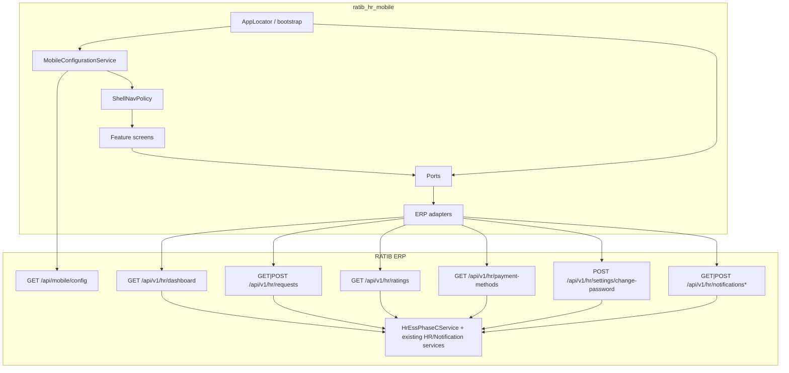

# Phase C — Enterprise ESS Modules

**Status:** COMPLETE (presentation + thin ERP adapters)  
**Depends on:** Phase A (MobileConfiguration)  
**Explicitly out of scope:** Push notifications, Offline Sync, Store signing

## Objective

Expand `ratib_hr_mobile` into a production-ready Enterprise Employee Self-Service shell with seven modules, all driven by ERP ports + `MobileConfiguration` feature flags + white-label branding.

## Architecture

**Rules enforced**

- No business logic in Flutter
- Tenant isolation via ERP `TenantContext` + employee resolver
- Feature visibility via `MobileFeatureKey` + `ShellNavPolicy`
- Branding via `BrandThemeFactory` + config display name / logo fields
- Role reserved (`AppWorkspaceRole`) for future Manager/HR/Supervisor/CEO shells

## Modules delivered

| # | Module | Feature key | Flutter | ERP |
|---|--------|-------------|---------|-----|
| 1 | Dashboard | (home always) | `features/home/home_page.dart` | `GET /api/v1/hr/dashboard` |
| 2 | Customer / employee requests | `requests` | `features/requests/*` | `GET/POST /api/v1/hr/requests` |
| 3 | Application settings | `settings` | `features/settings/settings_page.dart` | change-password + local prefs |
| 4 | Workforce ratings | `ratings` | `features/ratings/ratings_page.dart` | `GET /api/v1/hr/ratings` |
| 5 | Complaints & inquiries | `inquiries` | `features/inquiries/inquiries_page.dart` | POST typed requests |
| 6 | Notification center | `notifications` | `features/notifications/notifications_page.dart` | list / filter / mark read |
| 7 | Payment methods | `payments` | `features/payments/payments_page.dart` | architecture payload only |

## API contracts required

| Method | Path | Purpose |
|--------|------|---------|
| GET | `/api/mobile/config` | Features + branding (Phase A; keys extended) |
| GET | `/api/v1/hr/dashboard` | Attendance, leave, pending, notif summary, payroll stub |
| GET | `/api/v1/hr/requests` | List employee requests (`?type=`) |
| GET | `/api/v1/hr/requests/{id}` | Detail + history array |
| POST | `/api/v1/hr/requests` | Submit inquiry/complaint |
| GET | `/api/v1/hr/ratings` | Performance score + reviews (read-only) |
| GET | `/api/v1/hr/payment-methods` | Empty architecture envelope |
| POST | `/api/v1/hr/settings/change-password` | Password change via `User::applyPassword` |
| GET | `/api/v1/hr/notifications` | List (`?type=` filter) |
| POST | `/api/v1/hr/notifications/{id}/read` | Mark one read |
| POST | `/api/v1/hr/notifications/read-all` | Mark all read |

## ERP adapters required (Flutter)

| Port | Adapter |
|------|---------|
| `DashboardPort` | `ErpDashboardAdapter` |
| `EmployeeRequestPort` | `ErpEmployeeRequestAdapter` |
| `InquiryPort` | `ErpInquiryAdapter` |
| `RatingsPort` | `ErpRatingsAdapter` |
| `PaymentMethodsPort` | `ErpPaymentMethodsAdapter` |
| `SettingsPort` | `ErpSettingsAdapter` |
| `NotificationPort` | `ErpNotificationAdapter` (extended) |

ERP composition: `HrEssPhaseCService` + one controller file per class under `app/controllers/Api/` (`HrEssDashboardController`, `HrEssEmployeeRequestsController`, …) routed in `routes/modules/api.php`.

## Completion

| Area | % |
|------|---|
| Ports + DI + feature flags | 100% |
| ERP thin APIs | 95% (schedule/history/payments data gaps) |
| Flutter screens | 100% for Phase C scope |
| Tests (flags / branding / paths / l10n) | 100% |
| Push / Offline / Store signing | 0% (deferred by design) |
| **Overall Phase C** | **~90%** |

## Remaining before production release

1. **Phase B** — native device QA (Android/iOS on hardware)
2. Wire real attendance / leave check-in & apply screens (still placeholders)
3. Employee work **schedule** source in ERP (dashboard returns `null`)
4. Real **bank / salary payment** data when HR payroll exposes it
5. Request **conversation history** model (returns `[]` today)
6. Push notification device registration (Phase I)
7. Offline sync / queue (Phase G)
8. Store signing secrets (Phase J)
9. Documents / payslips thin APIs when ready

## Explicit non-goals (this phase)

- Push notifications
- Offline Sync
- Store Signing
- Modifications to `rateb_mobile`, Capacitor, Tracking
- Invented ERP business rules in Flutter
