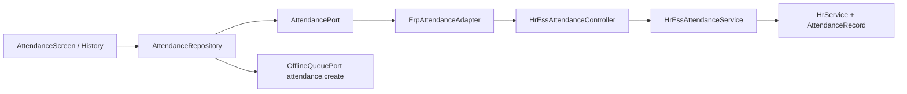

# Phase D — ESS Attendance

**Status:** COMPLETE  
**Depends on:** Phase A (MobileConfiguration), Phase C (ESS shell)  
**Project:** `ratib_hr_mobile` + ESS attendance ERP APIs only

## Objective

Complete Enterprise ESS Attendance: today, history, check-in, check-out — ERP as Source of Truth, Flutter presentation only.

## Architecture

## APIs

| Method | Path | Notes |
|--------|------|-------|
| GET | `/api/v1/hr/attendance/today` | `data.attendance` DTO |
| GET | `/api/v1/hr/attendance/history` | `data.items` (+ from/to) |
| POST | `/api/v1/hr/attendance/check-in` | 409 `already_checked_in` |
| POST | `/api/v1/hr/attendance/check-out` | 422 `invalid_state`; online only |

Envelope:

- Success: `{ "success": true, "data": { ... } }`
- Error: `{ "success": false, "code": "", "message": "" }`

Identity: `ApiAuthMiddleware` + `HrEssEmployeeResolverService` — never trust client `employee_id`.

## Offline (D5)

- Allowed queue action: **`attendance.create` only**
- Check-out: **online only** (never queued)
- Flutter: `LocalOfflineQueueAdapter` + flush via online check-in (409 treated as synced)
- Reuses existing ERP offline replay action name; no `attendance.update`

## Flutter deliverables

| Item | Path |
|------|------|
| Port | `lib/core/contracts/attendance_port.dart` |
| Adapter | `lib/core/adapters/erp_attendance_adapter.dart` |
| Offline queue | `lib/core/adapters/local_offline_queue_adapter.dart` |
| Repository | `lib/features/attendance/attendance_repository.dart` |
| State | `lib/features/attendance/attendance_state.dart` |
| Screens | `attendance_screen.dart`, `attendance_history_screen.dart` |

Feature flag: `MobileFeatureKey.attendance`.

## Security

- Company + employee isolation on all queries
- Duplicate check-in → 409
- Illegal check-out → 422
- Parameterized SQL (no injection)
- DTO strips `company_id` / `employee_id` from responses

## Tests

| Suite | Command |
|-------|---------|
| ERP | `php rateb-erp/tests/hr/run-ess-phase-d-attendance-tests.php` |
| Flutter | `flutter test test/phase_d_attendance_test.dart` |

## Explicit non-goals

- Shift / payroll / geofence calculations in Flutter
- New offline action types
- Touching `rateb_mobile`, Capacitor, Tracking, POS
- Leave deep wiring (Phase D leave / later roadmap)
