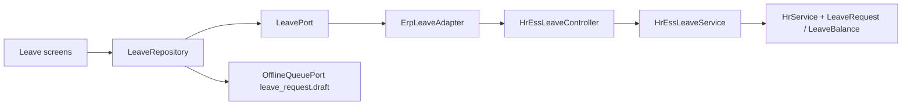

# Phase E — ESS Leave Management

**Status:** COMPLETE  
**Depends on:** Phase A (MobileConfiguration), Phase D (Attendance / offline queue)  
**Project:** `ratib_hr_mobile` + ESS leave ERP APIs only

## Objective

Complete Enterprise ESS Leave: balances, apply, my requests, request details — ERP as Source of Truth, Flutter presentation only.

## Architecture

## APIs

| Method | Path | Notes |
|--------|------|-------|
| GET | `/api/v1/hr/leave/balances` | `data.items` balance DTOs |
| GET | `/api/v1/hr/leave/requests` | `data.items` request DTOs |
| GET | `/api/v1/hr/leave/requests/{id}` | detail for Request Details screen |
| POST | `/api/v1/hr/leave/apply` | pending draft; server inclusive days |

Envelope: `success` + `data` / `code` + `message`  
409 `duplicate_request` · 422 `validation_error`  
Never trust client `employee_id`.

Days formula: inclusive calendar days — same as Admin leave create / offline `leaveDraft`.

## Offline

- Allowed action: **`leave_request.draft` only**
- Flush via online apply; `duplicate_request` treated as synced
- No new queue types

## Flutter screens

| Screen | Route |
|--------|-------|
| Balances hub | `/leave` |
| Apply | `/leave/apply` |
| My Requests | `/leave/status` |
| Request Details | `/leave/detail?id=` |

Feature flag: `MobileFeatureKey.leave`.

## Tests

| Suite | Command |
|-------|---------|
| ERP | `php rateb-erp/tests/hr/run-ess-phase-e-leave-tests.php` |
| Flutter | `flutter test test/phase_e_leave_test.dart` |

## Explicit non-goals

- Approve/reject in mobile
- Leave policy / balance deduction in Flutter
- Touching `rateb_mobile`, Capacitor, Tracking, POS
