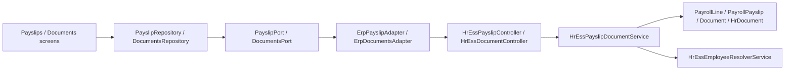

# Phase F — ESS Payslips & Documents

**Status:** COMPLETE  
**Depends on:** Phase A (MobileConfiguration), Phase E (Leave)  
**Project:** `ratib_hr_mobile` + ESS payslip/document ERP APIs only

## Objective

Employee self-service payslips and documents — ERP as Source of Truth, Flutter presentation only. Online only (no payroll/document offline sync).

## Architecture

## APIs

| Method | Path | Notes |
|--------|------|-------|
| GET | `/api/v1/hr/payslips` | `data.items` payslip DTOs |
| GET | `/api/v1/hr/payslips/{id}` | detail |
| GET | `/api/v1/hr/payslips/{id}/file` | authenticated text slip stream |
| GET | `/api/v1/hr/documents` | `data.items` metadata DTOs (`?category=`) |
| GET | `/api/v1/hr/documents/{id}` | detail |
| GET | `/api/v1/hr/documents/{id}/file` | authenticated binary (no storage path in JSON) |

Envelope: `success` + `data` / `code` + `message`  
404 `not_found` · 422 `validation_error` · 403 via auth middleware  
Never trust client `employee_id`.

Payslip DTO: `id`, `period`, `month`, `year`, `gross_amount`, `net_amount`, `status`, `download_url`  
Document DTO: `id`, `title`, `category`, `file_name`, `file_url`, `uploaded_at`

## Feature flags

- `features.payslips` (aliases legacy `features.payroll`)
- `features.documents`

Hidden in shell when disabled.

## Flutter screens

| Screen | Route |
|--------|-------|
| Payslips list | `/more/payslips` |
| Payslip detail | `/more/payslips/detail?id=` |
| Documents list | `/more/documents` |
| Document detail | `/more/documents/detail?id=` |

## Offline

- **Not allowed** for payroll/documents
- Online only; optional cache later

## Tests

| Suite | Command |
|-------|---------|
| ERP | `php rateb-erp/tests/hr/run-ess-phase-f-payslip-document-tests.php` |
| Flutter | `flutter test test/phase_f_payslips_documents_test.dart` |

## Explicit non-goals

- Salary / payroll calculation in Flutter
- Offline payroll or document sync
- Touching `rateb_mobile`, Capacitor, Tracking, POS
