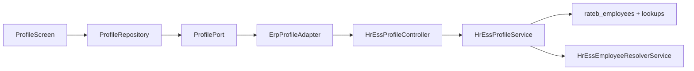

# Phase G — ESS Profile Module

**Status:** COMPLETE  
**Depends on:** Phase A (MobileConfiguration), Phase F (Payslips/Documents)  
**Project:** `ratib_hr_mobile` + ESS profile ERP API only

## Objective

Employee self-service profile (read-only) — ERP as Source of Truth, Flutter presentation only.

## Architecture

## APIs

| Method | Path | Notes |
|--------|------|-------|
| GET | `/api/v1/hr/profile` | `data.profile` DTO |

**PUT not implemented** — no existing ESS self-edit workflow; do not invent approval/update paths.

Envelope: `success` + `data` / `code` + `message`  
Never trust client `employee_id` / `company_id` / roles.

### Profile DTO

`id`, `employee_no`, `full_name`, `photo_url`, `email`, `phone`, `department`, `job_title`, `branch`, `manager`, `join_date`, `status`

Excluded: `salary_base`, `national_id`, passwords, tokens, device fields.

## Flutter

| Screen | Route |
|--------|-------|
| Profile | `/more/profile` |

Feature flag: `features.profile` (default on).

## Security

- Resolver + `company_id` + `employee_id` on load SQL
- Tenant mismatch → 403 `forbidden`
- Employee isolation via linked user only (no IDOR by employee id param)

## Tests

| Suite | Command |
|-------|---------|
| ERP | `php rateb-erp/tests/hr/run-ess-phase-g-profile-tests.php` |
| Flutter | `flutter test test/phase_g_profile_test.dart` |

## Explicit non-goals

- Profile edit / approval workflow
- Phase H/I/J
- Touching `rateb_mobile`, Capacitor, Tracking, POS
