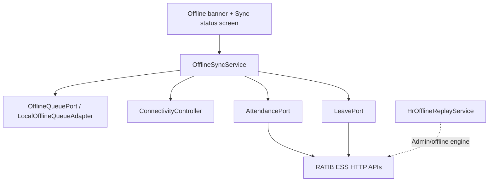

# Phase H — ESS Offline Hardening

**Status:** COMPLETE  
**Depends on:** Phase D (Attendance), Phase E (Leave)  
**Project:** `ratib_hr_mobile` + existing ERP `HrOfflineReplayService` verification only

## Objective

Harden the existing ESS offline foundation: queue persistence, connectivity UX, pending indicators, sync status — without inventing HR rules or new queue actions.

## Architecture

Flutter **does not** run local conflict resolution. Flush retries online ESS APIs. ERP offline replay remains the canonical engine for device/admin queues.

## Allowed actions

| Action | Purpose |
|--------|---------|
| `attendance.create` | Offline check-in |
| `leave_request.draft` | Offline leave draft |

## Forbidden

- `attendance.update` / `attendance.delete`
- Payroll / documents offline sync
- Local HR database
- New queue action types
- Local conflict/HR rule calculation

## Flutter

| Surface | Route / placement |
|---------|-------------------|
| Sync status | `/more/sync` |
| Offline / pending banner | Shell (`OfflineBannerHost`) |
| More entry | When attendance **or** leave enabled |

## ERP verification

`HrOfflineReplayService` already supports ESS actions with:

- Idempotency keys (`[offline:{key}]`)
- Tenant + employee `assertEmployee`
- Payload strip of client `company_id` / `branch_id` / `user_id` / `device_id`
- Duplicate short-circuit
- Clear `synced` / `failed` / `conflict` statuses

## Tests

| Suite | Command |
|-------|---------|
| ERP | `php rateb-erp/tests/hr/run-ess-phase-h-offline-tests.php` |
| Flutter | `flutter test test/phase_h_offline_test.dart` |

## Explicit non-goals

- Push / Device Registry (Phase J)
- Store release
- POS / Capacitor / `rateb_mobile` changes
